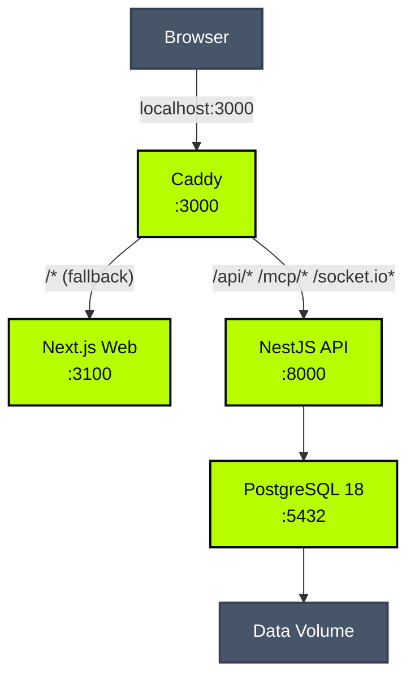

import { Callout, Steps } from "nextra/components";
import { Sh } from "../../../components/mdx-code";

# Docker

<Callout type="warning">
  **This image is not for production.** It runs every service in a single
  container with an embedded database and no replication, high availability, or
  automated backups. Use the [Kubernetes deployment](/deployment/kubernetes) for
  production workloads.
</Callout>

The Classifyre all-in-one Docker image bundles everything into a single container — PostgreSQL, the NestJS API, the Next.js web UI, and a Caddy reverse proxy. One command and the full application is running on port `3000`.

**Good for**

- Local development and feature exploration
- Sales demos and proof-of-concept trials
- Offline or air-gapped environments
- CI integration tests against a real running instance

---

## Quick start

<Steps>

### Pull the image

<Sh>{`docker pull classifyre/all-in-one:$version`}</Sh>

The image is available for `linux/amd64` and `linux/arm64`. Pin to a release version for reproducible demos.

### Run without persistence

<Sh>{`docker run --rm \\
  -p 3000:3000 \\
  classifyre/all-in-one:$version`}</Sh>

Open **http://localhost:3000** in your browser.

The API health endpoint is at **http://localhost:3000/api/ping**.

<Callout type="info">
  Without a volume, everything — sources, findings, settings, and credentials —
  is lost when the container stops.
</Callout>

### Add a data volume

<Sh>{`docker run --rm \\
  -p 3000:3000 \\
  -v classifyre-data:/var/lib/postgresql/data \\
  classifyre/all-in-one:$version`}</Sh>

With the volume mounted, the database and all application state survive container restarts and image upgrades.

</Steps>

---

---

## What runs inside

All services start automatically via [s6-overlay](https://github.com/just-containers/s6-overlay), a lightweight process supervisor that manages boot order and handles graceful shutdown.

```
Container  →  port 3000
│
└── s6-overlay (PID 1)
    ├── PostgreSQL 16    — database for all application data
    ├── NestJS API       — REST + WebSocket backend  (internal :8000)
    ├── Next.js Web      — dashboard UI              (internal :3100)
    └── Caddy            — reverse proxy, single public endpoint
                           /         → web UI
                           /api/*    → API
                           /socket.io/* → WebSocket
```

Prisma migrations run automatically every time the container starts. You never need to run them manually.

---

## Volumes

The container persists PostgreSQL data at `/var/lib/postgresql/data`, declared as a Docker volume. All logs go to stdout/stderr and are managed by s6-overlay — use `docker logs` to access them.

```
Docker volume /var/lib/postgresql/data
├── PG_VERSION
├── .classifyre_masked_config_key    (encryption key, auto-generated)
└── base/  global/  pg_wal/  ...     (PostgreSQL data files)
```

To persist data across restarts, mount a named volume at `/var/lib/postgresql/data`:

<Sh>{`docker run --rm \\
  -p 3000:3000 \\
  -v classifyre-data:/var/lib/postgresql/data \\
  classifyre/all-in-one:$version`}</Sh>

The container also uses `/cache/uv` as a package cache for on-demand Python dependency installs. It is declared as a separate volume.

<Sh>{`docker run --rm \\
  -p 3000:3000 \\
  -v classifyre-data:/var/lib/postgresql/data \\
  -v classifyre-uv-cache:/cache/uv \\
  classifyre/all-in-one:$version`}</Sh>

### What you lose without a volume

| Data                | Impact if lost                                                |
| ------------------- | ------------------------------------------------------------- |
| PostgreSQL database | All sources, findings, custom detectors, and job history gone |
| Encryption key      | Stored connector credentials become permanently unreadable    |
| uv package cache    | Dependencies re-downloaded on next Python install             |

### Why the encryption key matters

Classifyre encrypts connector credentials (API tokens, passwords) at rest using `CLASSIFYRE_MASKED_CONFIG_KEY`. When no volume is mounted, a new random key is generated on every container start. Any credentials you saved in the previous session become unreadable because the key that encrypted them no longer exists.

**Always mount a volume for any session where you configure real connectors.**

## Storage

The all-in-one Docker image has no embedded object storage. To enable S3 persistence, pass the relevant environment variables at runtime:

```bash
docker run \
  -e S3_ENDPOINT=https://s3.us-east-1.amazonaws.com \
  -e S3_BUCKET=my-classifyre-logs \
  -e S3_REGION=us-east-1 \
  -e S3_FORCE_PATH_STYLE=false \
  -e S3_ACCESS_KEY_ID=AKIA... \
  -e S3_SECRET_ACCESS_KEY=... \
  classifyre/all-in-one:latest
```

When these variables are not set, the image runs without object storage and logs stream in-memory only.

---

## Environment variables

| Variable                                    | Default        | Description                                                                                                                                 |
| ------------------------------------------- | -------------- | ------------------------------------------------------------------------------------------------------------------------------------------- |
| `CLASSIFYRE_MASKED_CONFIG_KEY`              | auto-generated | 32-character key for encrypting connector credentials. Set explicitly if you need the same key across sessions without a persistent volume. |
| `LOG_LEVEL`                                 | `info`         | Log verbosity: `debug`, `info`, `warn`, `error`.                                                                                            |
| `MAX_CONCURRENT_RUNNERS`                    | `1`            | Max simultaneous CLI scan jobs running inside the container.                                                                                |
| `POSTGRES_PASSWORD`                         | _(empty)_      | Password for the `postgres` user (auth is trust-based by default).                                                                          |
| `POSTGRES_DB`                               | `classifyre`   | Name of the default database created on first start.                                                                                        |
| `TEMP_DIR`                                  | `/tmp`         | Temporary directory for scan artifacts.                                                                                                     |
| `CLASSIFYRE_CLI_AUTO_INSTALL_OPTIONAL_DEPS` | `1`            | Auto-installs optional detector dependencies (e.g. OCR, ML models) via `uv` at runtime. Set to `0` to disable.                              |

<Sh>{`docker run \\
  -p 3000:3000 \\
  -v classifyre-data:/var/lib/postgresql/data \\
  -e LOG_LEVEL=debug \\
  classifyre/all-in-one:$version`}</Sh>

---

## System requirements

|      | Minimum | Recommended |
| ---- | ------- | ----------- |
| CPU  | 1 core  | 2 cores     |
| RAM  | 1 GB    | 2 GB        |
| Disk | 2 GB    | 5 GB        |

Playwright (browser-based crawling) is bundled in the image. Connectors that use it consume an additional ~500 MB RAM per browser instance during active scans.

---

## Upgrading

Pull the new image, stop the existing container, start again pointing at the same volume. Migrations run automatically.

<Sh>{`docker pull classifyre/all-in-one:$version

docker compose down
docker compose up -d`}</Sh>

The data volume is untouched by image upgrades.

---

## Backup and restore

Even for demos, you may want to preserve a working state.

**Backup:**

For a consistent backup, use `pg_dump` against the running container:

```bash
docker exec <container-id> pg_dump -h 127.0.0.1 -U postgres classifyre > classifyre-$(date +%Y%m%d).sql
```

To back up the full data directory (container must be stopped):

```bash
docker run --rm \
  -v classifyre-data:/var/lib/postgresql/data \
  -v "$(pwd)/backups:/backup" \
  alpine \
  tar czf /backup/classifyre-$(date +%Y%m%d).tar.gz -C /var/lib/postgresql/data .
```

**Restore:**

```bash
docker run --rm \
  -v classifyre-data:/var/lib/postgresql/data \
  -v "$(pwd)/backups:/backup" \
  alpine \
  tar xzf /backup/classifyre-20240101.tar.gz -C /var/lib/postgresql/data
```

---

## Troubleshooting

**Container exits immediately**

```bash
docker logs <container-id>
```

Common causes: port 3000 already in use (`lsof -i :3000`), insufficient disk space (`docker system df`).

**Web UI loads but API returns errors**

```bash
# Check s6 service status
docker exec <container-id> s6-rc -a list

# Tail the API log (via Docker, s6 captures stdout)
docker logs <container-id>
```

**Verify health**

```bash
curl -i http://localhost:3000/api/ping
# → 200 {"status":"ok"}
```

---

## Architecture reference



## Moving to production

When you outgrow the single-container setup, deploy Classifyre on Kubernetes with proper separation of concerns, a managed database, and horizontal scaling.

→ [Kubernetes Deployment](/deployment/kubernetes)
