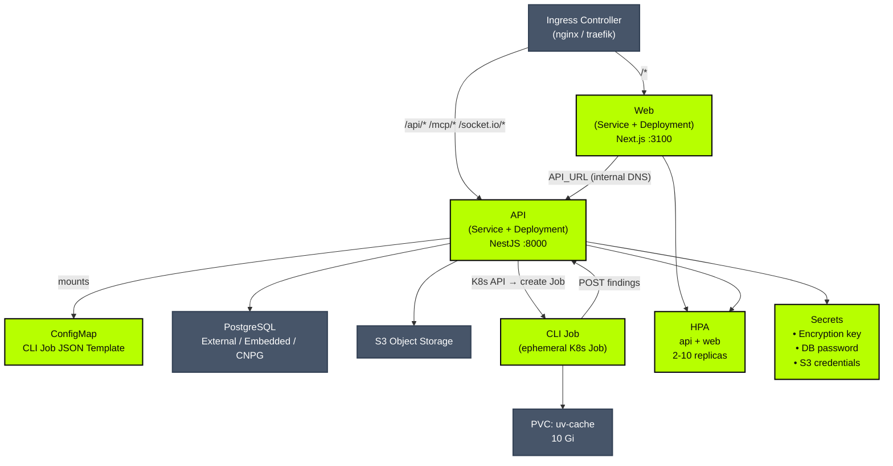

import { Callout, Steps, Tabs } from "nextra/components"
import HelmValuesReference from "../../../src/_generated/helm-values.mdx"
import { softwareVersion } from "@workspace/ui/lib/software-version"
import { Sh } from "../../../components/mdx-code"

# Kubernetes Deployment

The official Classifyre Helm chart deploys the API, web UI, database migrations, and CLI scan jobs to any Kubernetes cluster. It is the recommended path for production workloads.



**Supports**

- k3s, K3d, kind, EKS, GKE, AKS, and any conformant cluster
- External PostgreSQL, embedded single-pod PostgreSQL, or [CloudNativePG](https://cloudnative-pg.io/)
- Horizontal autoscaling (HPA) for API and web deployments
- OCI Helm registry, no `helm repo add` needed

---

## Prerequisites

- Kubernetes ≥ 1.26
- Helm ≥ 3.8
- An ingress controller (nginx is the default `ingress.className`)
- A PostgreSQL 14+ database (or use the embedded option for demos)

---

## Images

Release images and the Helm chart are published to Docker Hub.

| Component | Image |
|---|---|
| API (NestJS backend) | `classifyre/api` |
| Web (Next.js frontend) | `classifyre/web` |
| CLI (Python scan worker) | `classifyre/cli` |

### Available tags

Every full release publishes the version tag and `latest`. CI also publishes branch-name tags (`main`, `develop`, etc.) for every push.

| Tag | Example | Meaning | Recommended for |
|---|---|---|---|
| `{major}.{minor}.{patch}` | `{softwareVersion}` | Exact release | **Production** |
| `latest` | - | Latest stable release | Demos / quick evals |
| `main` | - | Latest commit on `main` | CI / development |
| `develop` | - | Latest commit on `develop` | CI / staging |

All images are multi-arch: `linux/amd64` + `linux/arm64`.

When you install the chart at a specific version and leave image tags empty, the chart defaults every image to its own `appVersion` automatically, no manual tag management needed.

---

## Helm Chart

The chart is published as an OCI artifact:

```
oci://registry-1.docker.io/classifyre/classifyre-core
```

Helm 3.8+ supports OCI natively, so there is no `helm repo add` step.

<Sh>{`# Inspect available versions
helm show chart oci://registry-1.docker.io/classifyre/classifyre-core

# Pull chart locally to inspect values before installing
helm pull oci://registry-1.docker.io/classifyre/classifyre-core --version $version --untar`}</Sh>

---

## Quick start

<Tabs items={["k3s / k3d (no ingress)", "Production (external DB)", "CloudNativePG"]}>
<Tabs.Tab>

<Steps>

### Create a namespace

```bash
kubectl create namespace classifyre
```

### Create a values file

```yaml filename="values-k3s.yaml"
ingress:
  enabled: false

frontend:
  service:
    type: NodePort
    nodePort: 30100

postgres:
  mode: embedded
  embedded:
    password: changeme
```

### Install the chart

<Sh>{`helm install classifyre \\
  oci://registry-1.docker.io/classifyre/classifyre-core \\
  --namespace classifyre \\
  --version $version \\
  -f values-k3s.yaml`}</Sh>

Helm uses the chart `appVersion` as the image tag automatically, no extra `--set` needed.

### Verify rollout

```bash
kubectl -n classifyre rollout status deployment/classifyre-api
kubectl -n classifyre rollout status deployment/classifyre-web
```

### Open the UI

Find the node IP and open **http://&lt;node-ip&gt;:30100** in your browser.

```bash
kubectl get nodes -o wide
```

</Steps>

<Callout type="warning">
  The embedded PostgreSQL option uses a single pod with a `ReadWriteOnce` PVC. It has no replication or automated backups. Use it for local dev and demos only.
</Callout>

</Tabs.Tab>
<Tabs.Tab>

<Steps>

### Create a namespace and secret

```bash
kubectl create namespace classifyre

kubectl create secret generic classifyre-pg \
  --namespace classifyre \
  --from-literal=password=<your-pg-password>
```

### Create a values file

```yaml filename="values-prod.yaml"
ingress:
  host: classifyre.example.com
  tls:
    - secretName: classifyre-tls
      hosts:
        - classifyre.example.com

postgres:
  mode: external
  connection:
    sslMode: require
  external:
    host: pg.example.com
    port: 5432
    database: classifyre
    username: classifyre
    existingSecret: classifyre-pg
    existingSecretPasswordKey: password

api:
  maskedConfigEncryption:
    value: ""          # leave empty, chart auto-generates and persists a key
```

### Install

<Sh>{`helm install classifyre \\
  oci://registry-1.docker.io/classifyre/classifyre-core \\
  --namespace classifyre \\
  --version $version \\
  -f values-prod.yaml`}</Sh>

</Steps>

</Tabs.Tab>
<Tabs.Tab>

<Steps>

### Install the CloudNativePG operator

```bash
helm upgrade --install cnpg cloudnative-pg \
  --repo https://cloudnative-pg.github.io/charts \
  --namespace cnpg-system --create-namespace
```

### Configure Classifyre for CNPG

```yaml filename="values-cnpg.yaml"
ingress:
  host: classifyre.example.com

postgres:
  mode: cnpg
  cnpg:
    clusterName: classifyre-cnpg
    instances: 3
    database: classifyre
    user: classifyre
    appPassword: <choose-a-password>
    storage:
      size: 50Gi
      storageClassName: fast-ssd
```

### Install

<Sh>{`helm install classifyre \\
  oci://registry-1.docker.io/classifyre/classifyre-core \\
  --namespace classifyre --create-namespace \\
  --version $version \\
  -f values-cnpg.yaml`}</Sh>

CNPG provisions a 3-instance cluster with synchronous replication and automated failover.

</Steps>

</Tabs.Tab>
</Tabs>

---

## Encryption key

Classifyre encrypts connector credentials (API tokens, passwords) at rest using `CLASSIFYRE_MASKED_CONFIG_KEY`.

**By default** the chart auto-generates a 32-character key on first install and stores it in a Kubernetes Secret. Subsequent `helm upgrade` runs look up the existing secret and reuse the same key, so credentials stay readable across upgrades.

<Callout type="warning">
  **Do not delete the secret.** If the secret is deleted, the key is lost and all stored connector credentials become permanently unreadable. You must re-enter them.
</Callout>

To supply your own key (useful when migrating from Docker or another cluster):

```yaml
api:
  maskedConfigEncryption:
    value: "your-exactly-32-character-key-here"
    autoGenerate: false
```

Or reference an existing Kubernetes Secret:

```yaml
api:
  maskedConfigEncryption:
    existingSecret: "my-classifyre-secrets"
    secretKey: CLASSIFYRE_MASKED_CONFIG_KEY
    autoGenerate: false
```

---

## Database migrations

Migrations run automatically as an init container in each API pod on every startup. You never need to run them manually. The init container uses the same image as the API and runs:

```
npx prisma migrate deploy
```

This is idempotent, if migrations are already applied, the init container exits immediately and the API starts normally.

---

## Ingress

The chart creates four ingress rules on a single host using the nginx ingress controller:

| Path | Target |
|---|---|
| `/` | Web UI |
| `/api/*` | REST API |
| `/mcp` and `/api/mcp` | MCP protocol endpoint |
| `/socket.io/*` | WebSocket |

The default class is `nginx`. Change it with:

```yaml
ingress:
  className: traefik   # or any other installed controller
```

### TLS

Add cert-manager annotations to get automatic certificates:

```yaml
ingress:
  host: classifyre.example.com
  annotations:
    cert-manager.io/cluster-issuer: letsencrypt-prod
  tls:
    - secretName: classifyre-tls
      hosts:
        - classifyre.example.com
```

---

## Upgrading

<Sh>{`# Pull the latest chart information
helm show chart oci://registry-1.docker.io/classifyre/classifyre-core --version $version

# Upgrade in place, migrations run automatically
helm upgrade classifyre \\
  oci://registry-1.docker.io/classifyre/classifyre-core \\
  --namespace classifyre \\
  --version $version \\
  -f values-prod.yaml`}</Sh>

The upgrade is rolling, pods are replaced one at a time. The API and web deployments each have a `minAvailable: 1` PodDisruptionBudget so at least one pod stays up during the rollout.

---

## Scaling

Horizontal autoscaling is enabled by default for both the API and web deployments:

```yaml
api:
  autoscaling:
    enabled: true
    minReplicas: 2
    maxReplicas: 10
    targetCPUUtilizationPercentage: 70
    targetMemoryUtilizationPercentage: 75

frontend:
  autoscaling:
    enabled: true
    minReplicas: 2
    maxReplicas: 10
    targetCPUUtilizationPercentage: 70
    targetMemoryUtilizationPercentage: 75
```

CLI scan jobs are ephemeral Kubernetes Jobs — they scale naturally since each scan spawns its own job and the cluster schedules them as capacity allows. Tune their resources with `api.cliJobs.resources`.

Default resource requests for CLI jobs: 500m CPU, 1 Gi memory, 6 Gi ephemeral storage.

---

## Storage

The chart provisions PVCs depending on configuration:

| PVC | Purpose | Default size | Access mode |
|---|---|---|---|
| `uv-cache` | Python package cache shared across CLI job pods | 10 Gi | ReadWriteOnce |
| `postgres` (embedded mode only) | PostgreSQL data directory | 20 Gi | ReadWriteOnce |

Run logs are persisted to S3-compatible object storage (when configured) or streamed live, there is no filesystem PVC for runner logs.

The `uv-cache` PVC uses `ReadWriteOnce` by default, which works on single-node clusters. On multi-node clusters with concurrent CLI jobs, switch to `ReadWriteMany` (e.g. with an NFS or EFS-backed storage class):

```yaml
api:
  cliJobs:
    uvCache:
      storageClassName: nfs-client
```

---

## Uninstalling

```bash
helm uninstall classifyre --namespace classifyre
```

PVCs are **not** deleted automatically. To remove them:

```bash
kubectl -n classifyre delete pvc --all
```

<Callout type="warning">
  Deleting PVCs removes the encryption key secret and all scan logs. Export anything you need first.
</Callout>

---

## Helm Chart Values

<HelmValuesReference />
