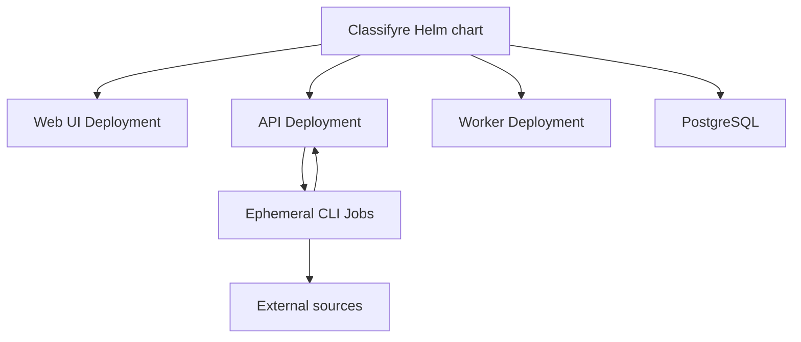

# Deployment

Classifyre supports two deployment paths:

- **Kubernetes with Helm** for local clusters, production, high availability,
  and horizontal scaling.
- **Desktop** for an investigator running the packaged application locally.

## Kubernetes

The official Helm chart deploys the web UI, API, background worker, ephemeral
CLI scan Jobs, and the required Kubernetes services and RBAC. PostgreSQL may be
provided by the chart for development or connected as external infrastructure
for production. Object storage is optional.

[Read the Kubernetes deployment guide](/deployment/kubernetes).

## Desktop

The desktop package includes the application resources required to run
Classifyre on macOS, Windows, or Linux. Download it from the project’s GitHub
releases.

## Platform components

The supported deployments use the same application components:

- **Web UI:** the user-facing Next.js application.
- **API and worker:** orchestration, state, background queues, and automation.
- **CLI Jobs:** isolated source extraction and detection runs.
- **PostgreSQL:** application state and investigation data.
- **Object storage:** optional logs and uploaded artifacts.
