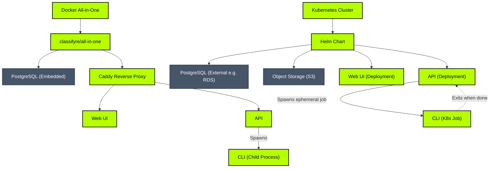
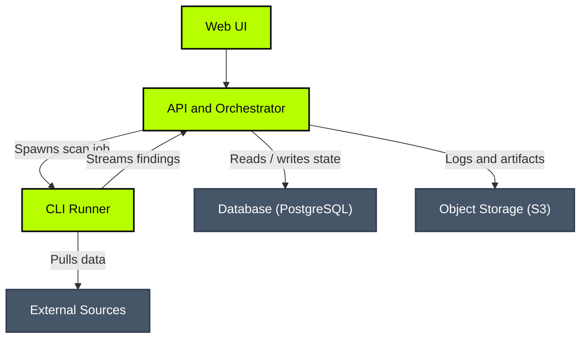

# Deployment Models

Classifyre supports two primary deployment pathways depending on your environment: a development-oriented **Docker All-in-One** setup, or a production-ready **Kubernetes Helm Chart**.

---

## Deployment Modes

### 1. Docker All-in-One (Development / Demo)

Designed for local evaluation, software exploration, sales demos, and offline testing.

- **Bundled Image:** The `classifyre/all-in-one` image packages PostgreSQL, the API, the Web UI, and a Caddy reverse proxy into a single container.
- **Process Supervisor:** Manages boot ordering and process health inside the container via `s6-overlay`.
- **CLI Execution:** The API spawns CLI processes locally using child process spawning.
- **Learn More:** Check out the [Docker Deployment Guide](/deployment/docker).

### 2. Kubernetes (Production)

Our recommended setup for production workloads, designed for high availability, durability, and horizontal scale.

- **Orchestration:** Deployed using the official Classifyre Helm Chart.
- **Scalability:** The API and Web UI run as standard, horizontally autoscalable Kubernetes deployments.
- **Database & Storage:** You specify your own production-grade PostgreSQL instance (e.g., AWS RDS) and S3 bucket endpoint.
- **CLI Execution:** The API spawns an isolated, ephemeral Kubernetes Job for every scan run. When the scan finishes, the job pod exits, releasing cluster resources.
- **Learn More:** Check out the [Kubernetes Deployment Guide](/deployment/kubernetes).

---

## Platform components

However you deploy it, Classifyre is a distributed, decoupled platform. It
separates the **Core Classifyre Stack** (the application services, in green) from
the **External Infrastructure** it relies on (in grey) — which you can bring your
own instances of.

### Core Classifyre Stack

These primary services form the core of the application:

#### 1. Web UI (Frontend)

- **Role:** The user-facing frontend.
- **Responsibilities:**
  - Configuring and managing data sources.
  - Enabling, disabling, and adjusting settings for detectors and classifiers.
  - Inspecting scan runs, execution logs, and classified findings.
  - Triggering scans manually or defining automated schedules.

#### 2. API and Orchestrator

- **Role:** The control plane and orchestrator.
- **Responsibilities:**
  - Exposing the APIs that power the Web UI.
  - Coordinating runner lifecycles, states, and jobs.
  - Spawning CLI execution runs (locally or as Kubernetes Jobs).
  - Receiving batched findings from active CLI scanners.
  - Fetching run artifacts and logs from storage.

#### 3. CLI Runner

- **Role:** The ephemeral execution worker where extraction and detection happen.
- **Responsibilities:**
  - Ingesting documents from target external sources.
  - Parsing text and structural metadata.
  - Running detectors (secrets, PII, custom LLM models) against parsed content.
  - Streaming findings back to the API in batches.

### External Infrastructure

Classifyre relies on standard external components for persistence, storage, and
ingestion. You can bring your own instances of each:

- **[PostgreSQL Database](/deployment/database/):** Stores all system metadata, configurations, schedules, logs, and findings. Classifyre supports **embedded** database pods for quick evaluations or **external** instances (such as AWS RDS, GCP Cloud SQL, or CloudNativePG) for production.
- **[S3 Object Storage](/deployment/storage/):** An **external** and **optional** component used to persist long-term runner execution logs. If disabled, logs are streamed live but not saved.
- **[External Data Sources](/sources/):** The target systems containing unstructured data (e.g., AWS S3, Confluence, Slack, Google Drive) that Classifyre scans to identify security and compliance findings.

---

## Infrastructure Configuration

To configure external storage, database options, and other deployment operations, see the dedicated reference guides:

- **[PostgreSQL Database](/deployment/database):** Embedded vs external database setup, connection security (SSL), and credentials management.
- **[S3 Object Storage](/deployment/storage):** Configuration parameters, bucket setup, and provider integration guides (AWS, MinIO, Backblaze B2).
- **[Analytics with PostHog](/deployment/analytics):** Product analytics proxy and reporting options.
- **[Upgrade & Versioning](/deployment/upgrade-and-versioning):** Release process and versioning rules.
