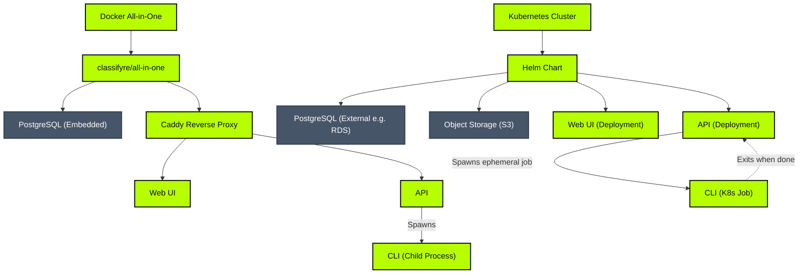

# Deployment Models

Classifyre supports two primary deployment pathways depending on your environment: a development-oriented **Docker All-in-One** setup, or a production-ready **Kubernetes Helm Chart**.

---

## Deployment Modes

### 1. Docker All-in-One (Development / Demo)
Designed for local evaluation, software exploration, sales demos, and offline testing.
- **Bundled Image:** The `classifyre/all-in-one` image packages PostgreSQL, the API, the Web UI, and a Caddy reverse proxy into a single container.
- **Process Supervisor:** Manages boot ordering and process health inside the container via `s6-overlay`.
- **CLI Execution:** The API spawns CLI processes locally using child process spawning.
- **Learn More:** Check out the [Docker Deployment Guide](/deployment/docker).

### 2. Kubernetes (Production)
Our recommended setup for production workloads, designed for high availability, durability, and horizontal scale.
- **Orchestration:** Deployed using the official Classifyre Helm Chart.
- **Scalability:** The API and Web UI run as standard, horizontally autoscalable Kubernetes deployments.
- **Database & Storage:** You specify your own production-grade PostgreSQL instance (e.g., AWS RDS) and S3 bucket endpoint.
- **CLI Execution:** The API spawns an isolated, ephemeral Kubernetes Job for every scan run. When the scan finishes, the job pod exits, releasing cluster resources.
- **Learn More:** Check out the [Kubernetes Deployment Guide](/deployment/kubernetes).

---

## Infrastructure Configuration

To configure external storage, database options, and other deployment operations, see the dedicated reference guides:

- **[PostgreSQL Database](/deployment/database):** Embedded vs external database setup, connection security (SSL), and credentials management.
- **[S3 Object Storage](/deployment/storage):** Configuration parameters, bucket setup, and provider integration guides (AWS, MinIO, Backblaze B2).
- **[Analytics with PostHog](/deployment/analytics):** Product analytics proxy and reporting options.
- **[Chart Publishing](/deployment/publishing):** Release process and versioning rules.
