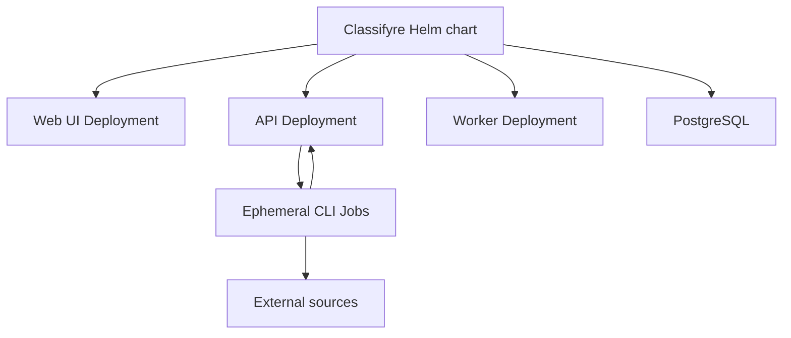

import { InstallOptions } from "../../components/install-options";

# Deployment

Classifyre ships in two distributions, with the same features in both:

- **Docker** — one image that runs on macOS, Windows, or Linux, with the
  database and scan workers inside it.
- **Kubernetes with Helm** — for shared instances, production, high
  availability, and horizontal scaling.

A [namespace export](/data-export/) moves work from one to the other, so this
is not a decision you are locked into.

<InstallOptions />

## Docker

The all-in-one image carries the API, the web UI, the Python scan workers, and
PostgreSQL, so nothing else has to be provisioned. Bind-mount a directory and it
becomes a source like any other.

[Read the Docker install guide](/deployment/docker/).

## Kubernetes

The official Helm chart deploys the web UI, API, background worker, ephemeral
CLI scan Jobs, and the required Kubernetes services and RBAC. PostgreSQL may be
provided by the chart for development or connected as external infrastructure
for production. Object storage is optional.

```mermaid
graph TD
    Helm["Classifyre Helm chart"] --> Web["Web UI Deployment"]
    Helm --> API["API Deployment"]
    Helm --> Worker["Worker Deployment"]
    Helm --> DB["PostgreSQL"]
    API --> Jobs["Ephemeral CLI Jobs"]
    Jobs --> Sources["External sources"]
    Jobs --> API
```

[Read the Kubernetes deployment guide](/deployment/kubernetes/).

## Platform components

The supported deployments use the same application components:

- **Web UI:** the user-facing Next.js application.
- **API and worker:** orchestration, state, background queues, and automation.
- **CLI Jobs:** isolated source extraction and detection runs.
- **PostgreSQL:** application state and investigation data.
- **Object storage:** optional logs and uploaded artifacts.
