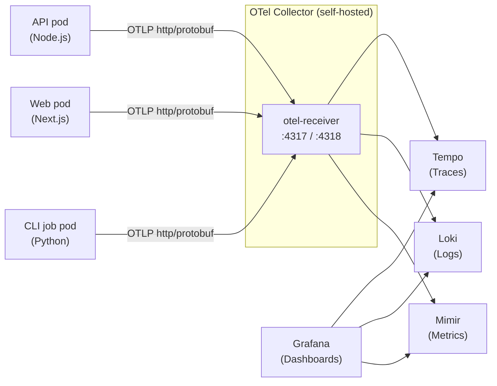

import { Callout, Steps, Tabs } from "nextra/components"

# OpenTelemetry (Application Telemetry)

Classifyre ships built-in [OpenTelemetry](https://opentelemetry.io) instrumentation across all services (**API**, **Web**, and **CLI jobs**). Telemetry data (traces, metrics, and logs) is exported via the OTLP protocol to a configurable endpoint.

Telemetry is **disabled by default**. When enabled, you must provide a `telemetry.otlpEndpoint` — deploy the [`helm/otel-receiver/`](#self-hosted-observability-stack) chart in your cluster and point at it.

## Data flow



You deploy `helm/otel-receiver/` to run the collector and backends inside your own cluster.

## How the Helm chart injects OTEL

When `telemetry.enabled: true`, the Helm chart injects the following environment variables into every workload:

| Env var | Source | API | Web | CLI |
|---|---|---|---|---|
| `OTEL_EXPORTER_OTLP_ENDPOINT` | `telemetry.otlpEndpoint` | ✓ | ✓ | ✓ |
| `OTEL_EXPORTER_OTLP_PROTOCOL` | `telemetry.otlpProtocol` | ✓ | ✓ | ✓ |
| `DEPLOY_ENV` | `telemetry.deployEnv` | ✓ | ✓ | ✓ |
| `CLASSIFYRE_INSTANCE_ID` | auto-generated UUID ConfigMap | ✓ | ✓ | ✓ |
| `OTEL_SERVICE_NAME` | hardcoded to `classifyre-cli` | — | — | ✓ |

<Callout type="info">
`OTEL_SERVICE_NAME` is only set explicitly for CLI jobs, where its value is `classifyre-cli`. The API and Web services rely on the OpenTelemetry SDK default (derived from the process name or package name).
</Callout>

The Grafana dashboards shipped with the self-hosted stack query for `resource.service.name=~"classifyre.*"` to match traces from all three services.

## Disabling telemetry

Telemetry is **disabled by default** (`telemetry.enabled: false`). No OTEL env vars are injected, and the single env var `TELEMETRY_DISABLED=1` is set instead.

```yaml
telemetry:
  enabled: false
```

To enable telemetry:

```yaml
telemetry:
  enabled: true
```

<Callout type="warning">
When telemetry is enabled but `telemetry.otlpEndpoint` is empty, a warning is printed during `helm install`/`helm upgrade`. Set `telemetry.otlpEndpoint` to your OTel Collector URL.
</Callout>

## Instance identity

When `telemetry.instanceId.enabled: true` (the default), the chart creates a ConfigMap (`<release>-instance-id`) containing a random UUID that persists across Helm upgrades (annotated with `helm.sh/resource-policy: keep`). This UUID is injected as `CLASSIFYRE_INSTANCE_ID` into every workload, enabling correlation of telemetry data from a specific deployment.

You can provide your own ConfigMap by setting `telemetry.instanceId.existingConfigMap`.

## Self-hosted observability stack

The `helm/otel-receiver/` chart deploys a complete observability stack inside your cluster:

| Component | Chart | Purpose |
|---|---|---|
| **OTel Collector** | `opentelemetry-collector` 0.158.x | OTLP ingestion, PII redaction, batching, routing |
| **Grafana** | `grafana` 10.5.x | Dashboards, explore, alerting |
| **Tempo** | `tempo` 1.24.x | Distributed tracing backend |
| **Loki** | `loki` 7.0.x | Log aggregation |
| **Promtail** | `promtail` 6.17.x | Pod log shipping (stdout/stderr → Loki) |
| **Mimir** | `mimir-distributed` 6.0.x | Horizontally-scalable metrics |

### Collector pipelines

| Pipeline | Receivers | Processors | Exporter | Backend |
|---|---|---|---|---|
| `traces` | `[otlp]` | `memory_limiter`, `transform/pii`, `batch` | `otlphttp/tempo` | Tempo (`:4318`) |
| `metrics` | `[otlp]` | `memory_limiter`, `batch` | `prometheusremotewrite/mimir` | Mimir (`/api/v1/push`) |
| `logs` | `[otlp]` | `memory_limiter`, `batch` | `loki` | Loki (`/loki/api/v1/push`) |

The `transform/pii` processor redacts home directories and email addresses from exception stacktraces and log messages before data leaves the cluster.

### Deploying

```bash
helm install otel-receiver ./helm/otel-receiver \
  --namespace monitoring --create-namespace
```

After deployment, get the collector endpoint:

```bash
echo "http://otel-receiver-opentelemetry-collector.monitoring:4318"
```

Then point the Classifyre chart at your self-hosted collector:

```yaml
telemetry:
  otlpEndpoint: "http://otel-receiver-opentelemetry-collector.monitoring:4318"
```

## Configuration reference

| Value | Default | Description |
|---|---|---|
| `telemetry.enabled` | `false` | Master switch. When `true`, exports traces/metrics/logs via OTLP. |
| `telemetry.otlpEndpoint` | `""` | OTLP endpoint URL. Required when `enabled=true`. |
| `telemetry.otlpProtocol` | `http/protobuf` | OTLP export protocol. |
| `telemetry.deployEnv` | `production` | Environment tag applied to every span, metric, and log. |
| `telemetry.instanceId.enabled` | `true` | Persist a stable anonymous instance UUID across upgrades. |
| `telemetry.instanceId.existingConfigMap` | `""` | Use an existing ConfigMap for the instance ID instead of auto-generating one. |
| `telemetry.instanceId.configMapKey` | `instance-id` | Key inside the ConfigMap holding the UUID. |

## Production considerations

For production deployments:

- **Air-gapped environments**: Set `telemetry.enabled: false` or point `telemetry.otlpEndpoint` at an internal OTel Collector.
- **Compliance**: The self-hosted stack keeps all telemetry data inside your cluster. The collector's PII redaction processor strips sensitive patterns before data reaches storage.
- **Scaling**: For high-volume deployments, adjust the collector's batch processor settings (`batch/timeout`, `batch/send-batch-size`) in the otel-receiver chart.
- **Storage**: Tempo and Loki use filesystem storage by default. For production, configure object storage (S3/GCS) via their respective chart values.
