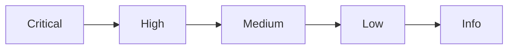
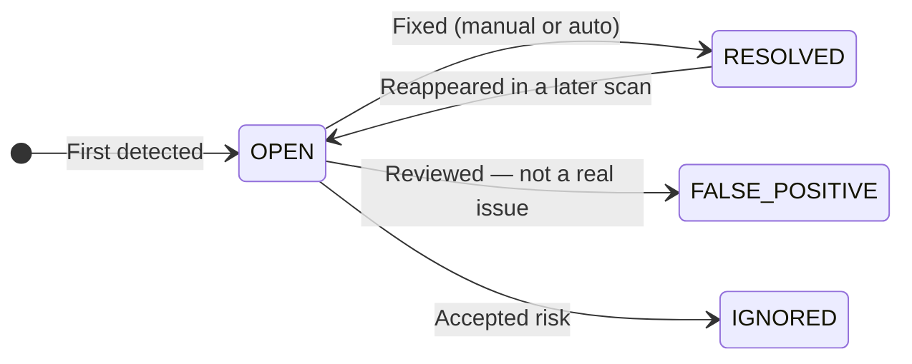

# Findings & Results

A **finding** is the result a detector yields: one signal, raised on one asset.
It's the unit you triage, filter, and investigate. This page covers everything a
finding carries — its fields, its severity, its confidence, and how it lives
across repeated scans.

---

## Anatomy of a finding

Every finding records *what* was found, *where*, *how sure* the detector is, and
*how serious* it is. The key fields:

| Field | What it tells you |
|---|---|
| **Detector** | Which detector raised it — a pre-built type, or your custom detector's name. |
| **Finding type** | The specific signal, e.g. an API key, a credit-card number, a policy match. |
| **Category** | The broad family the signal belongs to (secrets, PII, security, …). |
| **Severity** | How serious it is — Critical to Info (see below). |
| **Confidence** | How sure the detector is, from 0 to 1 (see below). |
| **Matched content** | The exact text or value that matched. |
| **Redacted content** | A safe-to-show version with the sensitive part masked. |
| **Context** | The surrounding text before and after the match, for quick judgement. |
| **Location** | Where in the asset it sits (e.g. line, field, or column). |
| **Metadata** | Extra detector-specific details about the match. |
| **Status** | Where it is in its lifecycle — Open, Resolved, and so on (see below). |

Because each finding is attached to an asset, it also inherits that asset's name,
link, and [metadata](/sources/assets-and-metadata/) — so you always know which
item, in which source, produced it.

> **Sensitive matches stay protected.** Findings keep a **redacted** version of
> the match so you can review and triage without re-exposing the secret or
> personal data that was found.

---

## Severity levels

Every finding is assigned a **severity** by the detector, based on what matched.
Severity is how you focus on what matters first — you can sort and filter by it
everywhere.

| Severity | Meaning | Example |
|---|---|---|
| **Critical** | Immediate risk — act now | A live credential or active malware signature |
| **High** | Significant risk — address soon | Personal data exposed in a public location |
| **Medium** | Moderate risk or policy deviation | A questionable pattern worth reviewing |
| **Low** | Minor issue or informational | A weak signal, low blast radius |
| **Info** | No direct risk, worth recording | A noted observation for completeness |

---

## Confidence

Alongside severity, each finding carries a **confidence** score from **0 to 1**
showing how certain the detector is about the match:

- **1.0** — the detector is fully confident (typical of exact pattern matches).
- **Lower scores** — the signal is more ambiguous and may deserve a human check.

Severity and confidence answer different questions: severity is *how bad is it if
real?*, confidence is *how likely is it real?* A high-severity, low-confidence
finding is worth a quick look; a high-severity, high-confidence one is worth
acting on.

---

## The finding lifecycle

Findings persist across scans. Rather than creating duplicates each run,
Classifyre tracks the **same** finding over time and updates its **status** and
**history** — giving you a complete audit trail.

### Statuses you control

| Status | Meaning |
|---|---|
| **Open** | Newly detected, not yet reviewed. |
| **False positive** | Reviewed and judged incorrect. |
| **Resolved** | The underlying issue is fixed. |
| **Ignored** | Acknowledged and accepted as a risk. |

### History recorded automatically

Each finding keeps a timeline of what happened to it:

| Event | When it fires |
|---|---|
| **Detected** | First time it appears |
| **Re-detected** | Still present in a later scan |
| **Resolved** | No longer present after a scan (auto), or marked by you |
| **Re-opened** | Returned after having been resolved |
| **Status / severity changed** | You updated it manually |

> **Your decisions stick.** When you mark something a false positive, ignored, or
> resolved, later scans respect that — your manual judgement is never silently
> overwritten.

---

## From findings to investigations

Findings are evidence. On their own they're a list; their real value comes from
working them:

- **[Investigations](/flow/investigations/)** — group related findings into
  inquiries and cases with hypotheses and evidence.
- **[Fingerprints](/flow/investigations/fingerprints/)** — connect findings that
  share identity into duplicate and similarity clusters.
- **[Autopilot](/flow/investigations/autopilot/)** — let AI agents open inquiries,
  build cases, and draft hypotheses from new findings automatically.
- **[Flow](/flow/)** — the full mechanics of how findings are detected, tracked,
  and auto-resolved across scans.

---

## Detectors, end to end

| Page | |
|---|---|
| [Overview](/detectors/) | Pre-built and custom detectors at a glance |
| [How Detectors Work](/detectors/how-it-works/) | Running, routing, and per-source setup |
| Findings & Results | What detectors produce *(you are here)* |
| [Pre-built Detectors](/detectors/pre-built/) | The ready-made packs |
| [Custom Detectors](/detectors/custom-detectors/) | Build your own |
