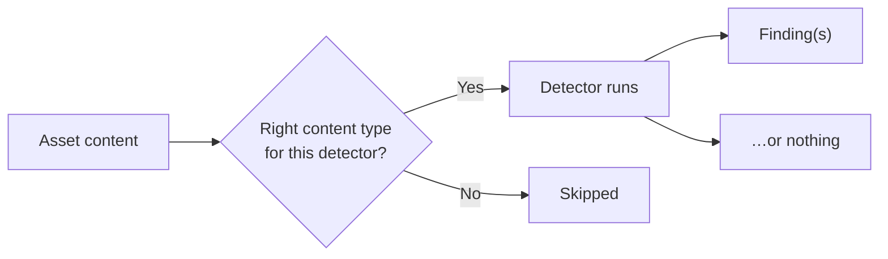
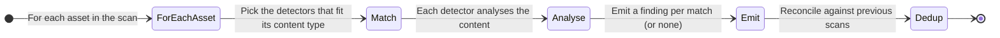
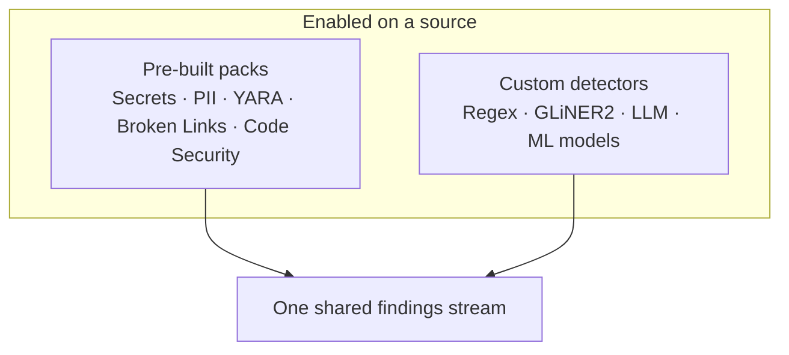

# How Detectors Work

Detectors don't run on their own — they run **as part of a source scan**, on the
content of each asset that scan produces. This page explains that flow, how a
detector is matched to the right kind of content, and how you choose which
detectors run on which source.

---

## Detectors live on the source

Every source carries its own list of detectors. A detector only runs on a source
if it's switched on there — so two sources can scan for completely different
things. You configure this in the source's setup (see
[Configuration & Fields](/sources/configuration/)):

| On a source you can… | Result |
|---|---|
| **Enable a pre-built pack** | That pack runs on every applicable asset in the scan |
| **Disable a pack** | It's skipped for that source |
| **Select custom detectors** | Your own detectors run alongside the built-in ones |

Because it's per-source, you can be strict on a customer-facing system and
lenient on an internal sandbox, without affecting each other.

> Don't want to manage this by hand? The
> [Config and Detector agents](/flow/investigations/autopilot/agents/) can enable
> the right packs on a silent source and even author new detectors — see
> [Autopilot](/flow/investigations/autopilot/).

---

## Content-type routing

Not every detector makes sense on every asset. A secrets scanner wants text; an
image classifier wants pixels. Each asset has a **content type**, and each
detector declares which content types it can handle. Classifyre only runs a
detector on assets it actually applies to.

| Content type | Example assets | Detectors that apply |
|---|---|---|
| **Text** | Documents, pages, messages, code | Secrets, PII, code security, text-based custom detectors |
| **Table** | Database rows, spreadsheets | PII, secrets, custom rules over column values |
| **URL** | Links | Broken-link checks |
| **Image** | Photos, screenshots, diagrams | Image classification, object detection |
| **Audio / Video** | Recordings, clips | Text detectors, *after* [transcription](/sources/content-extraction/) |
| **Binary / Other** | Files needing extraction | Text detectors, *after* [OCR](/sources/content-extraction/) |

This is why [OCR and transcription](/sources/content-extraction/) matter: they
turn images and media into **text**, which unlocks the text-based detectors on
content that would otherwise be skipped.

---

## What happens during a scan

1. **For each asset**, Classifyre selects the detectors enabled on the source
   that fit the asset's content type.
2. **Each detector analyses** the content independently.
3. **Matches become findings** — one per match, each with a severity and a
   confidence score. No match means no finding, which is the healthy default.
4. **Results reconcile** against earlier scans, so the same issue is tracked over
   time rather than duplicated (see [Findings & Results](/detectors/findings/)).

---

## Pre-built and custom, together

Pre-built and custom detectors run through the same machinery and produce the
same kind of findings — they differ only in where they come from:

So a custom EU-IBAN rule and the built-in PII pack land their results in the same
place, side by side, with the same severity scale and lifecycle.

Next: see exactly what a detector produces in
**[Findings & Results](/detectors/findings/)**.
