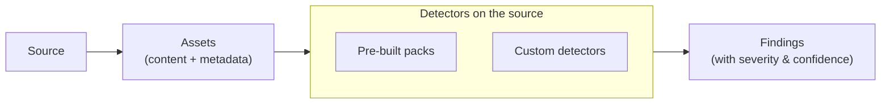

# Detectors

**Detectors** are the scanning engines that read the content pulled from your
[sources](/sources/) and flag anything that matters: hardcoded credentials,
personal data, malware signatures, insecure code, broken links — or any signal
you define yourself. Each thing a detector flags becomes a **finding**.

There are two kinds, and they work side by side:

|                         | What it is                                               | Best for                                         |
| ----------------------- | -------------------------------------------------------- | ------------------------------------------------ |
| **Pre-built detectors** | Curated, ready-to-use packs that ship with Classifyre    | Common, universal signals — turn them on and go  |
| **Custom detectors**    | Detectors _you_ build, from a simple rule to an AI model | Signals specific to your team, domain, or policy |

---

## The Source → Asset → Finding model

Everything detectors do sits inside one simple hierarchy:

1. **Source** — a connection to a system you run.
2. **Asset** — one item extracted from it (a page, file, table, message, video),
   carrying content and [metadata](/sources/assets-and-metadata/).
3. **Finding** — one signal a detector raised on one asset. An asset can produce
   zero, one, or many findings.

A scan ingests a source into assets, each asset's content is read by the
detectors configured on that source, and the result is a list of findings you
can triage and investigate.

---

## Start here

| Page                                                 | What you'll learn                                                                                           |
| ---------------------------------------------------- | ----------------------------------------------------------------------------------------------------------- |
| **[How Detectors Work](/detectors/how-it-works/)**   | How detectors run, how they're matched to content, and how you switch them on per source.                   |
| **[Findings & Results](/detectors/findings/)**       | What a detector produces — every field of a finding, severity levels, confidence, and the status lifecycle. |
| **[Pre-built Detectors](/detectors/pre-built/)**     | The ready-made packs and their configuration.                                                               |
| **[Custom Detectors](/detectors/custom-detectors/)** | Build your own — from a regex to an LLM, across text and images.                                            |

---

## Pre-built detectors

Classifyre ships with ready-made detectors for the most common signal types, so
you get findings on day one with nothing to train:

- **Secrets** — hardcoded credentials, API keys, tokens
- **PII** — personally identifiable information
- **YARA** — malware patterns and threat indicators
- **Broken Links** — unreachable or empty URLs
- **Code Security** — insecure code patterns

See **[Pre-built Detectors](/detectors/pre-built/)** for the full catalog and
configuration options.

---

## Custom detectors

When a signal is specific to you, build a **custom detector**. The same framework
spans the whole spectrum — from a zero-overhead pattern rule to a full AI model,
across both text and images:

| Engine                   | Modality | Best for                                            |
| ------------------------ | -------- | --------------------------------------------------- |
| **Regex**                | Text     | Codes, IDs, structured patterns — exact and instant |
| **GLiNER2**              | Text     | Entity extraction with no labelled training data    |
| **AI Detector (LLM)**    | Text     | Nuanced classification and structured extraction    |
| **Text Classification**  | Text     | Spam, toxicity, sentiment, topic labels             |
| **Image Classification** | Image    | NSFW, moderation, custom image categories           |
| **Object Detection**     | Image    | Locating objects, label-based severity              |

Semantic embeddings are created automatically during ingestion. They power
importance ranking and semantic search and do not need a custom detector.

See **[Custom Detectors](/detectors/custom-detectors/)** to pick an engine and
build one. The [Detector agent](/investigations/autopilot/agents/) can even
author and test custom detectors for you automatically.
