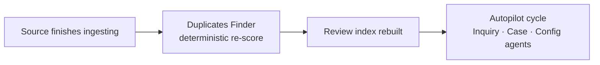

# AI Agents & Duplicates

Duplicate review is a place where automation is genuinely useful and also
genuinely dangerous. An agent that quietly empties your queue has destroyed the
one number the screen exists to report.

So the split is drawn narrowly and on purpose:

> **Agents compute, read, and clear the boring cases. People decide everything
> that is ambiguous or interesting.**

---

## Duplicates Finder — deterministic, no LLM

The matching itself has **no language model in it at all**.

The **Duplicates Finder** is an agent kind in the [autopilot](/investigations/autopilot/)
log, but it's a deterministic step: normalise values, hash them, score overlaps,
build clusters, refresh the review index. It's registered as an agent so its work
is **visible in the autopilot log** and so the LLM agents that run after it can
take its results into account.

It runs after every scan, before the autopilot cycle, so agents never reason
about stale duplicates. It also runs on demand after a
[tuning](/duplicates/tuning/) change, and when you promote a cluster into a case.

---

## Which agents touch duplicates, and when

| Agent | What it does with duplicates | When |
|---|---|---|
| **Duplicates Finder** | Computes matches, clusters, and the review index | After every scan; after a tuning change |
| **Case agent** | Turns confirmed duplicates into cases and inquiries; checks whether an asset it's investigating has near-identical twins elsewhere | During the autopilot cycle, while working a case |
| **Config agent** | Works the queue as a *matcher* problem: clears the safe band, excludes boilerplate, proposes weight and threshold changes | During the autopilot cycle, when tuning is enabled |
| **Inquiry agent** | Uses duplicate context to avoid re-raising the same finding from five copies of the same document | While triaging findings |

> **Why there is no "duplicates agent".** The work splits cleanly along a line
> that already exists. Acting on a duplicate *as evidence* is case work, and the
> case agent already owns evidence, provenance and follow-through. Fixing the
> *matcher* is configuration, and the config agent already owns weights,
> thresholds and exclusions with the gating that implies. A third agent would
> re-implement one of those two, add a sixth kind to the cycle, and — because
> **Duplicates Finder** already occupies the name — make every "duplicates run"
> in the autopilot log ambiguous about whether it was a re-score or a reasoning
> pass.

The tools are gated the way the rest of autopilot is: nothing that writes is
reachable when autopilot is switched off for the workspace, and mutating tools
are subject to the workspace's **observe / suggest / managed** mode. See
[Autopilot](/investigations/autopilot/).

---

## What an agent may read

These are read-only and always available to the agents above.

| Tool | Answers |
|---|---|
| **similar assets** | "What else looks like this asset?" — cluster members and top matches, each annotated with its pattern, whether lineage explains it, and **any verdict a person already recorded** |
| **review queue** | The backlog: patterns ranked by how much work each settles, undecided counts, and how many matches lineage cannot explain |
| **decisions** | What has already been judged and what became of it. `unactionedOnly` finds duplicates a person confirmed and never used. |
| **match cause** | Why one pair matched, as something to fix: the dominant label, the values, and how many other pairs the same combination produced |
| **exclusion candidates** | For a [boilerplate pattern](/duplicates/patterns/#rule-candidate-stop-matching-on-these-values), the values inside the template and how many matches they drive elsewhere |
| **value occurrences** | Where else a specific value appears across the estate |

The first of those carries the most important design decision on this page: an
agent is **always shown the human verdict**. Without it an agent has no way to
know a match was already settled, and would keep proposing work someone finished
— or argue against a decision it cannot see.

---

## What an agent may decide: the safe band

There is exactly one situation where an agent records a duplicate verdict on its
own.

> **The safe band:** match weight **≥ 0.95** *and* a [lineage
> path](/sources/lineage/) explaining it.

That combination is a **derived copy** — a mart that resembles the source it was
built from — where a human decision adds nothing. Both conditions are required:

- **A near-perfect score alone is not enough.** An unexplained near-identical
  pair is the single most interesting thing this product can surface, and it is
  exactly what a person should see.
- **A lineage path alone is not enough.** Plenty of derived assets differ
  substantially from their source; that is not a duplicate.

Everything else — anything ambiguous, anything unexplained, anything below the
band — is left alone however high it scores. That is routing, not automation.

### Agent decisions are counted apart

Every verdict an agent records is stamped as an agent decision and reported
separately in the headline and in [Decisions](/duplicates/decisions/). An agent
clearing five thousand derived copies must not make **pairs remaining** look as
though a person worked through them.

The safe band is also reversible from the undo log like any other batch.

---

## What an agent may propose

Everything else an agent can do here is a mutation gated by autopilot mode: in
*suggest* mode it becomes a proposal you approve, and only in *managed* mode is
it applied directly.

**Taking duplicates somewhere** — case agent:

- **Decisions to case** — confirmed pairs become evidence in a case, through the
  same path the *Add to case* button uses, so it lands with the normal case
  activity trail rather than a second, subtly different route. The verdicts are
  stamped with the case, so the ledger shows follow-through.
- **Decisions to inquiry** — for duplication that is *recurring* rather than
  historical: opens an inquiry watching for the same match signature instead of
  asking someone to review it again next month.
- **Promote a cluster into a case** — the coarse version, kept for a cluster
  that has not been through review.

**Fixing the matcher** — config agent:

- **Exclude a pattern's values** — the one-click fix for a
  [boilerplate pattern](/duplicates/patterns/#rule-candidate-stop-matching-on-these-values),
  aimed at the values the *exclusion candidates* tool named. Same gate as any
  other correlation tuning, and one reversible entry in the undo log.
- **Tune the matcher** — weights, thresholds and exclusion rules, workspace-wide.

The **match cause** and **exclusion candidates** tools exist specifically so a
proposal is aimed at the actual driver rather than guessed at. An agent that
proposes lowering a weight without reading the cause is proposing a change it
cannot justify.

---

## What agents never do

| Never | Why |
|---|---|
| Confirm an arbitrary pair | There is no tool for it. The safe band is the only route to a duplicate verdict, and it is narrow by construction. |
| Bulk-confirm a whole pattern | *Confirm all in band* is a human action. An agent has no basis for it. |
| Reject or **split** on judgement | Both suppress future clustering, and a wrong one is invisible and feels permanent. The only rejection an agent can record is the one attached to a boilerplate exclusion, where the reason is structural rather than a judgement about the two assets. |
| Confirm anything lineage cannot explain | That is the finding, not the noise. |
| Confirm anything below the safe band | Below it, judgement is the whole job. |
| Merge, delete or edit anything in your source systems | Classifyre records judgements; it never writes back. |

## Everything is on the record

Every mutating tool call writes an **agent decision** — the action, whether it
was applied, skipped as observe-only or failed, the reasoning the agent gave,
and the inputs. Reads are logged too, but as technical entries rather than
decisions: a read must never be reported as work done.

On top of that, anything an agent does in the queue shows up where a person
would look for it:

| Where | What you see |
|---|---|
| [Decisions](/duplicates/decisions/) | Agent verdicts marked **agent**, counted apart from yours |
| **Pairs remaining** | Never reduced by agent work — the headline stays a count of human work |
| The **undo log** | Agent batches sit alongside yours and are reversible the same way |
| [Autopilot](/investigations/autopilot/) | The run, its reasoning, and every decision it took |

That attribution is not cosmetic. An agent quietly clearing five thousand
derived copies would otherwise make the queue look worked through, and the one
number the screen exists to report would be a lie.

---

## Using duplicates through MCP

The same read tools are exposed over the [MCP server](/settings/mcp-server/), so
you can ask about duplicates from an external assistant — "what else looks like
this contract", "which duplicate patterns have the most unexplained matches",
"what did we already decide about these two". The same gating applies: reads are
open, mutations follow the workspace's autopilot mode.

See [Harness Tools](/settings/harness-tools/) for the full capability list.
