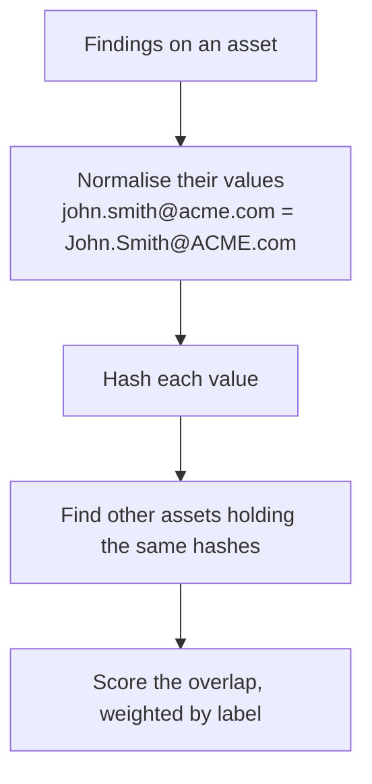

# How Matching Works

Every pair in the queue got there for one of four reasons. Each is a different
kind of claim with a different strength, so they are kept apart rather than
blended into a single "similarity" number.

| Family | Shown as | The claim |
|---|---|---|
| `SHARED_LABELS` | **Shared values** | These two assets contain the same concrete values |
| `PHONETIC` | **Similar spelling** | Their name-like values sound the same, spelled differently |
| `IDENTICAL_CONTENT` | **Identical content** | The same bytes, twice |
| `NEAR_DUPLICATE_TEXT` | **Repeated text** | Different words, same meaning |

---

## 1. Shared values — the weighted overlap

This is the main engine, and it is deliberately **deterministic and
explainable**. Two assets are linked because they demonstrably contain the same
values, and you can always see which ones.

### Normalising

A value is normalised before it counts, so trivial differences don't break a
match: emails are lowercased and trimmed, phone numbers reduced to digits and a
country code, names lowercased with runs of whitespace collapsed, URLs stripped
of trailing slashes.

### Weighting

Not every shared value is equally meaningful. Two documents sharing a **country**
tells you nothing; two documents sharing an **IBAN** tells you a great deal. So
each label carries a weight, and the score is a weighted overlap rather than a
count:

| Weight | Labels |
|---|---|
| 6 | `credit_card`, `iban`, `ssn`, `passport` |
| 5 | `national_id`, `email`, `api_key`, `secret` |
| 4 | `phone` |
| 3 | `address` |
| 2 | `person`, `name` |
| 1 | `url`, `domain`, `ip`, `country`, and every custom label |

Those are the shipped defaults. Every one of them is editable, and any label
Classifyre doesn't recognise — including every [custom
detector](/detectors/custom/) — starts at the default weight of 1. See
[Tuning](/duplicates/tuning/).

### The score

The result is a number between **0 and 1**: *the share of the two assets'
available weight that actually matched*.

> A score of **1.00** means every weighted value on both sides matched.
> A score of **0.50** means half the weight in play found a partner.

This is why the score is comparable between very different assets: a tiny record
with two matching values can score higher than a huge document that shares
twenty values out of four hundred, and that is the right answer — the tiny record
really is more likely to be the same thing.

### Values that are too common to mean anything

A value held by thousands of assets is not evidence — it's furniture. Values
above a fan-out ceiling are dropped from matching entirely, because pairing every
asset that contains, say, a standard support email address would produce
thousands of confident, useless matches.

Empty files are excluded from identical-content matching for the same reason.

---

## 2. Similar spelling (phonetic)

`Jon Smyth` and `John Smith` are usually the same person. A hash-based match
never sees that, so name-like values also get a **phonetic** pass: values are
reduced to a phonetic code, and candidates sharing a code are compared with a
string-similarity measure.

Two guards keep this honest:

- **Only name-like labels.** Structured identifiers — emails, phones, IBANs,
  URLs, IPs — are excluded. Their normalised form is already canonical and
  phonetics would only invent false matches.
- **A similarity floor.** Sharing a phonetic code isn't enough on its own
  (`john` and `jane` collide). The pair also has to clear a string-similarity
  threshold, or the match contributes no weight.

Phonetic pairs are filed under their own family so you can judge them as a group
— they're the ones most worth spot-checking.

---

## 3. Identical content

If two assets have the same content hash, they are the same bytes. That is a
stronger and differently-derived claim than "their findings overlap", so it gets
its own relationship type and its own pattern family, and it never overwrites a
value-overlap match.

Patterns in this family are marked **no judgement needed** — confirming them is
bookkeeping, not analysis.

Two limits apply:

- **Empty files are excluded.** Every empty file in a corpus shares one hash;
  grouping them is noise.
- **Very large identical groups are skipped.** A group of thousands of identical
  stub files says nothing about any individual member and would drag them all
  into one useless cluster.

---

## 4. Repeated text (near-duplicate)

A completely different engine. This one comes from the
[semantic layer](/settings/embeddings/): finding content is embedded as a
vector, and passages whose vectors sit close together are grouped as
near-duplicate text — even when they share no literal values at all.

This is what catches **boilerplate**: the confidentiality notice on four hundred
contracts, the template paragraph in every ticket, the standard footer. Those
groups are a real problem, because boilerplate quietly drives value matches
everywhere it appears.

Which is why patterns in this family are marked **rule candidate**: the fix isn't
to judge four hundred pairs, it's to stop the values inside the boilerplate from
driving matches elsewhere. That is one button — see
[Stop matching on these values](/duplicates/patterns/#rule-candidate-stop-matching-on-these-values).

> **This engine needs embeddings.** If no [embedding
> model](/settings/embeddings/) is configured, or the semantic index hasn't been
> built, there are simply no repeated-text patterns in the queue. Nothing else is
> affected.

Two practical notes: near-duplicate groups are found at the **finding** level and
projected onto asset pairs, which is quadratic — a fifty-asset group is 1,225
pairs — so the projection is capped. The pattern row shows the capped count
alongside the true size, so the number on screen is never a lie. And a pair that
already has a shared-value explanation keeps it: the value overlap is the more
actionable of the two.

---

## Clusters

When several assets are linked by strong enough matches, they are grouped into a
**cluster**: a set of assets treated as one thing, even across different systems.

Clusters are built by transitively joining strong pairs, which is powerful and
has one failure mode worth knowing about: **one weak link can chain two unrelated
groups into one cluster.** That's exactly what the
[cluster shape](/duplicates/patterns/#cluster-shapes) and the [split
action](/duplicates/pairs/#split-the-cluster-here) exist to catch.

Every asset belongs to at most one cluster.

---

## What lineage adds

Fingerprint matching and [lineage](/sources/lineage/) come from completely
different places — findings on one side; connector catalogs, query logs and dbt
manifests on the other. Because they don't share a source, combining them
actually adds information.

| Similarity | Lineage | What it means | Priority |
|---|---|---|---|
| High | **Path** | A derived copy. A mart that resembles its source is doing its job. | Low — expected |
| High | **No path** | Convergent duplication. Two teams built the same thing and nothing connects them. | **High — the case worth chasing** |
| High | **Unknown** | We have no lineage for at least one side. A coverage gap, not evidence. | Judge on the values |

Reporting derived copies as if they were problems is the main reason
metadata-only duplicate detection gets ignored. That's why the second row gets
the alarm colour in the app, and why an agent is never allowed to clear it.

> **One important exclusion.** Classifyre's own similarity edges are *not*
> counted as lineage evidence. If they were, every pair in the queue would find
> a "path" to itself and nothing would ever be escalated. Only lineage from
> independent sources counts. See [Lineage as
> evidence](/sources/lineage/#lineage-as-evidence-in-duplicate-review).

---

## When matching runs

Correlation runs automatically after a source finishes ingesting, before the
[autopilot cycle](/investigations/autopilot/), so agents see duplicates that are
already up to date. Repeated scans of the same source are coalesced so a busy
ingest doesn't trigger a recompute per scan.

Changing weights, cutoffs, or exclusions schedules a full re-score, because those
change every number in the queue.

The **review index** — the rollups behind the three levels — is rebuilt as part
of every recompute. If a workspace was scanned before this feature existed, its
queue reads empty until you press **Rebuild** in [Tuning](/duplicates/tuning/);
that rolls up data that was already scanned and does not re-scan anything.
