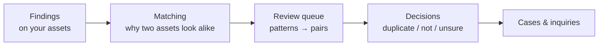
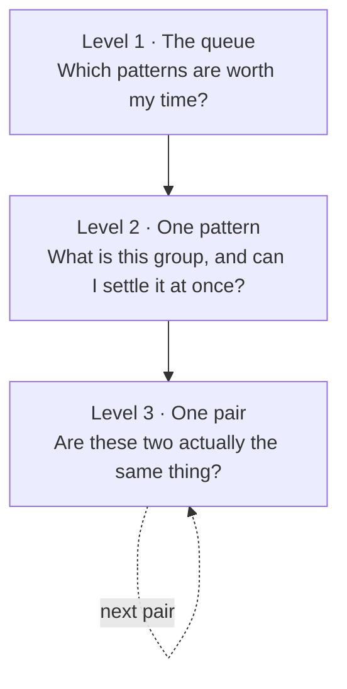

# Duplicate Review

Findings tell you **what** was found. Duplicate review tells you **where the
same thing shows up again** — the customer record that exists in three systems,
the export somebody rebuilt because they couldn't find the first one, the two
tables two teams maintain in parallel without knowing about each other.

You'll find it in the app under **Duplicate review**.

---

## What this is for

Duplicate detection is easy to build and easy to ignore. Most tools produce a
long list of "these two look similar", every entry needs a human, and the list
regenerates on the next scan. Nobody finishes it, so nobody starts it.

Classifyre is built around three ideas that make the list finishable:

1. **Group by cause, not by pair.** Every match is filed under the *reason* it
   matched — the set of values the two assets had in common. Eighteen thousand
   pairs are usually five or six **patterns**, and the top one is often a
   single normalisation rule.
2. **Say how much each decision is worth.** Every pattern shows how many pairs
   are still undecided, how far one decision reaches, and how much of the
   backlog it would clear.
3. **Separate the boring duplicates from the interesting ones.**
   A copy of a table that sits downstream of its source is *supposed* to look
   like it. Two teams independently building the same thing is not. Classifyre
   uses [lineage](/sources/lineage/) to tell those apart, so the second kind
   surfaces instead of drowning in the first.

---

## The three levels

The queue is a drill-down. Each level answers one question and ends in an
action, so you always know where you are and what's left.

| Level | Screen | Answers | Read next |
|---|---|---|---|
| 1 | **Duplicate review** | How much work is there, where does it come from, which pattern first? | [The Review Queue](/duplicates/review-queue/) |
| 2 | **A pattern** | What made these match, and can one decision settle all of them? | [Patterns](/duplicates/patterns/) |
| 3 | **A pair** | Are these two the same thing, and what's the evidence? | [Reviewing a Pair](/duplicates/pairs/) |
| — | **Decisions** | What did I already judge, and what became of it? | [Decisions](/duplicates/decisions/) |
| — | **Tuning** | Why is it matching like this, and how do I change it? | [Tuning](/duplicates/tuning/) |

---

## The five-minute version

1. Open **Duplicate review**. The big number is **pairs remaining** — undecided
   matches inside your review band.
2. Look at **Where the matches stand**. If almost everything sits above your
   merge cutoff, the matcher is being generous; if almost nothing does, it's
   being strict. You can move the cutoffs later.
3. Pick the top pattern in **Work by pattern**. It's ranked by how much work one
   decision settles, not by size.
4. Read the pattern header. It tells you what kind of decision this is —
   [cutoff candidate, rule candidate, no judgement needed, or needs
   judgement](/duplicates/patterns/#what-kind-of-decision-is-this).
5. Open a pair and press <kbd>c</kbd> or <kbd>r</kbd>. The queue advances on its
   own; keep going until it's empty.
6. Everything you decide lands in [**Decisions**](/duplicates/decisions/), where
   you can turn confirmed duplicates into a [case](/investigations/cases/) or an
   [inquiry](/investigations/inquiry/).

---

## Two engines, one queue

Two completely different things can make two assets look like the same thing,
and both feed the same queue:

| Engine | Matches on | Typical pattern |
|---|---|---|
| **Weighted overlap** | The concrete values inside findings — emails, account numbers, IBANs, names | "These two records are about the same customer" |
| **Near-duplicate text** | Meaning, via [embeddings](/settings/embeddings/) — two passages that say the same thing in different words | "These fifty documents share the same boilerplate paragraph" |

They answer the same question from opposite directions, which is why they share
a screen. See [How Matching Works](/duplicates/how-matching-works/).

---

## Where duplicates go next

A decision is only worth taking if it can go somewhere.

- **Add to case** — the two assets (and optionally their findings) become
  evidence in a [case](/investigations/cases/).
- **Create inquiry** — an [inquiry](/investigations/inquiry/) that keeps
  watching for the same signature, pre-filled with the labels and sources that
  made this pair match.
- **Nowhere, yet** — the common outcome, and a deliberate one. Confirmed
  duplicates that went nowhere are listed on their own in
  [Decisions](/duplicates/decisions/) so you can come back to them.

---

## Related reading

- [How Matching Works](/duplicates/how-matching-works/) — the scoring, in plain terms
- [Every Number Explained](/duplicates/glossary/) — every figure and phrase on these screens
- [Lineage & Relationships](/sources/lineage/) — why a lineage path changes what a duplicate means
- [AI Agents & Duplicates](/duplicates/ai-agents/) — what the harness does here, and what it deliberately doesn't
