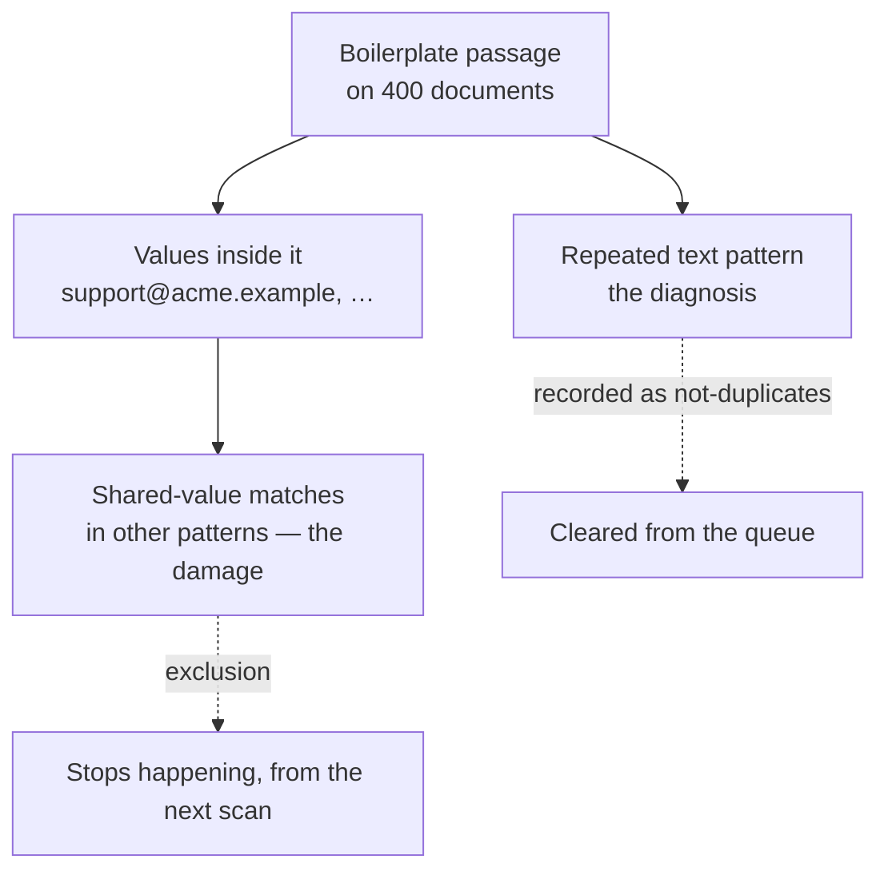

# Patterns

A **pattern** is a group of matched pairs that all matched for the *same reason*
— the same set of value labels, produced by the same engine.

> `email + person` is a pattern. So is `iban`. So is `boilerplate:4f2a91c0`.

Patterns exist because the alternative doesn't work. Eighteen thousand pairs is
unusable however you sort it; the same corpus is five or six patterns, and the
top one is usually a single rule someone can write in an afternoon.

---

## The header

The coloured block at the top of a pattern is the summary, and its **colour is
information**:

| Colour | Means |
|---|---|
| **Red** — *Worth chasing* | A fifth or more of these matches are similar with **no lineage path** between them. Two teams appear to have built the same thing independently. |
| **Black** | A straightforward rule — a cutoff or an exclusion. |
| **Grey** | An ordinary judgement call, one pair at a time. |

Under it are four figures that describe what a bulk action would do **right
now**, under your current cutoffs and filters:

| Figure | Meaning |
|---|---|
| **pairs** | Undecided pairs in this pattern, inside the band |
| **clusters** | Distinct clusters those pairs touch |
| **assets** | Distinct assets involved |
| **After / Before** | Total pairs remaining across the whole workspace, before and after |

**After / Before** is the honest measure of leverage. A pattern that takes 8,400
off a backlog of 12,000 is worth doing first, whatever else the page says.

These numbers move as you drag the cutoffs on the queue screen. They are live,
not a preview dialog — there's nothing here to configure, only a consequence to
read.

---

## What kind of decision is this?

Every pattern is classified by what kind of fix it admits. This is the single
most useful line on the screen, because it tells you whether to reach for the
tuning screen or the pair queue.

| Rule kind | Reads as | What it means | What to do |
|---|---|---|---|
| `MERGE` | **no judgement needed** | Byte-identical content | Confirm the lot. There is nothing to decide. |
| `EXCLUSION` | **rule candidate** | Shared boilerplate is doing the matching | Don't grind the pairs — press **Stop matching on these values**. See [below](#rule-candidate-stop-matching-on-these-values). |
| `THRESHOLD` | **cutoff candidate** | These labels match closely and consistently (average weight ≥ 0.85) | A **cutoff** decision, not a per-pair one. Set the merge cutoff and move on. |
| `JUDGEMENT` | **needs judgement** | The labels overlap but the rest doesn't agree | Genuinely per-pair. Open pairs and work them. |

### "Rule candidate": Stop matching on these values

The primary button on a boilerplate pattern, and the one place in the app where
a single click writes instance-wide configuration. It's worth understanding
exactly what it does, because the thing it fixes is **not** the pattern you're
looking at.

A repeated-text pattern is a **diagnosis, not the damage.** Its own pairs come
from [embedding similarity](/duplicates/how-matching-works/#4-repeated-text-near-duplicate)
— "these two documents contain the same passage" — and no exclusion will make
those go away.

The damage is second-order. The template *contains findings*: the mailbox in a
signature block, the address in a footer, the company name in a legal notice.
Those values then produce **shared-value matches between every document carrying
the template**, and those matches live in completely different patterns. That's
what the exclusion removes.

So the dialog does two things at once:

1. **Writes an exclusion rule per value you tick.** Those values stop being
   indexed for matching everywhere, permanently, from the next scan.
2. **Records *Not a duplicate* on the pattern's own pairs** — because assets
   that matched on shared template text are, by definition, not the same thing.
   That also stops later scans re-clustering them.

Before you press it, the dialog tells you:

| Figure | Meaning |
|---|---|
| **The values themselves** | Every value that would stop matching, with its label. You approve a list, not a promise. |
| **in *n* assets** | How many assets hold that value — how far excluding it reaches |
| **matched pairs in other patterns** | The matches the template is actually driving. **This is the number the action changes.** |

Values held by only a single asset are filtered out — those aren't boilerplate.
Everything is ticked by default; untick anything you'd rather keep, such as a
value that is genuinely identifying and only happens to appear in the template
too.

The whole thing is one entry in the **undo log**, and undoing it removes every
rule it wrote.

> **The blunt version.** Excluding a whole *label* — "this detector's output is
> useless for matching" — is a different and much wider decision, so it lives on
> the [tuning screen](/duplicates/tuning/#exclusions) rather than behind a
> one-click button here.

### "Cutoff candidate" in practice

A cutoff candidate is a pattern where the score is doing its job: matches are
tight and consistent, so *where you draw the line* is the only real question. The
right move is to go back to the [histogram](/duplicates/review-queue/#score-distribution-and-the-two-cutoffs),
put the merge cutoff above this pattern's mass, and save. Every pair above it
stops needing a person — permanently, not just this once.

### "Needs judgement" in practice

The opposite. Some strong signal is present but contradicted by the rest of the
evidence — the same person's name on two genuinely different documents, say. No
threshold separates these, so the honest answer is to look at them. Sample a
dozen pairs first: if they're all the same mistake, the real fix is usually a
[weight change or an exclusion](/duplicates/tuning/), not four hundred verdicts.

---

## Filtering by lineage

Four buttons narrow the pattern to matches by what [lineage](/sources/lineage/)
says about them:

| Filter | Shows | Why you'd use it |
|---|---|---|
| **All** | Everything | Default |
| **No path** | Both sides have lineage, and nothing connects them | **The interesting cell.** Convergent duplication. |
| **Shared upstream** | One derives from the other, or both from the same place | Verifying that expected redundancy really is expected |
| **Lineage unknown** | We have no lineage for at least one side | Judge on values alone; also a map of your lineage coverage gaps |

> "Lineage unknown" is a statement about *our data*, not about the assets. It
> never counts as evidence in either direction.

---

## Pairs to review

The table of actual work, strongest match first, undecided only.

| Column | What it's for |
|---|---|
| **Pair** | Both asset **names** — not truncated ids. You need to know what you're being asked to look at. |
| **Score** | The [match weight](/duplicates/pairs/#match-weight), 0–1 |
| **Matched on** | Which labels matched |
| **Values that matched** | **The actual shared values.** |
| **Lineage** | Path / no path / unknown |

**Values that matched** is the column that saves the most time. It's the
difference between a distinctive match (`ACME-8871-2205`) and shared furniture
(`support@company.com`) — visible without opening anything.

You can tick rows and **Confirm** them as a batch, or click any row to open the
pair. From there the queue [advances on its
own](/duplicates/pairs/#the-queue-advances).

---

## Clusters in this pattern

The second tab. A **cluster** is a set of assets the engine joined together
transitively — treated as one thing.

This tab is for **sanity-checking the rule above, not for grinding through**. A
cluster far larger than you'd expect almost always means one weak link chained
two unrelated groups together, and that's something you want to know *before*
confirming eight hundred pairs.

| Column | Meaning |
|---|---|
| **Cluster** | Its member count and how many systems it spans |
| **Shape** | Its topology — see below |
| **Undecided** | Pairs left in it |
| **Top score** | Its strongest pair |
| **Labels** | The full label set, not the truncated pattern key |

### Cluster shapes

| Shape | Meaning | Read it as |
|---|---|---|
| **pair** | Just two assets | The simple case |
| **clique** | Every member matches every other | Genuinely one thing. High confidence. |
| **chain** | Matches form a line; **the ends don't match each other** | Suspicious. Transitivity dragged in members that have nothing in common. |
| **partial** | Some members match, others don't | Mixed. Worth opening. |

A **chain** is the classic false cluster: A matches B, B matches C, and A and C
have nothing to do with each other. If a chain's ends are genuinely unrelated,
[split it](/duplicates/pairs/#split-the-cluster-here).

The cluster inherits **the strongest claim any of its pairs makes**: one
unexplained pair is enough to mark the whole cluster worth a look.

At pattern level you may also see **mixed**, which just means the pattern's
clusters aren't all the same shape.

---

## Confirm all in band

The other bulk action — the primary one on every pattern except a boilerplate
one, where [Stop matching on these values](#rule-candidate-stop-matching-on-these-values)
takes the lead.

It records **Confirm** on every undecided pair in this pattern, inside the
current cutoffs and lineage filter.

Before you press it:

- The four header figures tell you exactly what it will touch — including
  **After**, the backlog you'll be left with.
- It only touches **undecided** pairs. Anything already judged is untouched.
- It respects the **lineage filter**. Confirming with **Shared upstream**
  selected is a good habit: you're confirming derived copies, which is the
  boring, safe half.
- It is **reversible** from the **Undo log** button next to it.

> **Undo isn't time travel.** Once the review index has been rebuilt — after any
> scan or recompute — the pairs a batch referred to may have been re-scored or
> re-clustered. Those entries are shown greyed rather than offered and then
> failing. Undo the same day.

---

Next: [Reviewing a Pair](/duplicates/pairs/) — the evidence, the actions, and the shortcuts.
