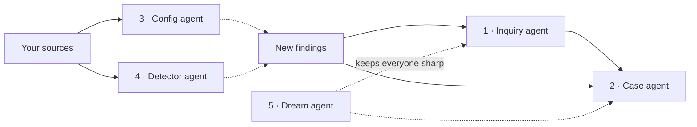
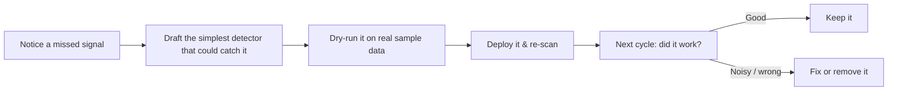

# Meet the Agents

Autopilot is a small crew of specialists rather than one all-knowing model.
Each agent has a single, well-defined job and a clear set of things it is
allowed to change. This is deliberate: narrow agents are predictable, easy to
reason about, and easy to switch on or off one at a time.

Two agents work the **investigation** side (Inquiry and Case), two work the
**detection** side (Config and Detector), and one — Dream — keeps the whole crew
learning. Here is each in turn.

---

## 1 · Inquiry agent — keeps watch

An **inquiry** is a standing question over your findings, e.g. *"Are credentials
leaking through CI logs?"* Once it exists, it keeps matching new findings scan
after scan, so the same problem is tracked instead of re-discovered.

The Inquiry agent keeps that set of standing questions healthy:

| It will | It won't |
|---|---|
| Open a new inquiry when a genuinely new topic appears | Create a near-duplicate of one that already exists |
| Broaden an existing inquiry to catch related findings | Re-create an inquiry you deliberately archived |
| Flag when an inquiry has enough signal to deserve a case | Touch your cases (that's the Case agent's job) |

**Why it matters:** it kills alert fatigue. Instead of a thousand loose
findings, you get a tidy set of questions worth watching.

---

## 2 · Case agent — builds investigations

A **case** is the workspace where an investigation actually happens: evidence,
competing explanations, and a path to a conclusion. The Case agent turns
matched findings into that structured work.

In a single run it can:

- **Open a case** when a coherent investigation is warranted — with a title,
  severity, and the inquiries that drive it.
- **Draft hypotheses** — competing explanations for what happened ("leak via CI
  logs" vs "stale data export").
- **Attach evidence and findings**, and **link** each piece to the hypothesis it
  supports or contradicts.
- **Add notes**, connect related items on the case graph, and **update status**
  (including closing a case when it's resolved).

> The Case agent is deliberately conservative: it would rather enrich an open
> case than spin up a thin new one. You always get the final say on a
> hypothesis — Autopilot proposes, your team confirms or rejects.

---

## 3 · Config agent — tunes your sources

A source can be connected correctly and still produce **nothing** — usually
because no detectors are switched on for it, or the ones that are switched on
are too noisy. The Config agent fixes that by adjusting each source's
**editable settings** (which detectors run, how much data is sampled, resource
limits). It never touches connection credentials.

Its signature move is the **cold start**:

```mermaid
stateDiagram-v2
    direction LR
    [*] --> Silent: Source has data but no findings
    Silent --> LookAtData: Profile the assets — what kind of data is this?
    LookAtData --> EnableDetectors: Switch on the detectors that fit
    EnableDetectors --> Rescan: Re-scan so it takes effect
    Rescan --> CheckBack: A later run confirms it helped
    CheckBack --> [*]
```

So a source that's been sitting silent — say a document store nobody enabled
secret-scanning on — gets profiled, gets the right detector packs turned on, and
starts producing evidence. The agent writes down what it changed and *expected*,
then a later run checks whether reality matched.

**Why it matters:** getting a silent source to produce its first finding is just
as valuable as quieting a noisy one — and you didn't have to configure either.

---

## 4 · Detector agent — writes new detectors

Sometimes the right detector simply doesn't exist yet. The Detector agent closes
that gap by authoring a **brand-new custom detector**, treating it as a tested
hypothesis rather than a guess.

It works one careful loop at a time:

It picks the **simplest tool that fits** the signal — a plain pattern rule for
something like an account number, or a smarter model-based detector for fuzzier
language — and only ever adds **one** new detector per cycle, so changes stay
easy to follow. Crucially, it comes back in a later run to check the detector's
real-world results before calling it done.

> Authoring a detector with the Detector agent requires an **AI provider** to be
> configured. See [Steering & Fine-Tuning](/flow/investigations/autopilot/steering/).

You can read more about the kinds of detectors it can build on the
[Detectors](/detectors/) pages.

---

## 5 · Dream agent — learns and tidies up

The other four agents act on your data. The **Dream agent** acts on Autopilot
*itself*. On a quiet schedule it "dreams": it reviews everything the crew has
learned, removes duplicates and noise, sharpens vague notes into crisp lessons,
and rewrites the **System Brief** so it stays a short, accurate picture of your
instance.

| The Dream agent does | The Dream agent never |
|---|---|
| Merge and de-duplicate memory entries | Change your inquiries or cases |
| Distil long, rambling notes into clear lessons | Delete instructions *you* gave it |
| Refresh the System Brief's overview | Touch sources or detectors |

**Why it matters:** without housekeeping, an agent's memory drifts and bloats.
Dreaming keeps Autopilot's knowledge of your world coherent — so it gets *better*
over time, not noisier. Learn more in
[Memory & System Brief](/flow/investigations/autopilot/memory/).

---

## At a glance

| Agent | Side | Acts on | Switched on with |
|---|---|---|---|
| **Inquiry** | Investigation | Inquiries | Inquiry toggle |
| **Case** | Investigation | Cases, hypotheses, evidence | Case toggle |
| **Config** | Detection | Source settings | Config toggle |
| **Detector** | Detection | Custom detectors | Detector toggle (needs AI provider) |
| **Dream** | Learning | Memory & System Brief | Always on, runs on a schedule |

Next: see how these agents are triggered and what a single run looks like in
**[How a Cycle Runs](/flow/investigations/autopilot/cycle/)**.
