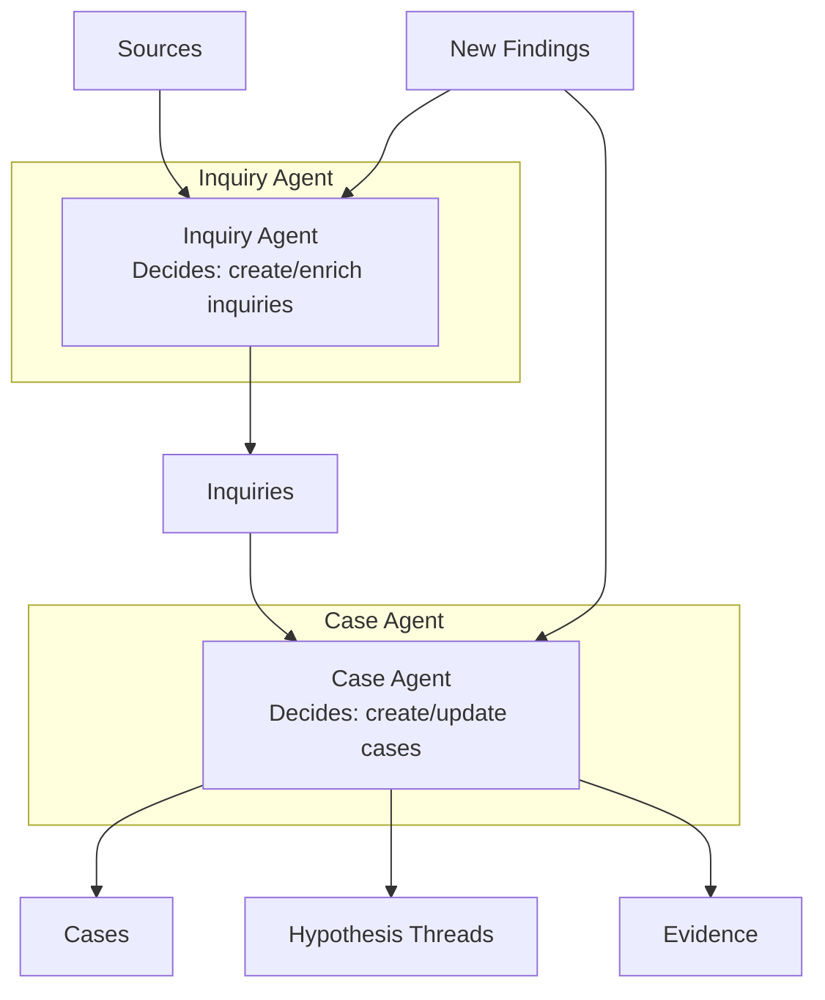
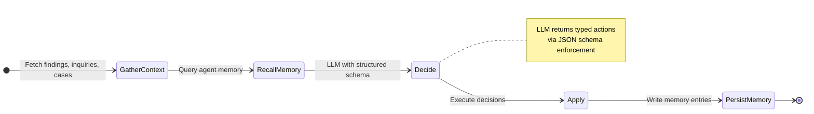
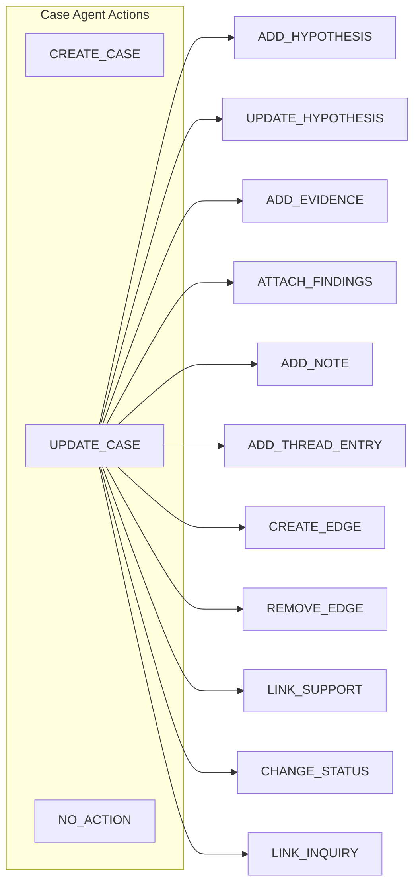
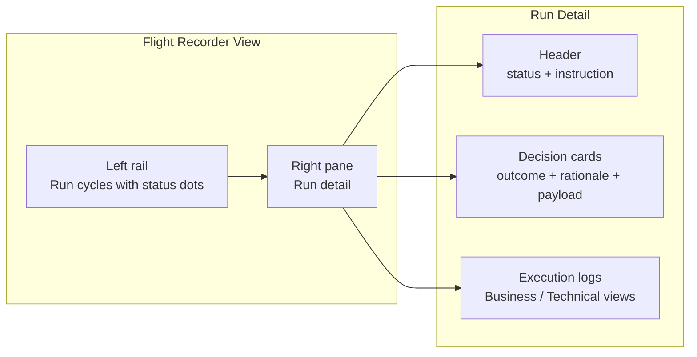

# Autopilot

The autopilot system runs **AI agents** that operate autonomously on the
investigation pipeline. Two specialised agents — the **Inquiry Agent** and
the **Case Agent** — monitor findings, decide whether to create or update
inquiries and cases, and execute those decisions without manual intervention.

## Decision pipeline

Both agents follow the same pipeline:

1. **Gather context** — Fetch relevant findings, inquiries, cases, and
   archived items from the database.
2. **Recall memory** — Query the agent's long-term memory for glossary
   definitions, decision precedents, and the topic-to-inquiry map.
3. **Decide** — Call the LLM with a structured output schema to produce a
   list of actions.
4. **Apply** — Execute the decisions via the `DecisionApplierService`.
5. **Persist memory** — Write new memory entries from the cycle for future
   reference.

## Inquiry Agent

The Inquiry Agent monitors findings and decides on inquiry management:

| Action | Description |
|---|---|
| `CREATE_INQUIRY` | Create a new inquiry with generated matchers for a topic |
| `UPDATE_INQUIRY` | Update an existing inquiry's matchers |
| `ENRICH_INQUIRY_MATCHERS` | Union new matcher criteria into existing inquiry |
| `SIGNAL_CASE_READY` | Flag that an inquiry has enough signal to warrant a case |
| `NO_ACTION` | Nothing needs to change |

The agent is controlled by instance settings:

| Setting | Purpose |
|---|---|
| `autopilotInquiryEnabled` | Master toggle |
| `autopilotInquiryDesired` | Operator guidance on what to investigate |
| `autopilotInquirySearchable` | What data/topics are worth matching |

## Case Agent

The Case Agent monitors inquiries and findings, and decides on case
management. It has two top-level actions, one with many sub-operations:

### `CREATE_CASE`
Creates a new case automatically, including:
- Setting title, description, severity, and driving inquiries
- Pulling selected matches as initial evidence

### `UPDATE_CASE`
Applies one or more sub-operations on an existing case:

| Sub-operation | Description |
|---|---|
| `ADD_HYPOTHESIS` | Propose a new hypothesis thread |
| `UPDATE_HYPOTHESIS` | Change status, confidence, or statement |
| `ADD_EVIDENCE` | Attach an asset as evidence |
| `ATTACH_FINDINGS` | Attach findings to evidence |
| `ADD_NOTE` | Add a note to a case or thread |
| `ADD_THREAD_ENTRY` | Add a statement to an existing thread |
| `CREATE_EDGE` | Create a manual graph edge |
| `REMOVE_EDGE` | Remove a graph edge |
| `LINK_SUPPORT` | Link evidence/finding to a hypothesis |
| `CHANGE_STATUS` | Change case status (e.g. close when resolved) |
| `LINK_INQUIRY` | Link an inquiry to the case |

### `NO_ACTION`
Nothing needs to change.

## Memory system

The agent memory is a persistent store of three kinds:

| Kind | Purpose |
|---|---|
| **Glossary** | Domain-specific term definitions |
| **Precedents** | Past decision patterns and their outcomes |
| **Topic Map** | Mapping of topics to existing inquiries |

Memory entries have:
- **Key** — Unique identifier
- **Content** — Free-text value
- **Weight** — Multiplier for relevance scoring (higher = more important)
- **Tags** — Categorisation tags

The memory can be viewed and edited in the Autopilot panel under the
"Memory" tab, with search and inline editing.

## Flight recorder

The Autopilot panel includes a **flight recorder** that shows all autopilot
run cycles:

- **Left rail** — Lists all autopilot cycles with status dots (success,
  failure, running), summaries, and timestamps.
- **Decision cards** — Each decision shows its outcome badge (applied /
  observe-only / failed), action label, rationale text, and expandable
  JSON payload.
- **Execution logs** — Dual-channel view: **Business narrative** (plain
  English summary) and **Technical logs** (terminal-style rendering with
  expandable JSON, level-coloured output).
- **Live polling** — While a cycle is running, the view auto-polls for
  updates.

## Manual runs

A dialog allows manual triggering of an autopilot cycle:

- **General mode** — Optional instruction, agent selector (Both / Inquiry
  only / Case only), scope selector (all sources or a specific source).
- **Case-focused mode** — Simplified UI scoped to one specific case.
