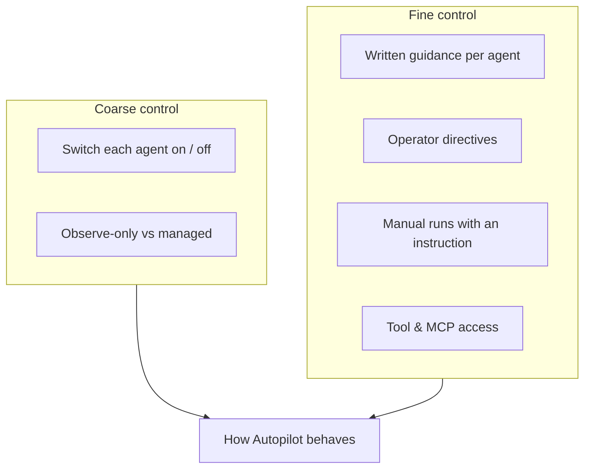
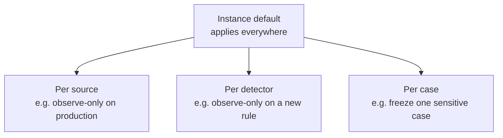

# Steering & Fine-Tuning

Autopilot is meant to fit *your* operation, not the other way round. This page
covers every way to shape what it does — from a single on/off switch to giving
each agent written guidance and connecting your own tools.

Everything here lives in the **Harness** panel and in **Settings**.

---

## 1 · Switch agents on or off

Every agent is **off by default**. You turn on exactly the ones you want, one at
a time — there's no all-or-nothing switch. A common path is to start with the
Inquiry agent, get comfortable, then add the Case agent, and so on.

| Agent | Turn it on when you want Autopilot to… |
|---|---|
| **Inquiry** | Keep standing questions tidy and up to date |
| **Case** | Build and maintain investigation cases for you |
| **Config** | Tune source detectors and wake up silent sources |
| **Detector** | Author new custom detectors (needs an AI provider) |

> The **Dream agent** has no on/off switch — its housekeeping is always on and
> runs on a quiet schedule. It never changes your inquiries, cases, sources, or
> detectors, so it's safe to leave running.

---

## 2 · Choose observe-only or managed

For each thing Autopilot can touch, you choose how much rope it gets:

| Mode | What it means |
|---|---|
| **Managed** | The agent may make changes directly. |
| **Observe-only** | The agent may look and *propose*, but never change anything. Proposals show up in the Flight Recorder. |
| **Inherit** | Follow the instance-wide default (the usual setting for individual items). |

You can set this at three levels, from broad to specific:

The more specific setting wins. So you can run the whole instance in *managed*
mode but pin your most sensitive source to *observe-only* — or the reverse.

> **A good rollout:** start instance-wide in observe-only, read Autopilot's
> proposals for a few cycles, then switch the areas you trust over to managed.

---

## 3 · Give each agent written guidance

Toggles decide *whether* an agent runs; **guidance** shapes *how* it behaves.
Each agent has a plain-text field where you describe your priorities in your own
words — no special syntax, just write what you'd tell a new analyst.

| Agent | Guidance you can give | Example |
|---|---|---|
| **Inquiry** | What's worth investigating, and what data/topics are worth matching | *"Prioritise credential and PII exposure. Ignore internal demo data."* |
| **Case** | How to build and prioritise cases | *"Open cases only for production systems. Always propose at least two hypotheses."* |
| **Config** | How aggressively to tune sources | *"Prefer precision over recall on customer-facing sources."* |
| **Detector** | What kinds of detectors to favour | *"Focus on financial identifiers used in our EU regions."* |

Guidance is the everyday way to fine-tune Autopilot. It applies to that agent on
every run.

---

## 4 · Set standing rules with operator directives

For permanent policy — rules that should *always* apply and never be forgotten —
use **operator directives** (managed under the **Memory** tab). Unlike ordinary
learned notes, the Dream agent never prunes or rewrites these, so they stick.

Good directives are short and absolute:

- *"Never open cases for the `staging` environment."*
- *"Treat all IBAN findings as high severity."*
- *"Our primary focus is customer-data exposure."*

See [Memory & System Brief](/flow/investigations/autopilot/memory/) for how
directives differ from ordinary memory.

---

## 5 · Run it manually and steer a single run

You don't have to wait for a scan. From the Harness panel you can start a run on
demand and point it where you want:

| Option | What it does |
|---|---|
| **Instruction** | A one-line nudge for *this run only*, e.g. *"Look for exfiltration suspects."* |
| **Which agents** | Run the whole crew, or just the agents you pick. |
| **Scope** | Sweep all sources, or focus on one. |
| **Case-focused run** | A simplified run aimed at a single case you're working. |

A manual run reviews **all** of your open data (not just the latest scan's
findings), which makes it the right tool for a deliberate sweep or a focused
question. An instruction is a *temporary* steer; for permanent rules use an
operator directive instead.

---

## 6 · Connect your own tools (advanced)

Out of the box, the agents already have everything they need to read findings and
manage inquiries, cases, sources, and detectors. If you want them to reach
*your* systems too, you can connect external tools using the **Model Context
Protocol (MCP)**.

- Register an MCP server under the relevant Settings page, and its tools become
  available to Autopilot.
- You can scope which agents may use which tools, so — for example — only the
  Case agent can call an internal enrichment service.
- Every external tool call is gated and logged exactly like a built-in one,
  including observe-only enforcement.

See the [MCP Server settings](/settings/mcp-server/) for setup details.

---

## Don't forget the AI provider

The agents that reason with a language model — most importantly the **Detector**
agent — need an **AI provider** configured. If you've enabled an agent and it
isn't doing anything, the **Setup** section of the System Brief will usually flag
a missing provider as the reason.

Configure one under [AI Providers](/settings/ai-providers/).

---

## Quick reference

| You want to… | Use this |
|---|---|
| Stop or start an agent entirely | Its **on/off toggle** |
| Let it propose but not change things | **Observe-only** (instance, source, detector, or case) |
| Shape how an agent behaves every run | That agent's **guidance** field |
| Set a permanent, never-forgotten rule | An **operator directive** (Memory tab) |
| Aim it at something right now | A **manual run** with an instruction |
| Give it access to your own systems | An **MCP** tool connection |

Next: see exactly what Autopilot did and why in
**[Flight Recorder & Audit](/flow/investigations/autopilot/flight-recorder/)**.
