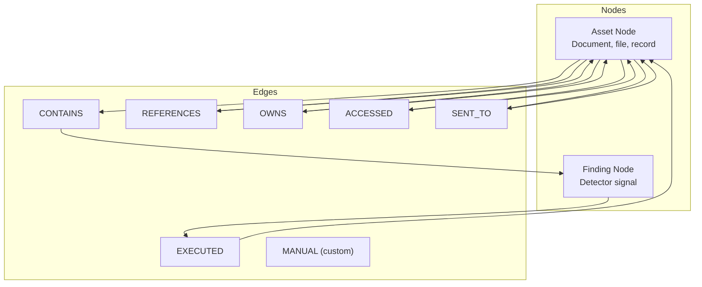
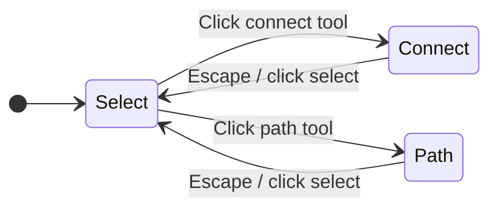

# Graph

The knowledge graph is the **primary visual investigation tool** in a case
workspace. It renders entities (assets and findings) as nodes in a
force-directed layout, with edges representing relationships detected across
your data. Evidence overlay, hypothesis colouring, and three interaction
modes let you navigate complex relationships.



## Node types

| Type | Visual | Description |
|---|---|---|
| **Asset** | Rectangle with asset-type icon | A document, file, database record, or other source entity |
| **Finding** | Coloured circle with category code | A detector signal (SECRETS, PII, YARA, etc.) — circle colour encodes severity |

## Edge types

Edges have an **origin** that determines how they were created:

| Origin | Description |
|---|---|
| **SOURCE_DERIVED** | Extracted from source metadata during ingestion (e.g. a Confluence page hierarchy) |
| **INFERRED** | Computed by the graph engine based on shared properties (e.g. same asset referenced in two places) |
| **MANUAL** | Created by the investigator via the UI context menu or API |

Relation types include: `CONTAINS`, `REFERENCES`, `OWNS`, `ACCESSED`,
`READS`, `WRITES`, `GENERATED_FROM`, `EXPORTED_TO`, `ATTACHED_TO`,
`SENT_TO`, `EXECUTED`, `MENTIONS`, plus custom relation types.

## Interaction modes



| Mode | What it does |
|---|---|
| **Select** | Click a node to inspect it (detail panel opens). Click an edge to see its properties. Drag nodes to reposition (pins them). Background drag to pan. |
| **Connect** | Click a source node, then a target node — creates a manual edge between them with a chosen relation type. |
| **Find Path** | Click two nodes — BFS computes the shortest path through the visible graph and highlights it in acid green. |

## Visual indicators

Nodes and edges carry a rich set of visual indicators:

- **Evidence ring** — Nodes that are attached as evidence get an acid-green
  outer ring.
- **Hypothesis dots** — Small coloured dots on the node perimeter show which
  hypotheses this node is linked to, with the hypothesis colour.
- **Cross-hypothesis ring** — A dashed purple ring appears when a node is
  linked to multiple hypotheses.
- **Collapsed findings** — Asset nodes with many findings show a "**+N**"
  chip; clicking it collapses/expands the findings.
- **Path highlight** — Edges on the shortest path between two selected nodes
  are rendered in acid green.
- **Edge labels** — Relation type text rendered at the midpoint of each edge.
- **Arrow markers** — Directional arrows on edges (colour-coded by type).

## Pivot queries

The graph supports **Palantir-style pivot questions** — named queries that
expand the graph around a selected node:

| Pivot | Traversal |
|---|---|
| **Who touched** | Incoming ACCESSED / READS / EXECUTED / WRITES |
| **Upstream lineage** | Incoming GENERATED_FROM / READS / OWNS |
| **Downstream lineage** | Outgoing GENERATED_FROM / EXPORTED_TO / WRITES |
| **Access** | Both-direction OWNS / ACCESSED / READS / WRITES |
| **Emails** | Both-direction ATTACHED_TO / SENT_TO / MENTIONS |
| **Similar findings** | Both-direction CONTAINS |

## Context menu

Right-clicking a node or edge opens a context menu:

**Node menu:**
- Add/remove evidence
- Attach/unlink finding
- Link to hypothesis (with quick stance buttons for each hypothesis)
- Connect from here (switches to connect mode)
- Find path to (switches to path mode)
- Collapse/expand findings
- Load related entities (expand graph)
- Review unattached findings
- Release pin
- Open asset/finding in detail view

**Edge menu:**
- Rename relation type (manual edges only)
- Delete edge (manual edges only)
- Read-only notice for SOURCE_DERIVED / INFERRED edges

## Sidebar panels

| Panel | Content |
|---|---|
| **Hypothesis legend** | All hypotheses with colour dot, status badge, confidence, for/against counts. Focus toggle highlights that hypothesis's linked nodes. "New hypothesis" button. |
| **Highlight filters** | Multi-select filters by source and detector type. Dims non-matching nodes/edges. |
| **Edge type filters** | Toggle visibility per edge relation type. |
| **Graph legend & stats** | Visual legend (node shapes, colours) + live counts: assets, findings, evidence items, edges. |

## API

`GET /cases/:id/graph` returns the evidence neighbourhood for a case:

```json
{
  "nodes": [
    { "id": "ast_...", "type": "asset", "label": "report.pdf", "severity": "critical" },
    { "id": "fnd_...", "type": "finding", "label": "API key detected", "severity": "critical" }
  ],
  "edges": [
    { "id": "e_...", "source": "ast_...", "target": "fnd_...",
      "relationType": "CONTAINS", "origin": "SOURCE_DERIVED" }
  ]
}
```

Graph expansion is done via `POST /graph/expand` (recursive traversal from a
seed entity) and `POST /graph/pivot` (named pivot questions).

The graph UI uses a custom `useForceLayout` hook wrapping d3-force for
physics simulation, and `usePanZoom` for SVG pan and zoom. New nodes are
positioned using `seedPosition` — near their connected neighbour or jittered
near the canvas centre.
