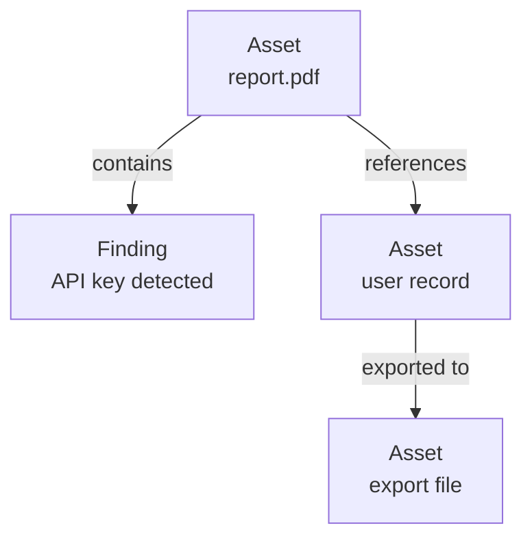
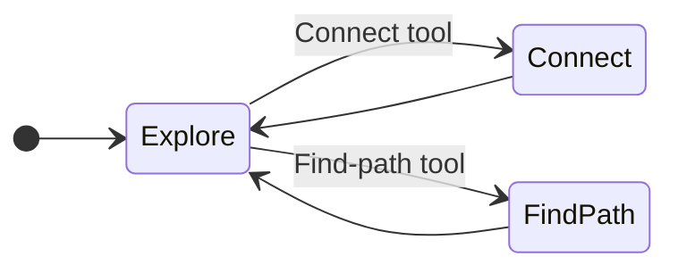

# Graph

The knowledge graph is the **visual investigation tool** at the centre of a case.
It draws your assets and findings as connected nodes, with the relationships
between them as links, so you can *see* how things relate instead of reading down
a table. It's where a tangle of findings becomes a picture you can reason about.

---

## What's on the graph

| Node | Represents |
|---|---|
| **Asset** | A document, file, record, or other item from a source — shown with its type icon |
| **Finding** | A signal a detector raised — shown as a coloured dot, where the colour is its severity |

Nodes are joined by **relationships** — "contains," "references," "owns,"
"accessed," "sent to," and more. Each relationship comes from one of three
places, so you always know how sure to be of it:

| Where it came from | Meaning |
|---|---|
| **From the source** | Discovered in the source itself during scanning (e.g. a page hierarchy) |
| **Inferred** | Worked out by Classifyre from things the items share (e.g. the same value in two places) |
| **Manual** | Drawn by you, to capture a connection you know about |

---

## Exploring

The graph has three simple modes for working with it:

| Mode | What it does |
|---|---|
| **Explore** | Click a node to inspect it, drag to rearrange, and pan around the canvas. |
| **Connect** | Click one node, then another, to draw a relationship between them. |
| **Find path** | Pick two nodes and the graph highlights the shortest chain of relationships linking them. |

You can also **expand** the graph outward from any node to pull in its related
items, growing the picture as your investigation widens.

---

## Visual cues

The graph encodes a lot at a glance:

- **Evidence ring** — items attached as evidence are circled, so case evidence
  stands out from surrounding context.
- **Hypothesis dots** — small coloured marks show which
  [hypotheses](/flow/investigations/cases/hypothesis/) a node is linked to, in
  each hypothesis's colour.
- **Cross-hypothesis marker** — a node tied to more than one hypothesis is
  flagged, so contested evidence is easy to spot.
- **Grouped findings** — an asset with many findings shows a compact "+N" badge
  you can expand when you want the detail.
- **Highlighted path** — the chain between two nodes you're tracing is picked out
  clearly.

---

## Asking questions of the graph

Rather than clicking around manually, you can ask the graph **focused questions**
that expand it along meaningful relationships:

| Question | Shows you |
|---|---|
| **Who touched this?** | Who or what accessed, read, or ran the item |
| **Where did it come from?** | The upstream lineage that produced it |
| **Where did it go?** | The downstream lineage it fed into |
| **Who has access?** | Ownership and access relationships |
| **Email trail** | Who it was sent to or mentioned with |
| **Similar findings** | Other items carrying the same kind of signal |

These turn the graph into an investigative interview: ask a question, and the
relevant relationships light up.

---

## Working directly on the graph

Right-click any node or relationship to act on it without leaving the graph — add
or remove evidence, attach a finding, link a node to a hypothesis (for or
against), draw or trace a connection, expand to related items, or open the item's
full detail. Relationships you drew yourself can be renamed or deleted;
relationships that came from the source or were inferred are read-only, so the
underlying truth isn't accidentally rewritten.

---

## Side panels

A few panels keep the big picture in view while you work:

| Panel | Helps you |
|---|---|
| **Hypotheses** | See every hypothesis with its verdict, confidence, and for/against count — and spotlight the evidence linked to one |
| **Highlight filters** | Dim everything except the sources or detectors you care about |
| **Relationship filters** | Show or hide specific kinds of connection |
| **Legend & stats** | A key to the shapes and colours, plus live counts of assets, findings, evidence, and links |

Together they let you move from a wide view of the whole case down to the single
relationship that cracks it.
