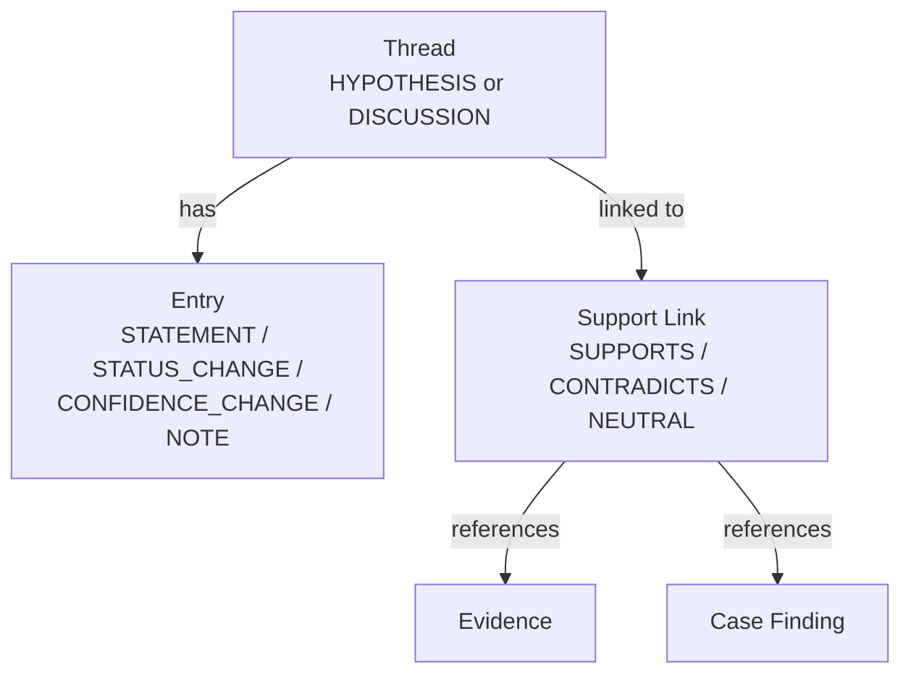
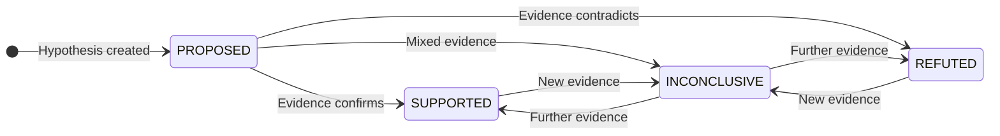

# Hypothesis & Threads

Threads are the structured discussion system inside a case. They come in two
flavours: **hypotheses** (investigation theories with verdict and confidence
tracking) and **discussions** (free-form debrief notes).

## Hypothesis lifecycle

| Status | Description |
|---|---|
| **PROPOSED** | Initial state — hypothesis stated but not yet tested |
| **SUPPORTED** | Evidence consistently supports the hypothesis |
| **REFUTED** | Evidence consistently contradicts the hypothesis |
| **INCONCLUSIVE** | Mixed or insufficient evidence |

## Confidence scoring

Each hypothesis carries a **confidence** score (0.0 – 1.0) that captures the
investigator's certainty. The score is set manually via the UI confidence
slider and is independent of the status — you can have a SUPPORTED hypothesis
at 0.5 confidence or a REFUTED one at 0.9.

## Support links

Evidence and case findings can be linked to a hypothesis with a specific
**stance**:

| Stance | Meaning |
|---|---|
| **SUPPORTS** | This evidence/finding backs the hypothesis |
| **CONTRADICTS** | This evidence/finding opposes the hypothesis |
| **NEUTRAL** | Contextual but not directional |

The threads panel in the UI shows a for/against count per hypothesis, and
the linked items are rendered with colour-coded stances in the detail pane.

## Thread entries

Thread entries form the audit trail of a hypothesis or discussion:

| Entry type | Description |
|---|---|
| **STATEMENT** | A free-form note or observation |
| **STATUS_CHANGE** | Record of a verdict change (auto-generated) |
| **CONFIDENCE_CHANGE** | Record of a confidence change (auto-generated) |
| **NOTE** | A comment on the thread |

Entries are cursor-paginated and recorded with an optional actor reference.

## UI layout

The threads UI has a two-panel layout:

- **Left rail** — Lists all threads grouped by type (Hypotheses at top,
  Discussions below). Each hypothesis shows its colour dot, verdict badge,
  and for/against support counts.
- **Detail pane** — The selected thread's detail: linked evidence with
  stance, editable verdict (dropdown) and confidence (slider), colour
  picker, entry history feed, and a note composer (Cmd+Enter to send).
