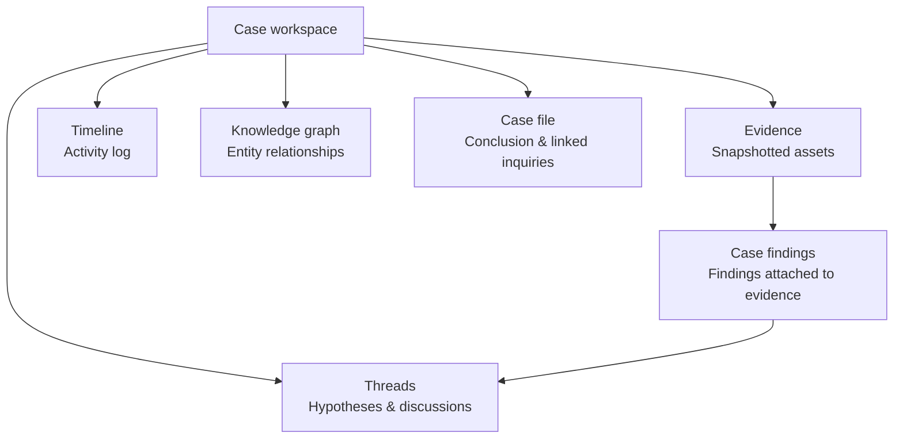
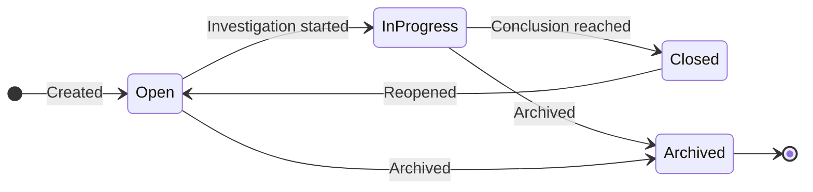

# Cases

A case is a structured **investigation workspace**. It collects **evidence**
(snapshotted assets with their findings), organises **hypotheses** as threaded
discussions, and works toward a written **conclusion**. Where findings are raw
signals, a case is the place you actually figure out what happened and what to do
about it.

---

## The workspace

A case is organised into a few views, each for a different part of the work:

| View | What you do there |
|---|---|
| **[Graph](/flow/investigations/cases/graph/)** | Explore how assets and findings connect, visually |
| **Evidence** | Review the snapshotted assets and their findings; add notes; attach or detach items |
| **[Threads](/flow/investigations/cases/hypothesis/)** | Propose hypotheses, link the evidence for and against them, and discuss |
| **[Timeline](/flow/investigations/cases/timeline/)** | See everything that has happened in the case, in order |
| **Case file** | Write the conclusion, manage linked inquiries, and close or reopen the case |

---

## Status lifecycle

| Status | Meaning |
|---|---|
| **Open** | Created, awaiting action |
| **In progress** | Actively being investigated |
| **Closed** | Conclusion written, investigation complete |
| **Archived** | No longer active, kept for the record |

---

## Starting a case

There are three ways to open a case, depending on where the work begins:

1. **From an inquiry** — open a case straight from an
   [inquiry](/flow/investigations/inquiry/); it's pre-linked and its current
   matches come in as starting evidence.
2. **From a fingerprint cluster** — in
   [Fingerprints](/flow/investigations/fingerprints/), turn a duplicate or
   similarity cluster into a case; its members come in as evidence.
3. **From scratch** — start a blank case and, optionally, link one or more
   inquiries to seed it with their matches.

---

## Working the evidence

**Evidence** is an asset captured into the case, together with the findings on
it. As you investigate you can:

- **Pull in matches** from a linked inquiry in one click.
- **Add notes** to any piece of evidence or any finding, to capture your
  reasoning.
- **Attach or detach** individual findings as the picture changes.

Evidence is a snapshot, so a case keeps a stable record of what you were looking
at — even as later scans change the underlying data.

---

## Letting Autopilot help

Each case has an **AI mode** that controls whether the
[Autopilot](/flow/investigations/autopilot/) case agent can act on it on its
own, or only observe and propose. You can freeze a sensitive case to
observe-only while letting Autopilot manage the rest — see
[Steering & Fine-Tuning](/flow/investigations/autopilot/steering/) for how
observe-only works at the instance, source, detector, and case level.

---

## Closing a case

Closing a case asks for a written **conclusion** — the answer the investigation
reached. When you close it, its linked inquiries are archived (so they stop
feeding it new matches), the case is marked closed, and the conclusion is
recorded in the [timeline](/flow/investigations/cases/timeline/). You can always
reopen it later if something changes.

---

## Go deeper

| Page | |
|---|---|
| [Hypothesis & Threads](/flow/investigations/cases/hypothesis/) | Propose explanations and test them against evidence |
| [Timeline](/flow/investigations/cases/timeline/) | The complete activity log of a case |
| [Graph](/flow/investigations/cases/graph/) | The visual investigation tool |
