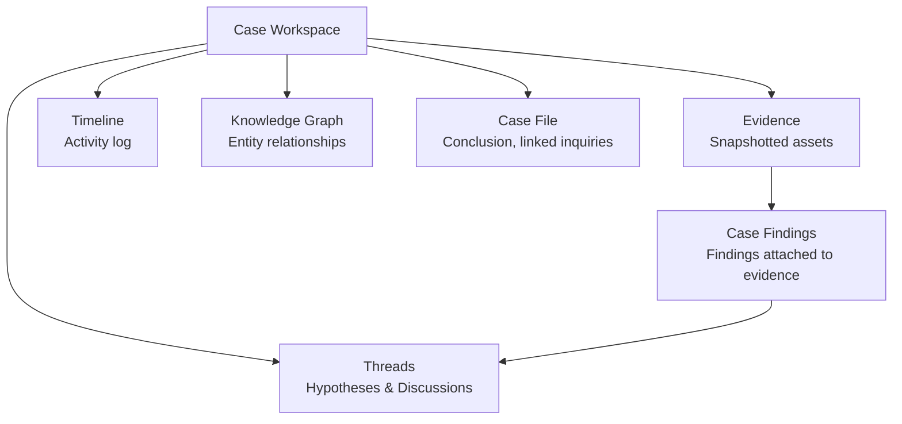
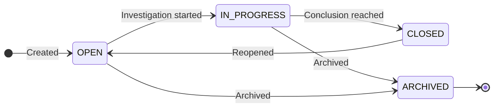

# Cases

A case is a structured investigation workspace. It collects **evidence**
(snapshotted assets with their findings), organises **hypotheses** through
threaded discussions, and produces a **conclusion**.

## Workspace tabs

| Tab | Description |
|---|---|
| **Graph** | Interactive knowledge graph — force-directed layout with entity nodes, evidence rings, hypothesis colouring, and three interaction modes (select, connect, find path) |
| **Evidence** | Table of snapshotted assets with nested findings. Inline note editing, attach/detach, sort and search |
| **Threads** | Hypothesis and discussion threads. Create hypotheses with verdict/confidence, link evidence with stance (SUPPORTS/CONTRADICTS/NEUTRAL), add notes |
| **Timeline** | Cursor-paginated unified activity feed. 20+ event types grouped by day with category filters |
| **Case file** | Conclusion editor, linked inquiries panel, recent activity summary, close/reopen actions |

## Status lifecycle

| Status | Meaning |
|---|---|
| **OPEN** | Case created, awaiting action |
| **IN_PROGRESS** | Actively being investigated |
| **CLOSED** | Conclusion written, investigation complete |
| **ARCHIVED** | No longer active, read-only |

## Creating a case

Cases can be created in two ways:

1. **From an inquiry** — Navigate to an inquiry detail page and click "Open
   new case". The inquiry is pre-linked and its current matches are pulled
   as initial evidence.
2. **Directly** — Use the "New case" button on the investigations page.
   Optionally select one or more driving inquiries and choose which of their
   matches to include as initial evidence.

When creating from the form, the `POST /cases` endpoint creates the case and
optionally links inquiries. Then `POST /cases/:id/pull` is called for each
selected inquiry to copy matching findings into the case. The UI shows
granular toast messages for partial success or failure during this process.

## Evidence management

Evidence is an asset snapshotted into a case. Each evidence row can hold
multiple **case findings** (individual detector signals). Key operations:

- **Attach** — Navigate to `/investigations/[id]/evidence/add?assetId=...`
  to browse the findings table and attach selected findings as evidence.
  Already-attached findings are excluded from the picker.
- **Inline notes** — Each evidence row and finding supports a writable note
  field (auto-saved on blur).
- **Remove** — Detach evidence or individual findings from the case.
- **Pull from inquiry** — One-click pull of all current matches from a
  linked driving inquiry.

## AI mode

Each case has an AI mode setting (INHERIT / ACTIVE / PASSIVE) that controls
whether the autopilot case agent can autonomously operate on this case.

## Closing a case

Closing a case requires a written conclusion. The "Close case" action:

1. Archives all linked inquiries (prevents further match updates).
2. Sets the case status to CLOSED.
3. Records the conclusion in the timeline.
