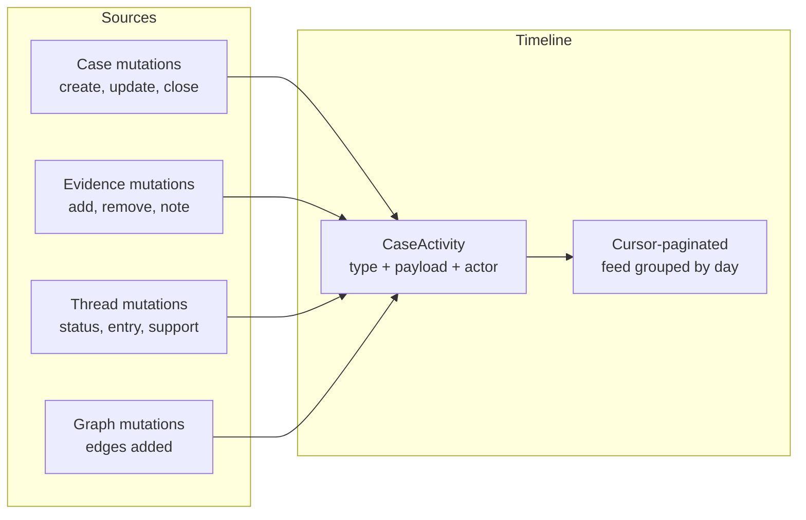

# Timeline

The timeline is a **unified activity feed** for a case. Every meaningful
mutation — from case creation to evidence changes, thread updates, and status
transitions — is recorded as an activity entry with a typed event, JSON
payload, and optional actor reference.



## Activity types

| Category | Activity types |
|---|---|
| **Case** | `CASE_CREATED`, `CASE_UPDATED`, `CASE_CLOSED`, `CASE_REOPENED`, `CASE_DELETED` |
| **Inquiries** | `INQUIRY_LINKED`, `INQUIRY_UNLINKED`, `INQUIRY_PULLED` |
| **Evidence** | `EVIDENCE_ADDED`, `EVIDENCE_REMOVED`, `EVIDENCE_NOTE_UPDATED`, `FINDING_ATTACHED`, `FINDING_DETACHED`, `FINDING_NOTE_UPDATED` |
| **Threads** | `THREAD_CREATED`, `THREAD_STATUS_CHANGED`, `THREAD_CONFIDENCE_CHANGED`, `THREAD_ENTRY_ADDED`, `SUPPORT_LINKED`, `SUPPORT_UNLINKED` |
| **Graph** | `MANUAL_EDGE_CREATED`, `MANUAL_EDGE_DELETED`, `MANUAL_EDGE_RENAMED` |

## UI features

- **Day grouping** — Events are grouped by calendar day with sticky date headers.
- **Type-specific icons** — Each activity type has a dedicated icon and colour
  mapped in the `ACTIVITY_TYPE_CONFIG` constant.
- **Category filters** — Filter the feed by category: All / Case / Inquiries /
  Evidence / Threads.
- **Actor display** — Each event shows the acting user or an AI actor badge.
- **Cursor pagination** — "Load older" button requests the next cursor-based
  page. No page number navigation.
- **Jump-to-day** — A compact day picker lets you skip to a specific date.

## API

`GET /cases/:caseId/timeline` returns the paginated timeline. The response
uses cursor-based pagination (opaque cursor in the response body, passed via
`?cursor=` query parameter).

```json
{
  "items": [
    {
      "type": "EVIDENCE_ADDED",
      "payload": { "evidenceId": "...", "assetLabel": "..." },
      "actor": { "type": "user", "id": "..." },
      "createdAt": "2026-06-12T10:30:00Z"
    }
  ],
  "nextCursor": "eyJpZCI6IjEyMyJ9"
}
```
