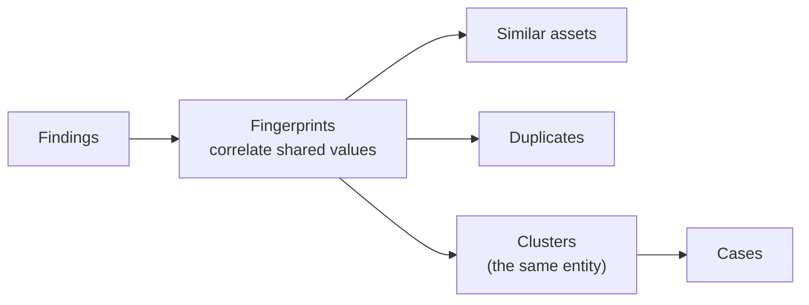
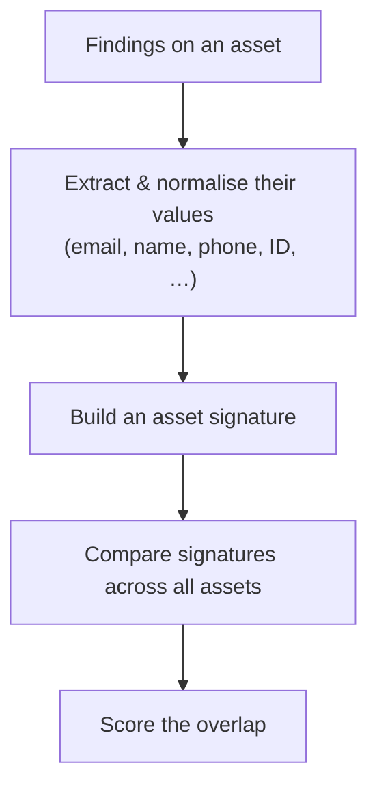
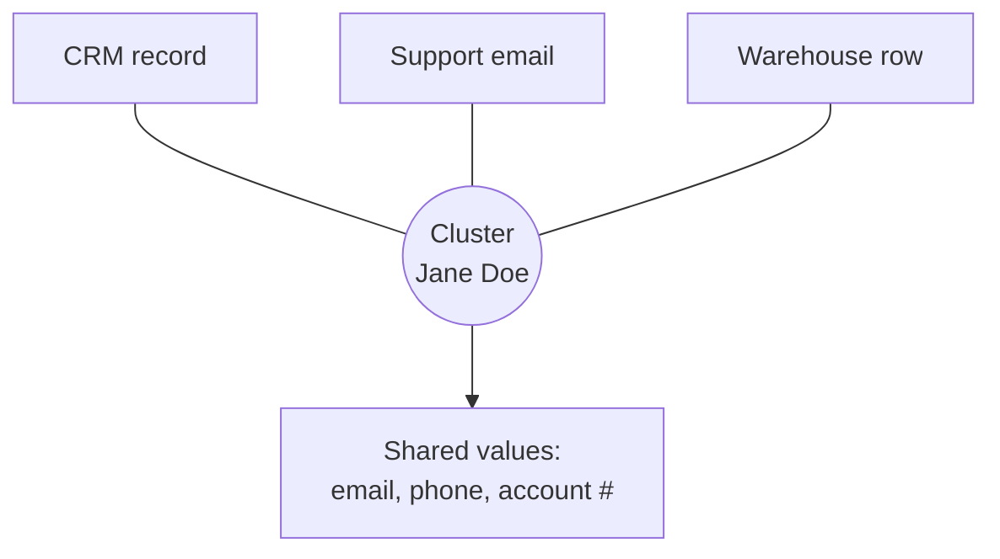
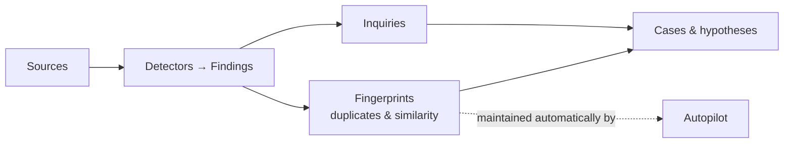

# Fingerprints

Findings tell you *what* was found. **Fingerprints** tell you *where the same
thing shows up again* — the customer whose email appears in three systems, the
record duplicated across two databases, the entity that connects a dozen
findings. It's how Classifyre turns a flat list of findings into a map of
**duplicates** and **similar** items.

Fingerprints sit between detection and investigation:

You'll find this in the app under **Fingerprints**, where a similarity graph
shows how your assets connect.

---

## How a fingerprint is built

A fingerprint is built from the **values inside your findings** — emails, names,
phone numbers, account IDs, addresses, and so on. The approach is deliberately
**deterministic and explainable**: there's no black-box embedding. Two assets are
linked because they demonstrably **share the same values**, and you can always
see which ones.

1. **Extract values** from each asset's findings and **normalise** them (so
   `John.Smith@acme.com` and `john.smith@acme.com ` match).
2. **Build a signature** for the asset — a compact summary of its values.
3. **Compare** signatures across every asset and **score** how much they overlap.

Two extra touches make matching smarter:

- **Exact-duplicate bucketing** — assets whose values are all identical are
  caught immediately as duplicates.
- **Phonetic matching** for name-like values — `John Smith` and `Jon Smyth` are
  recognised as likely the same person, not two different ones.

---

## Similarity, related, and duplicate

Every link between two assets carries a **similarity score** from 0 to 1 — the
share of important values they have in common. Two thresholds turn that score
into plain language:

| Band | Meaning |
|---|---|
| **Similar / related** | Enough shared values to be worth a look — they *might* be connected. |
| **Duplicate** | So much overlap they're almost certainly the **same** underlying item or entity. |
| *(below the lower threshold)* | Not linked — too little in common to matter. |

In the **Fingerprints** graph, a **similarity slider** lets you raise or lower the
bar: drag it up to see only strong duplicates, down to explore looser
relationships.

---

## Clusters: the same entity, everywhere

When several assets are all linked by strong evidence, Classifyre groups them
into a **cluster** — a set of assets treated as **one entity**, even when they
live in different sources. A cluster might be "all the records about customer
*Jane Doe*" scattered across a CRM, a support inbox, and a data warehouse.

Each cluster shows **how many assets** it spans, **how many sources** it touches,
and the **values its members have in common** — the shared evidence that binds
it together. Every asset belongs to at most one cluster, so the picture stays
clean.

> **From cluster to case in one step.** When a cluster looks worth investigating,
> you can **create a case** straight from it — its members come in as evidence,
> ready to work. This is one of the fastest ways to start an investigation. See
> [Cases](/flow/investigations/cases/).

---

## Tuning what counts (advanced)

Fingerprinting has sensible defaults, but you can shape it to your domain:

| Control | What it does |
|---|---|
| **Value weights** | Make some kinds of value count for more. A shared national ID is far stronger evidence than a shared city — weight it accordingly. |
| **Thresholds** | Move the lines for "related" and "duplicate" to be stricter or looser. |
| **Exclusions** | Ignore noisy values that shouldn't link anything (placeholders like `null`, shared support addresses, test data). |

Changing any of these **recomputes** the fingerprints across your data so the
graph and clusters reflect the new rules.

---

## Where Fingerprints fit

- **[Inquiries](/flow/investigations/inquiry/)** watch findings by *rule*;
  fingerprints connect them by *shared identity*. They're complementary lenses on
  the same findings.
- **[Cases](/flow/investigations/cases/)** are where a cluster becomes a real
  investigation, with evidence and hypotheses.
- **[Autopilot](/flow/investigations/autopilot/)** keeps fingerprints up to date
  automatically: a deterministic correlation step refreshes duplicates and
  clusters after each scan — *before* the AI agents reason over them — and the
  agents can open a case from a notable cluster on their own.

---

## In short

| Concept | What it is |
|---|---|
| **Fingerprint** | An asset's normalised values, used to compare it to others |
| **Similarity score** | How much two assets overlap (0–1) |
| **Duplicate** | Two assets that overlap enough to be the same item |
| **Cluster** | A group of assets treated as one entity, across sources |

Next: turn a cluster or a set of findings into a real investigation in
**[Cases](/flow/investigations/cases/)**.
