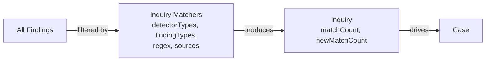
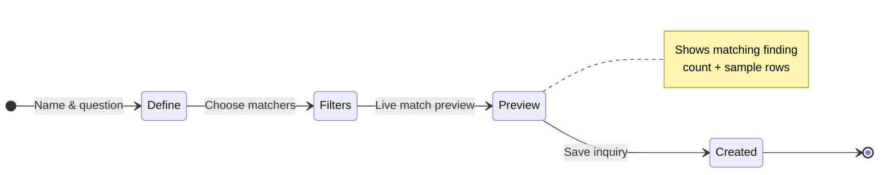

# Inquiry

An inquiry is a **saved question** over your findings. It continuously tracks
how many findings match its criteria, surfacing new matches as they are
discovered by scans. Think of it as a live monitor that answers one
investigation question.



## Matcher model

An inquiry filters findings across four orthogonal dimensions. All
non-empty dimensions must match (AND logic):

| Dimension | Description |
|---|---|
| **Sources** | `matchAllSources` or specific source IDs |
| **Detector types** | `SECRETS`, `PII`, `YARA`, `BROKEN_LINKS`, `CODE_SECURITY`, `CUSTOM` |
| **Custom detector keys** | Named custom detectors |
| **Finding types** | Exact match on finding type |
| **Finding type regex** | Regex pattern against finding type |
| **Finding value regex** | Regex pattern against matched content |

## Create flow



The inquiry form is a three-step wizard:

1. **Define** — Name the inquiry and write the investigation question.
2. **Filters** — Choose match-all or specific sources, pick detector types,
   custom detectors, finding types (with search), and add regex patterns.
3. **Preview** — See a live count of how many findings currently match, with
   sample rows rendered in the matches table.

## Lifetime

```mermaid
stateDiagram-v2
    direction LR
    [*] --> Active: Created
    Active --> Archived: User archives
    Active --> Deleted: User deletes
    Archived --> Active: Unarchive
    Archived --> Deleted: User deletes
    Deleted --> [*]

    state Active {
        [*] --> MatchCountComputed
        MatchCountComputed --> NewMatches: Scan adds findings
        NewMatches --> MatchCountComputed: Re-scan
        MatchCountComputed --> PulledToCase: Open case
    end
```

- **Active** — Continuously tracks matches. The `newMatchCount` badge
  increments when new findings match after the last `markSeen`.
- **Archived** — Hidden from default views but still exists. Can be
  unarchived.
- **Deleted** — Permanently removed. Linked cases lose the inquiry
  relationship.

## Re-scanning

Calling `POST /inquiries/:id/rematch` recomputes matches against all current
findings. This is useful if matchers were updated or you want to refresh
after a long gap.

The `POST /inquiries/preview` endpoint provides the same computation but
without saving — useful for testing matcher config in the creation form.

## Linking to cases

An inquiry can drive one or more cases. When linked:

- The case workspace shows the inquiry in the "Driving inquiries" panel.
- A "Pull matches" action copies the inquiry's current matching findings
  into the case as evidence (creating case-finding records).
- New matches since the last pull are highlighted with an amber alert in
  the case workspace.

## Inquiries vs Fingerprints

Inquiries and [Fingerprints](/flow/investigations/fingerprints/) are two
complementary ways to make sense of findings:

- An **inquiry** groups findings by **rule** — *"show me everything matching
  these criteria."*
- **Fingerprints** group assets by **shared identity** — *"show me everything
  that looks like the same entity."*

Both feed [cases](/flow/investigations/cases/), and both can be maintained for
you by [Autopilot](/flow/investigations/autopilot/).
