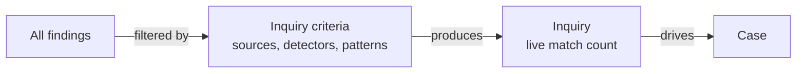
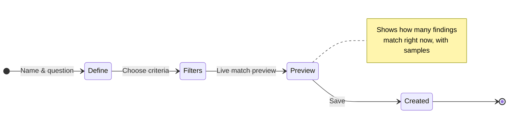
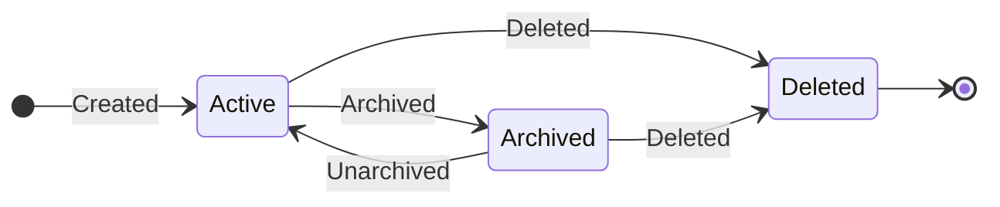

# Inquiry

An inquiry is a **saved question** over your findings. It continuously tracks how
many findings match its criteria and surfaces new ones as scans discover them —
a live monitor that answers a single investigation question, such as *"Are
credentials leaking through CI logs?"*

---

## What an inquiry matches on

An inquiry narrows findings down across a few dimensions. You can use as many or
as few as you like — whatever you fill in is combined, so a finding has to satisfy
*all* of your chosen criteria to match.

| Dimension | Narrows findings to… |
|---|---|
| **Sources** | All sources, or only the ones you pick |
| **Detector types** | Specific detectors — Secrets, PII, security, custom, and so on |
| **Custom detectors** | Specific custom detectors you've built |
| **Finding types** | A particular kind of signal |
| **Finding-type pattern** | Signal types matching a text pattern |
| **Finding-value pattern** | Findings whose matched content fits a text pattern |

This lets an inquiry be as broad as *"any PII, anywhere"* or as precise as
*"credit-card numbers found in the finance warehouse."*

---

## Creating an inquiry

The inquiry form is a short, three-step wizard:

1. **Define** — name the inquiry and write the question you're trying to answer.
2. **Criteria** — choose the sources, detectors, finding types, and patterns that
   define a match.
3. **Preview** — see a live count of how many findings match right now, with a
   few sample rows, so you can fine-tune before saving.

The preview runs the same matching live, without saving — so you can experiment
with the criteria until the count looks right.

---

## The life of an inquiry

| State | What it means |
|---|---|
| **Active** | Continuously tracking matches. A **"new matches"** badge appears when fresh findings match since you last looked. |
| **Archived** | Hidden from default views but kept. You can bring it back at any time. |
| **Deleted** | Permanently removed. Any cases it was driving simply lose the link. |

Because inquiries keep matching as new scans land, an active inquiry is a
standing watch — set it once and it keeps answering its question over time. If
you ever change its criteria or want a fresh result after a quiet spell, you can
**re-run** it to recompute matches against all current findings.

---

## Driving cases

An inquiry can drive one or more [cases](/flow/investigations/cases/). When it's
linked to a case:

- The case shows it in its **"Driving inquiries"** panel.
- A **"Pull matches"** action copies the inquiry's current matching findings into
  the case as evidence.
- Any **new matches** since the last pull are flagged in the case, so nothing
  slips by while you work.

---

## Inquiries vs Fingerprints

Inquiries and [Fingerprints](/flow/investigations/fingerprints/) are two
complementary ways to make sense of findings:

- An **inquiry** groups findings by **rule** — *"show me everything matching
  these criteria."*
- **Fingerprints** group assets by **shared identity** — *"show me everything
  that looks like the same entity."*

Both feed [cases](/flow/investigations/cases/), and both can be maintained for
you automatically by [Autopilot](/flow/investigations/autopilot/) — which keeps
inquiries tidy and de-duplicated after every scan.
