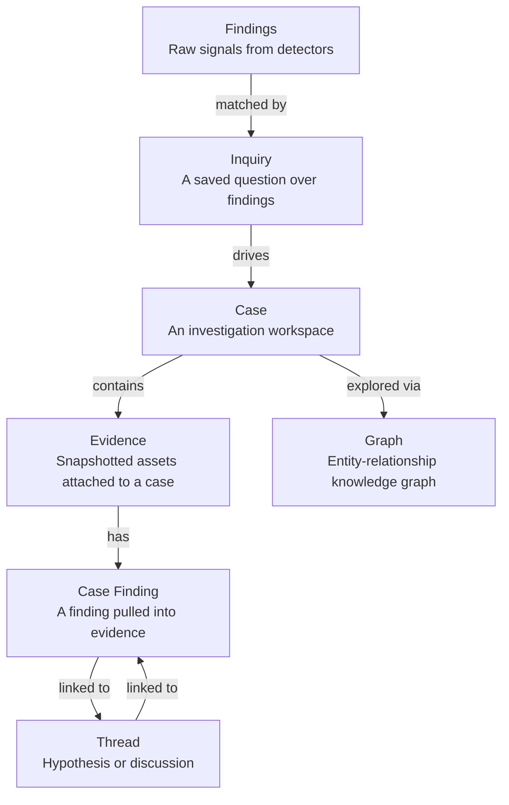
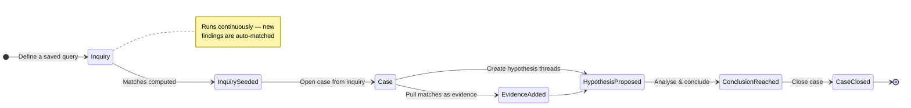

# Investigations

The investigation system is a structured workflow for triaging and analysing
findings. It consists of two core concepts: **inquiries** (saved queries that
continuously surface matching findings) and **cases** (workspaces where
evidence, hypotheses, and conclusions are organised).

## Lifecycle

- **Inquiry** — Define matchers (detector types, finding types, regex patterns)
  and get a live count of matching findings. Rescan anytime.
- **Case** — A workspace to collect evidence, weigh hypotheses, and reach a
  conclusion. Linked inquiries keep the case fed with fresh matches.
- **Evidence** — Assets snapshotted into the case, with attached case findings.
- **Threads** — Hypothesis and discussion threads with support-links to
  evidence, status/confidence tracking, and structured entries.
- **Graph** — A force-directed knowledge graph visualising entities,
  relationships, and evidence overlay across the investigation.
