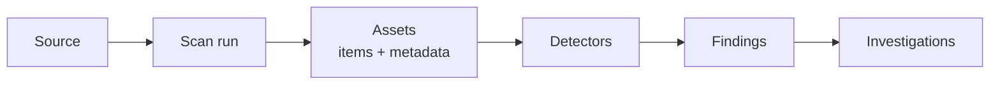
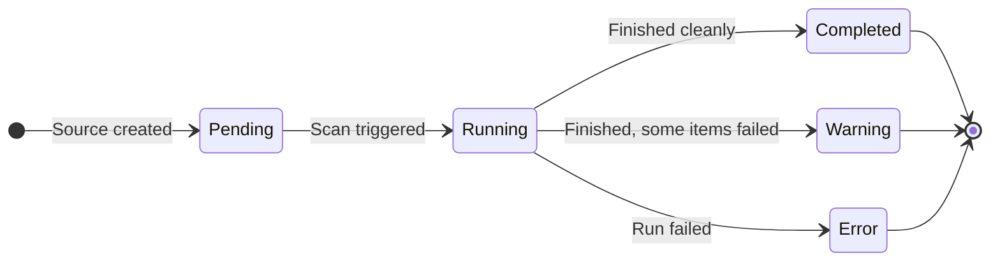
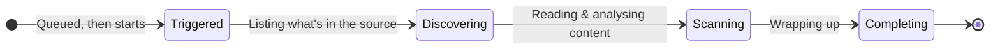
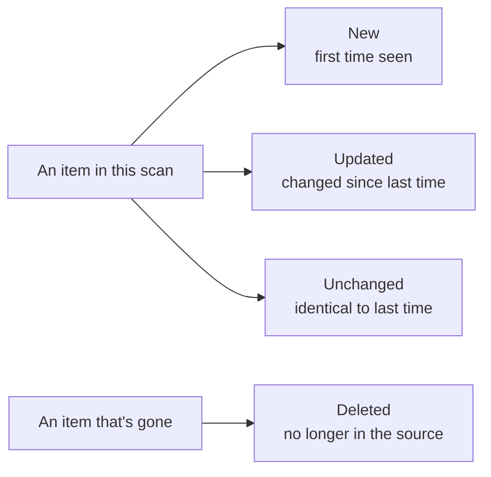

# Flow

This is the **journey of a scan**: what happens between pressing "scan" and
seeing findings, the statuses you'll see along the way, and how Classifyre keeps
results accurate as the same source is scanned again and again.

It's the connective tissue between [Sources](/sources/),
[Detectors](/detectors/), and [Investigations](/flow/investigations/).

---

## A source and its scans

A **source** is a connection you've configured; a **scan** is one run against it.
A source can be scanned many times — manually or on a schedule — and each run is
recorded so you can see its progress and history.

At any moment a source shows a simple status reflecting its most recent run:

| Status | What it means |
|---|---|
| **Pending** | The source exists but isn't scanning right now (never scanned, or its last run finished). |
| **Running** | A scan is in progress. Only one scan runs per source at a time. |
| **Completed** | The last scan finished and every item processed cleanly. |
| **Warning** | The last scan finished, but some items couldn't be processed (check the run logs). |
| **Error** | The last scan failed partway through. |

---

## What happens during a scan

When a scan runs, it moves through four phases you can watch in the app:

| Phase | What's happening |
|---|---|
| **Triggered** | The scan is queued and starts as soon as there's capacity. |
| **Discovering** | The source is listed — every page, file, or record — so progress can be shown ("134 of 500 scanned"). |
| **Scanning** | Each item is read as an [asset](/sources/assets-and-metadata/), its content extracted, and [detectors](/detectors/) run over it. Findings start appearing. |
| **Completing** | The run wraps up: items that have disappeared from the source are reconciled, and findings are brought up to date (see below). |

How *much* of a source a scan reads, and in what order, is governed by its
[sampling strategy](/sources/sampling/).

---

## What repeat scans do

Classifyre remembers what it saw last time, so a second scan doesn't start from
scratch or pile up duplicates. Every item is compared to the previous run and
sorted into one of four buckets:

| Outcome | What Classifyre does |
|---|---|
| **New** | Reads it and records any findings as freshly detected. |
| **Updated** | Re-reads it and refreshes its findings. |
| **Unchanged** | Notes it's still there, without redoing the work. |
| **Deleted** | Marks it gone and **auto-resolves** the findings that came from it. |

This is what makes results trustworthy over time: the same issue is **tracked**,
not re-reported, and issues that genuinely go away are closed automatically.

---

## Findings stay up to date

Because items are reconciled each run, **findings persist and update** rather than
duplicate. A finding that's still there is kept; one that's been fixed at the
source is automatically resolved; one that comes back is reopened.

> Your own decisions are always respected. If you've marked a finding as a false
> positive, ignored, or resolved, a later scan won't silently overturn that.

The full anatomy of a finding — its fields, severity, confidence, and lifecycle —
lives in **[Findings & Results](/detectors/findings/)**.

---

## What happens to findings next

Producing findings is where this lifecycle ends and the **investigation** layer
begins. From here, findings are watched, connected, and worked:

- **[Investigations](/flow/investigations/)** — the full picture of how findings
  become inquiries, fingerprints, cases, and hypotheses.
- **[Inquiries](/flow/investigations/inquiry/)** — standing questions that keep
  surfacing matching findings.
- **[Fingerprints](/flow/investigations/fingerprints/)** — duplicate and
  similarity detection across assets.
- **[Autopilot](/flow/investigations/autopilot/)** — AI agents that act on new
  findings automatically after every scan.
