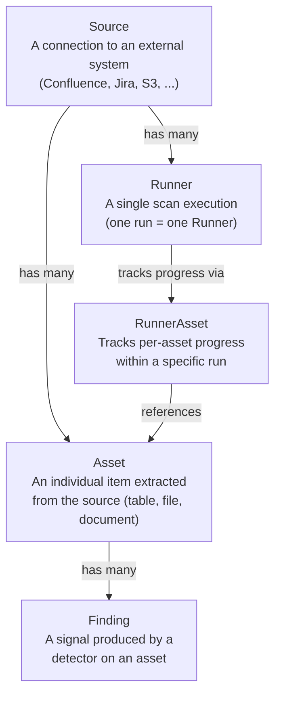
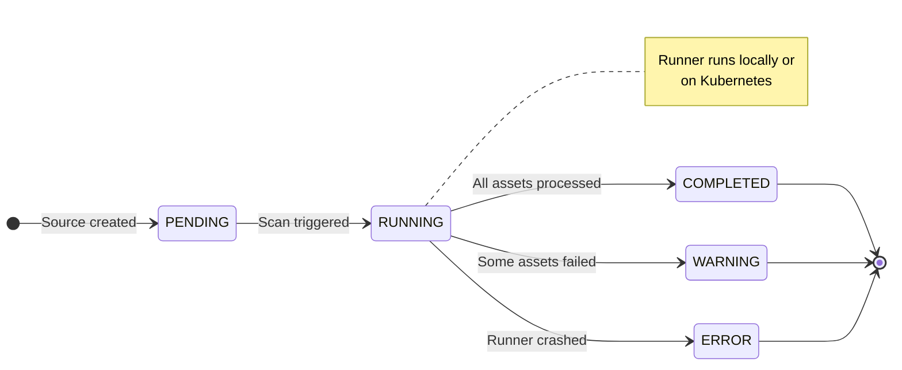
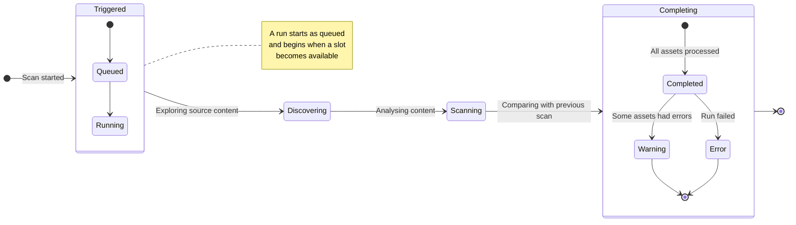
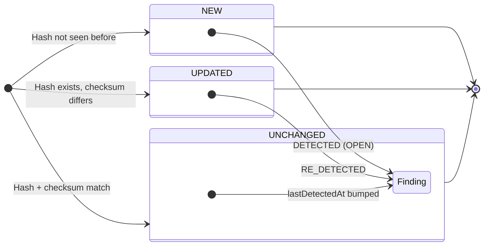
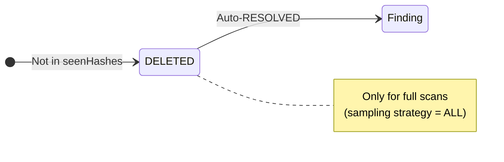
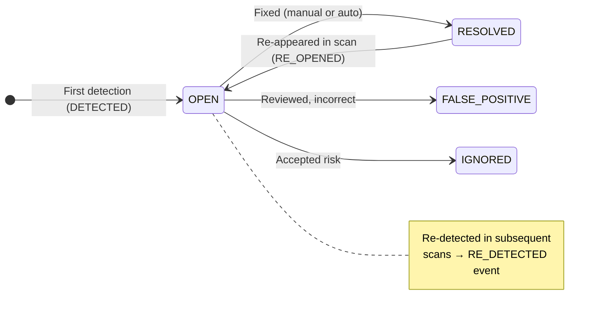

# Flow

End-to-end lifecycle from source creation to findings.
Each stage has its own status machine and transitions that are reflected in the UI.

---

## Entity model

The core entities and their relationships:

Each source can have multiple runners (scan runs), each runner tracks its
progress through runner assets, and every runner asset maps to one asset in
the database. Findings belong to both an asset and a source.

---

## Source lifecycle

A source starts as a configuration and transitions through run statuses:

- **PENDING** — source exists but has not been scanned yet, or its last run
  is finished
- **RUNNING** — a runner is actively executing for this source. Only one run
  can be active per source at a time
- **COMPLETED** — the last run finished with zero asset errors
- **WARNING** — the last run finished but some assets had processing errors
- **ERROR** — the last run terminated abnormally

---

## Scan run lifecycle

When a scan is triggered (manually or via schedule), it moves through four
phases visible in the UI:

| Phase | What happens |
|---|---|
| **Triggered** | The scan is queued and starts when capacity allows. You'll see this in the Scans page as "pending" or "running". |
| **Discovering** | The runner lists all content in the source — every page, file, or record. The Scans detail page shows progress: "134 of 500 assets scanned". |
| **Scanning** | Each asset is processed: content is extracted and detectors (secrets, PII, YARA, etc.) run against it. Findings start appearing in the UI. |
| **Completing** | The run wraps up. Assets that no longer exist in the source are marked as deleted. Findings that disappeared in this run are automatically resolved. |

At the end, the source shows one of three terminal statuses:

- **Completed** — everything processed successfully
- **Warning** — finished but some assets had errors (check the run logs)
- **Error** — the run failed partway through

---

## Asset ingestion and diffing

When the CLI sends a batch of assets, the API diffs them against existing
records for the same source:

**During finalization** (full scans only), assets not in the seen set:

---

## Finding lifecycle

Findings persist across scans and track their own state machine:

### History events

Each status change is recorded as a history entry:

| Event | When it fires |
|---|---|
| **DETECTED** | First time a finding appears |
| **RE_DETECTED** | Finding still present in a later scan |
| **RE_OPENED** | A previously resolved finding reappears |
| **RESOLVED** | Finding no longer present (auto), or manually marked |
| **STATUS_CHANGED** | User manually changed the status |
| **SEVERITY_CHANGED** | User manually changed the severity |

### Auto-resolution

During finalization, findings that were present in a previous run but are
absent in the current scan are automatically resolved. Manual overrides
(FALSE_POSITIVE, IGNORED, RESOLVED) are respected and never overwritten.

---

## What happens to findings next

Producing findings is where this lifecycle ends and the **investigation** layer
begins. From here, findings are watched, connected, and worked:

- **[Investigations](/flow/investigations/)** — the full picture of how findings
  become inquiries, fingerprints, cases, and hypotheses.
- **[Inquiries](/flow/investigations/inquiry/)** — standing questions that keep
  surfacing matching findings.
- **[Fingerprints](/flow/investigations/fingerprints/)** — duplicate and
  similarity detection across assets.
- **[Autopilot](/flow/investigations/autopilot/)** — AI agents that act on new
  findings automatically after every scan.

