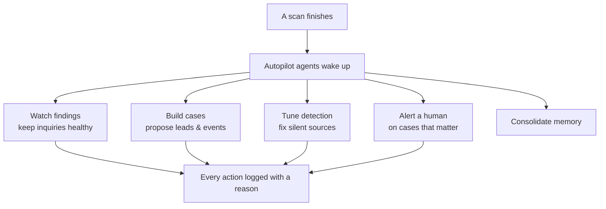

# Autopilot & AI Assistance

Every step described in this section — ranking, connections, leads, events,
the glossary — can be worked by hand, or **Autopilot** can do the legwork for
you after every scan. This page explains what that means in practice.

---

## The six missions, in plain words

Autopilot isn't one general-purpose bot — it's several agents, each with a
single job, so the work stays predictable:

| Mission | What it does |
|---|---|
| **Inquiry** | Keeps standing questions healthy — creates new ones for recurring findings, archives ones that have gone quiet, and avoids creating duplicates. |
| **Case** | Builds and maintains investigations: proposes leads, drafts a dated event when evidence points to one, and closes or reopens cases as the picture changes. |
| **Config** | Tunes detection — switches on the right detectors for a source that's producing nothing, and adjusts connection tuning when clusters look wrong. |
| **Detector author** | Writes, tests, and checks a brand-new custom detector when nothing existing catches something important — then verifies whether it actually worked. |
| **Escalation** | Reviews open cases and makes sure a human is told about the ones that genuinely warrant attention — it changes nothing in the investigation itself, only raises the alert. |
| **Dream** | Runs on a quiet schedule to tidy up what the other agents have learned, so the whole system gets sharper over time instead of accumulating noise. |

---

## What agents may — and may not — do

Agents can **propose** constantly: a new inquiry, a candidate lead, a possible
event, a glossary term, a tuning change. What they can commit without review
depends on the supervision level you set.

- **A lead is always a proposal, never a fact.** Whether suggested by ranking,
  an inquiry match, or an agent, it sits in the triage queue until a person
  accepts or dismisses it. See [Leads, Evidence & Events](/how-it-works/investigating/).
- **Agent-proposed glossary terms start unverified**, clearly marked as
  agent-origin, and can never overwrite an entry you defined yourself.
- **Dated events proposed by an agent stay unverified** until a person
  confirms them — agents are instructed never to fabricate a date.
- **Escalation only alerts.** It cannot change severity, close a case, or
  touch evidence — its one action is telling a human to look.

## Provenance: knowing who said what

Every piece of agent-generated content — a memory note, a glossary term, an
event, a proposed lead — carries its **origin**: agent or operator. That
distinction is preserved permanently, so you can always tell whether something
was confirmed by a person or is still a machine's best guess.

## How to supervise it

You choose the level of trust, and it can be scoped narrowly:

- **Off by default.** Every agent is disabled until you turn it on.
- **Observe-only mode.** Set the whole instance — or a single source,
  detector, or case — to observe-only, and agents will propose without
  touching anything.
- **A written reason for every action.** Every move an agent makes, and every
  deliberate choice *not* to act, is logged in plain English so you can audit
  it later.

---

## Where this leads

Autopilot uses the exact same ranking, connections, and case tools described
throughout this section — it doesn't have a separate, hidden path. For the
full technical detail on each agent, cycles, memory, and steering controls,
see [Autopilot](/investigations/autopilot/).
