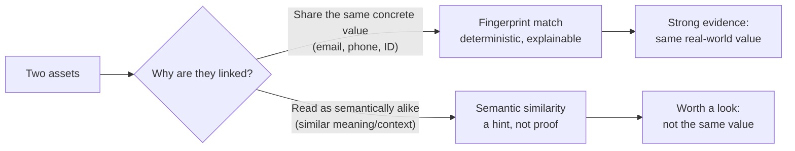

# Connections & Fingerprints

Classifyre links your data in **two fundamentally different ways**. Confusing
them leads to bad conclusions, so this page draws the line clearly.

---

## Fingerprints: shared values, deterministic

A **fingerprint** connection means two assets provably **share the same
concrete value** — the same email address, phone number, account ID, or name
(with light normalisation, so `John.Smith@acme.com` and a lowercase variant
still match). There's no guessing involved: you can always see exactly which
value ties two assets together.

Every fingerprint link carries a **similarity score** describing how much
overlap there is, and two thresholds turn that score into plain categories:

| Category | Meaning |
|---|---|
| **Similar / related** | Enough shared values to be worth a look. |
| **Duplicate** | So much overlap they're almost certainly the same underlying record or entity. |

When several assets are strongly linked, they're grouped into a **cluster** —
treated as one entity even when they live in different systems. A cluster
touching several sources is often the first sign that the same person or
record has left a trail across your data estate.

## Semantic similarity: meaning, not identity

Ranking's semantic layer (see [Ranking & the Semantic Layer](/how-it-works/ranking-and-semantics/))
also compares findings by **meaning** — do two findings sit in similar
contexts, even without sharing an exact value? This is useful for surfacing
neighbours worth reviewing, but it is **not** proof of identity. Two documents
can read alike without being about the same person, transaction, or event.

**The crisp distinction:** a fingerprint link says *"these definitely share
this exact value."* A semantic similarity says *"these read alike — go check."*
Fingerprints are evidence; similarity is a lead.

---

## Tuning what counts

Fingerprinting has sensible defaults, but you can adjust it to your domain from
the Fingerprints Tune panel:

| Control | What it does |
|---|---|
| **Value weights** | Make some kinds of value count for more — a shared national ID is much stronger evidence than a shared city. |
| **Thresholds** | Move the bar for what counts as "related" versus "duplicate." |
| **Exclusions** | Ignore noisy values that shouldn't link anything, like placeholder text or a shared support address. |

Changing any of these recomputes the connections across your data, so the
graph and clusters immediately reflect the new rules.

---

## Where this leads

A strong cluster or a striking connection is one of the fastest ways to open a
[case](/how-it-works/investigating/): its members come in as a ready-made
starting point. For the full technical detail, see
[Fingerprints](/investigations/fingerprints/).
