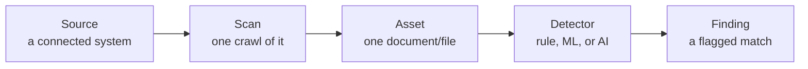

# From Documents to Findings

Everything in Classifyre starts with turning documents you already have into
signals worth acting on. This page walks through that first stretch, in plain
terms.

---

## Sources: the systems you connect

A **source** is a connection to a system you already run — SharePoint,
Confluence, Jira, a file share, a local folder, and more. Connecting a source
doesn't move your data anywhere; Classifyre reads it in place, on the schedule
and scope you choose.

## Scans: one pass over a source

A **scan** is a single crawl of a source. You can scan on demand or on a
schedule, and each scan is recorded so you can see its progress and history.
Repeat scans are smart about it: unchanged items aren't reprocessed, changed
items are refreshed, and items that disappeared from the source have their
findings automatically closed out. Nothing is silently duplicated or lost.

## Assets: what a scan finds

Every document, file, page, or record a scan discovers becomes an **asset** —
along with metadata like its owner, location, and last-changed date. Assets are
the unit everything else attaches to: findings, evidence, connections.

## Detectors: what looks for what

A **detector** reads an asset's content and looks for something specific. There
are three kinds:

- **Pattern-based** — precise rules for structured things like credentials or
  ID numbers.
- **Machine-learning** — models that recognise entities like names or
  organisations even when the wording varies.
- **Custom, AI-based** — detectors you define, including ones backed by an AI
  model, for anything specific to your investigation.

A source can run any combination of detectors, and you can build your own when
the built-in ones don't cover what you're looking for.

## Findings: what a detector produces

Every time a detector spots something, it raises a **finding** — one flagged
match, on one asset. A finding carries:

- **What matched** and the surrounding text, so you can judge it in context
  without digging through the original document.
- **Severity** — how serious it would be *if it's a real issue*, from Critical
  down to Info.
- **Confidence** — how sure the detector is that the match is real, separate
  from how serious it would be.

A high-severity, low-confidence finding deserves a quick look. A
high-severity, high-confidence one deserves action. Findings persist across
scans rather than piling up as duplicates — the same issue is tracked over
time, and your decisions (marking something resolved, ignored, or a false
positive) are always respected by later scans.

---

## Where this leads

A flat list of findings is a start, not an answer. The next step is working out
*which* findings actually matter — that's what
[Ranking & the Semantic Layer](/how-it-works/ranking-and-semantics/) does.

For the full technical reference, see [Sources](/sources/),
[Detectors](/detectors/), and [Findings & Results](/detectors/findings/).
