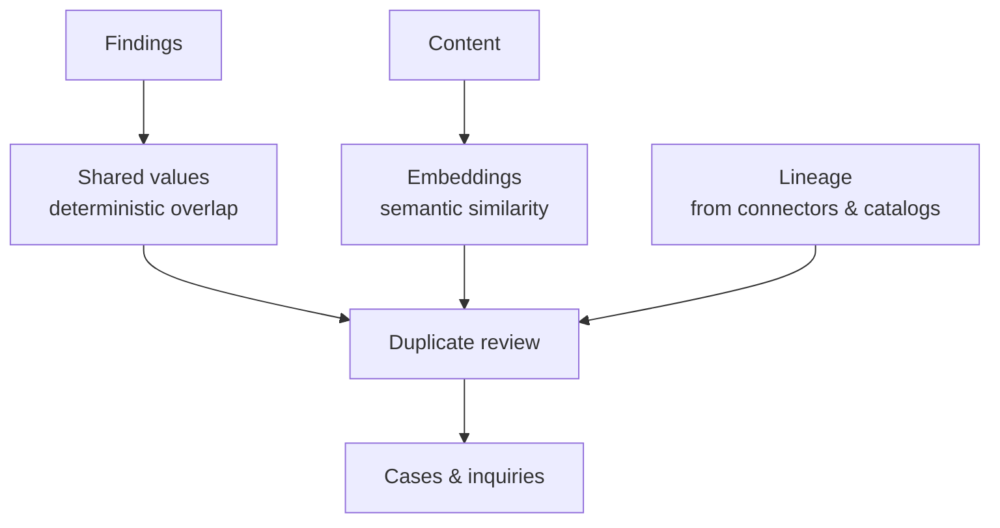

# Connections & Duplicates

Findings tell you what is in a document. **Connections** tell you how documents
relate to each other. Classifyre builds those from two signals that come from
completely different places, and deliberately never blends them into one number.

---

## Signal 1 — shared values

Two assets are linked because they demonstrably **contain the same values**: the
same email address, the same account number, the same IBAN. Values are normalised
and hashed, and the overlap is scored, weighted so a shared credit card counts
for more than a shared country code.

This signal is **deterministic and explainable**. There is no black box: for any
link you can see exactly which values produced it and how much each contributed.

## Signal 2 — semantic similarity

Content is embedded as a vector, and passages whose vectors sit close together
are treated as saying the same thing — even when they share no literal values.
This is what recognises boilerplate, templates, and the same paragraph rewritten.

This signal is **approximate but generalising**. It sees what value overlap
cannot, and it cannot tell you which specific value made it fire.

## Why they aren't averaged together

Because they fail differently. Averaging two measures that fail in different ways
gives a number that is wrong in both directions and can't be debugged.

Instead each match keeps the family it came from, and each family gets its own
kind of fix: a shared-value pattern is fixed by weights and exclusions; a
repeated-text pattern is fixed by excluding the boilerplate. Blended, neither fix
would be findable.

---

## Signal 3 — lineage, as a cross-check

The two signals above both come from the **content** of your assets. Lineage
comes from somewhere else entirely: connector catalogs, query logs, view SQL, dbt
manifests.

That independence is what makes it useful here. When two assets look nearly
identical, lineage answers *why*:

- **There's a path between them** → a derived copy. Expected.
- **There's no path, and both have lineage** → nobody built one from the other,
  yet they're nearly the same. Somebody rebuilt something that already existed.

This is the distinction that decides whether duplicate detection is worth reading
at all. See [Lineage & Relationships](/sources/lineage/) and [Duplicate
Review](/duplicates/).

---

## Where this shows up

| Screen | Uses |
|---|---|
| [Duplicate review](/duplicates/) | All three, as one queue |
| Asset → similar | Shared values, annotated with pattern and lineage |
| Asset → lineage | Lineage only |
| [Cases](/investigations/cases/) | Clusters promoted to evidence; the case graph groups relationships by class |
| [Inquiries](/investigations/inquiry/) | Match signatures derived from what made a pair match |

---

## Reading next

- [Duplicate Review](/duplicates/) — the queue, and how to work it
- [How Matching Works](/duplicates/how-matching-works/) — the scoring in detail
- [Ranking & the Semantic Layer](/how-it-works/ranking-and-semantics/) — where the embeddings come from
- [Lineage & Relationships](/sources/lineage/) — the five relationship classes
