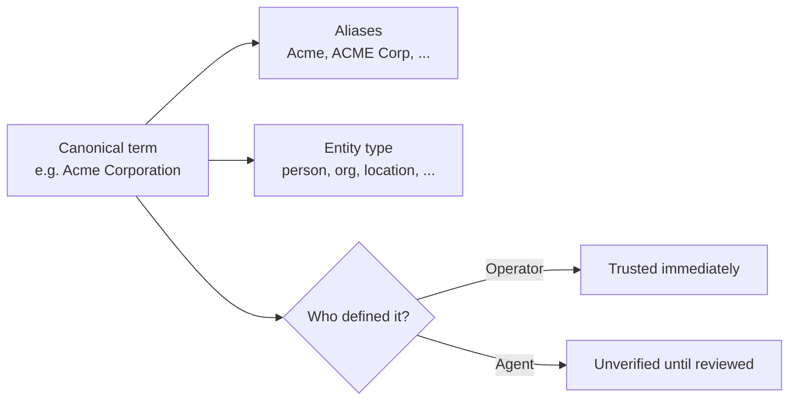

# Glossary & Shared Vocabulary

Investigations involve the same names, organisations, and terms coming up
again and again — often written differently each time. The **glossary** is
Classifyre's shared vocabulary, so that "Acme Corp," "ACME Corporation," and
"Acme" are recognised as the same thing, by people and by AI agents alike.

---

## What it's for

Without a shared glossary, an investigation drifts: one person writes a full
name, another writes an abbreviation, a detector reports a raw value, and
nothing connects them automatically. The glossary fixes that by giving each
real-world thing — a person, an organisation, a location, a reference number,
or any other recurring term — one **canonical entry** with a list of
**aliases** that all point back to it. Looking something up matches on the
exact term, any of its aliases, or a close semantic match, so a search doesn't
depend on getting the wording exactly right.

Every entry also carries an **entity type** — person, organisation, location,
reference, or general term — which helps keep searches and suggestions
relevant.

## Operator terms vs. agent terms

Anyone can add to the glossary, but not all entries start out equal:

- **Operator-curated terms** are entries you or your team define directly.
  They're trusted immediately.
- **Agent-proposed terms** are suggestions from an AI agent that noticed a
  recurring name or reference worth tracking. These start **unverified** —
  clearly marked as agent-origin — until a person reviews and confirms them.

Critically, an agent proposal can never silently overwrite or replace an
operator's entry. At most, an agent can suggest an additional alias for a term
you've already defined — it cannot redefine what you've established.

## Why this matters day to day

A well-maintained glossary makes everything upstream sharper: fingerprint
connections and inquiry matches read variant spellings correctly, case notes
reference the same canonical entities, and Autopilot agents reason about "the
same person" instead of treating each spelling as a new unknown. It's a small
amount of curation that compounds across every investigation you run.

---

## Where this leads

The glossary is consumed everywhere findings, connections, and cases are
worked — and it's one of the things [Autopilot](/how-it-works/autopilot/)
agents can propose additions to, always subject to your review. See
[Autopilot & AI Assistance](/how-it-works/autopilot/) for how agent-proposed
content is governed more broadly.
