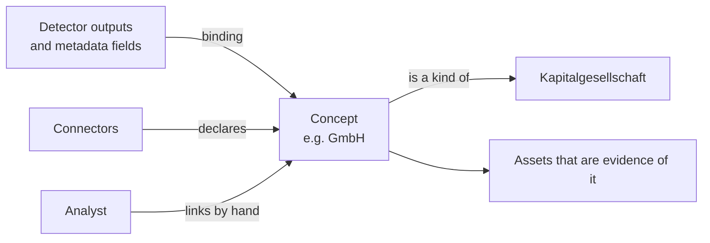

# Glossary & Shared Vocabulary

Investigations keep running into the same things written differently: a register
writes `GES`, a contract says *Gesellschaft mit beschränkter Haftung*, an analyst
types *GmbH*. The **glossary** is Classifyre's shared vocabulary. It says once
what things are, and the **semantic layer** built on it lets every finding,
asset and case carry that meaning — so a question about *Personal data* or
*Bank account* reaches every piece of evidence, whatever detector or language
it came from.

```mermaid
graph LR
    Data["Detector outputs<br/>and metadata fields"] -->|binding| Concept["Concept<br/>e.g. GmbH"]
    Connector["Connectors"] -->|declares| Concept
    Person["Analyst"] -->|links by hand| Concept
    Concept -->|is a kind of| Broader["Kapitalgesellschaft"]
    Concept --> Evidence["Assets that are evidence of it"]
```

---

## Concepts and entities

Every term has a **kind**:

- A **concept** is a *kind of thing*: *GmbH*, *IBAN*, *Force majeure*,
  *Eigenmittelquote*. Concepts have a definition and usually belong to a
  scheme.
- An **entity** is *one particular thing*: *ACME Holding GmbH*, *Jane Doe*, a
  project codename. Entities keep the entity types you know — person,
  organisation, location, reference.

Each term has a stable **key** (`gmbh`, `bank-account-iban`). Keys are what
connectors, bindings, filters and agents refer to, so renaming a term never
breaks anything: an old key keeps resolving to the term it named.

Besides its name, a term has three kinds of labels:

| Label | Matches | Example |
|---|---|---|
| **Aliases** | as words, any case | *limited liability company* |
| **Codes** | exactly, case-sensitive | `GES`, `AT_SVNR` |
| **Hidden aliases** | exactly, never as a word in text | `E` for *Einzelvertretung* |

Single letters and short abbreviations belong in hidden aliases — as an alias,
`E` would match half the corpus.

## Schemes and relations

A **scheme** is a controlled vocabulary: the legal forms of a register, the
GDPR categories of personal data. Concepts within it form a tree through
**broader** relations — *GmbH* is a kind of *Kapitalgesellschaft*, which is a
kind of *Gesellschaft*. Other relations say a concept is **related to**,
**part of** or an **instance of** another, or carry a verb of your own. Cycles
are refused, with the path that would close them.

Evidence rolls up the tree: asking about *Kapitalgesellschaft* with
*include narrower* reaches every *GmbH* and *AG* too.

## Draft, approved, deprecated

Terms, relations and bindings move through the same lifecycle. **Only approved
items drive meaning**: a draft term can be looked up and discussed, but nothing
links to it until it is approved. Deprecating a term (optionally naming its
replacement) stops new links while keeping history.

Terms you add are approved at once. Terms proposed by AI agents, imports marked
as drafts and suggestions from the system start as **drafts** and wait in the
review queue.

## Giving data a meaning

### Bindings

A **binding** says once what a detector output or metadata field means. It is a
choice from the vocabulary your data actually produces — never a pattern:

- **Every finding of this kind** — `IBAN_CODE` from the PII detector means
  *Bank account (IBAN)*.
- **Only these values** — the tag `risk` means *Financial distress* only when
  its value is `hoch`.
- **Each value names a term** — the tag `legal_form` holds register codes;
  each value is looked up among the codes and labels of the *Rechtsformen*
  scheme, so `GES` means *GmbH* and `AG` means *Aktiengesellschaft*.

The *What does this mean?* dialog opens from a finding, a term, or the
**Unbound vocabulary** tab, picks a sensible default (a lookup when the values
mostly name concepts of one scheme), and previews how many findings, assets and
sources it would give meaning before you save. Saving needs no re-scan: links
follow within moments. Mark an output **No meaning** (say, `DATE_TIME`) to take
it off the worklist on purpose.

The **Unbound vocabulary** tab lists every output and field with open findings
and no meaning yet, with the semantic coverage of your workspace on top.

### Find in text

Some concepts never appear as a detector output — a PDF just says
*Eigenmittelquote*. **Find in text** builds a tested REGEX detector from the
concept's labels (word boundaries, codes matched exactly) and binds its output
to the concept.

### Connector declarations

Connectors and augmentation notebooks can say what a record is with
`means(Ref.asset(...), Ref.term("gmbh"))` or `asset.means("gmbh")` — see
[custom connectors](/sources/custom-connectors/reference/). A declaration to a
key nobody has defined yet is kept and shows up under *Unknown references* in
the review queue; it links the moment the term exists.

### Linking by hand

From a finding, an asset or a case, **Link to a term** records that it is about
a concept. On a case board, drawing a link from evidence to a pinned concept
does the same.

### Starter packs

**Starter packs** install schemes, concepts and bindings for common needs — GDPR
personal data, secrets and credentials, financial identifiers, DACH company law.
Preview first; nothing you curated is overwritten.

## Meaning in daily work

- **Finding and asset pages** show a *Meaning* card: which concepts the evidence
  is about, through which binding or link, and what follows up the taxonomy.
- **Term pages** list the assets that are evidence of the concept (by method,
  support and severity), its bindings, relations and history.
- **Filters and watches** accept glossary terms: search findings or assets by
  concept, and build an inquiry watch *about* a concept, with or without its
  narrower concepts.
- **Exports** carry a `terms` column.
- **Discovery** has a *Meaning* map next to the source map: concepts sized by
  their evidence, coloured by scheme, connected by the taxonomy.
- **Case boards** list the concepts the case's evidence is about and can pin
  them as cards.

## The review queue

Everything that would change meaning without you deciding lands in one queue:
agent drafts, proposed aliases, suggested bindings for unbound vocabulary,
suggested document links (with embeddings on), suggested relations, and
unknown term references. Accept, dismiss with a reason, or dismiss forever —
a dismissed suggestion comes back only if its evidence changes materially.

## Agents

Autopilot agents read the glossary, its vocabulary and meaning, and propose
terms, relations, bindings and document links. Within guardrails you set in
Settings → Autopilot, they may **approve** relations and bindings they proposed:
only between approved terms, never against an operator's binding, below an
impact limit, within a daily budget, and only after previewing exactly what
they approve. Every agent approval is in the undo log. Agents never decide on
documents, terms or aliases — those stay yours.

## Import, export and transfer

Import and export CSV or SKOS (JSON-LD), with a dry run first. Workspace
archives carry schemes, terms, relations, bindings, manual links and your
review decisions; derived data — the vocabulary inventory, semantic links,
pending suggestions and the map — is rebuilt after an import. In Settings →
Cleanup the curated glossary is protected, and the derived datasets can be
cleaned and rebuild themselves.

---

## Where this leads

The glossary is consumed everywhere findings, connections and cases are worked,
and it is one of the things [Autopilot](/how-it-works/autopilot/) agents can
propose additions to, always subject to your review.
