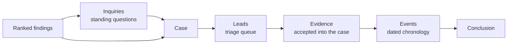
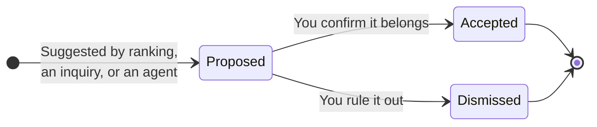

# Investigating: Leads, Evidence & Events

This is where Classifyre stops being a detection tool and becomes an
**investigation workspace**. This page walks the path a piece of information
takes from "a finding somewhere in a scan" to "part of a case conclusion."

---

## Inquiries: standing questions

An **inquiry** is a saved question over findings — for example, *"are
credentials leaking through build logs?"* Once created, it keeps watching:
every new scan is checked against it, and it surfaces new matches as they
appear, so you never have to re-ask the same question by hand. An inquiry can
feed one or more cases, pulling its current matches in as a starting point.

## Cases: where the work happens

A **case** is the investigation workspace. It holds the **evidence** you've
gathered, the discussion around it, and ultimately a written **conclusion**.
Cases can start from an inquiry, from a fingerprint cluster (see
[Connections & Fingerprints](/how-it-works/connections-and-fingerprints/)), or
from scratch.

## Leads: a triage queue, not evidence yet

A **lead** is a *candidate* — something that might belong in the case, but
hasn't been confirmed. Leads come from a few places: findings that look like
close neighbours of evidence you already accepted, high-importance matches from
a linked inquiry, or a suggestion from an AI agent. A lead is never treated as
evidence on its own — it sits in a queue until a person makes a call.

- **Proposed** — sitting in the queue, awaiting review.
- **Accepted** — you've confirmed it, and it becomes evidence in the case.
- **Dismissed** — you've ruled it out. Classifyre remembers this, so the same
  candidate isn't proposed again.

That memory of dismissals matters: it's what keeps the queue useful instead of
repeating itself.

## Evidence: what the case is actually built on

Once accepted, a lead becomes **evidence** — an asset and its findings,
captured into the case as a stable snapshot. You can add notes explaining your
reasoning, and attach or detach individual findings as your understanding
changes. Because evidence is a snapshot, the case keeps a reliable record even
as later scans change the underlying source.

## Events: the real-world chronology

Separate from the record of *actions taken in the case*, **events** build a
chronology of what actually happened in the real world — a payment, a filing, a
meeting — each dated (to the precision you actually know: day, month, or year),
linked to the evidence that supports it, and flagged **verified** only once a
person confirms it. This is what turns a pile of evidence into a timeline you
can explain.

## Conclusion: closing the loop

When the picture is clear, you close the case with a written **conclusion** —
the answer the investigation reached. Closing archives the inquiries that were
feeding it, and the conclusion is recorded permanently. A closed case can
always be reopened if new evidence surfaces later.

---

## Where this leads

This whole workflow — proposing leads, drafting events — can be run for you by
[Autopilot](/how-it-works/autopilot/), always leaving a proposal for a human to
accept or dismiss rather than acting unilaterally on the record. For full
technical detail, see [Investigations](/investigations/) and
[Cases](/investigations/cases/).
