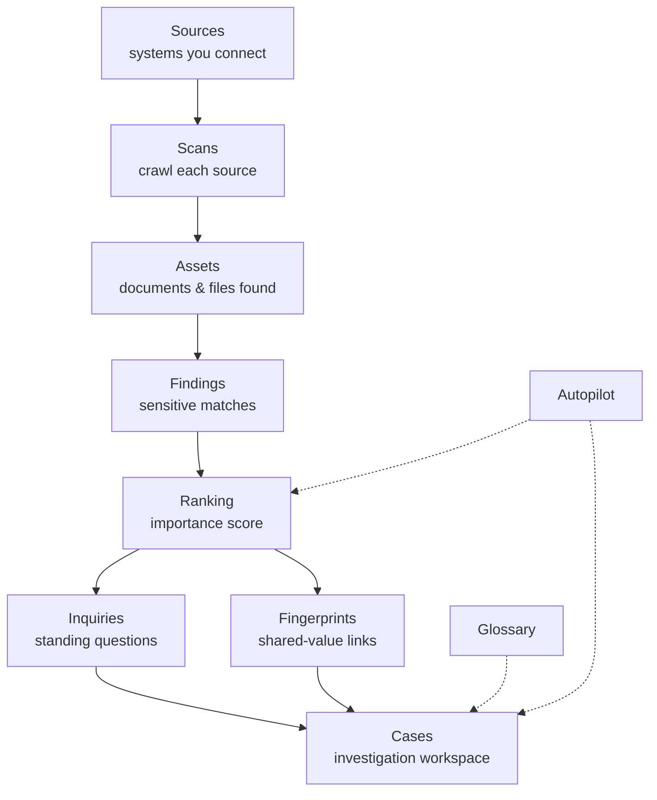

# How Classifyre Works

This section explains Classifyre the way an **operator or investigator** would
describe it — not a developer. If you want the full technical detail on any
piece, each section links to the deeper docs.

At its core, Classifyre does one thing: it turns the data scattered across the
systems you already run into a small number of **leads worth a human's time**,
and gives you a structured place to work them.

Prefer to learn screen by screen? Take **[A Tour of the
App](/how-it-works/in-the-app/)** — it maps every item in the app's navigation
to what it's for.

---

## The journey, in plain English

**1. Connect a source.** Point Classifyre at a system you already run —
SharePoint, Confluence, Jira, a file share, a local folder. Nothing is moved
out of your control; Classifyre reads it in place.

**2. Scan it.** A scan crawls the source and registers every document or file
as an **asset**, with metadata like owner, location, and last-changed date.

**3. Detect.** **Detectors** — pattern rules, ML models, or AI-based custom
detectors — read each asset and raise a **finding** whenever something's worth
a look, each carrying a **severity** (how bad if real) and a **confidence**
(how sure the detector is).

**4. Rank.** Severity alone doesn't say what to look at *first*. A ranking
pass scores each finding's **importance** — how much it looks like a genuine
lead, independent of severity — using signals like recurrence across
documents, context quality, and whether it looks like test data. See
[Ranking & the Semantic Layer](/how-it-works/ranking-and-semantics/).

**5. Watch and connect.** **Inquiries** are saved questions that keep watching
for matching findings; **fingerprints** link assets sharing concrete values
like an email or ID — revealing when the same record shows up in several
systems. See [Connections & Fingerprints](/how-it-works/connections-and-fingerprints/).

**6. Investigate.** A **case** is where the real work happens. Promising
findings arrive as **leads** — a triage queue you accept into **evidence** or
dismiss. You record dated **events** to build a chronology, and write a
**conclusion** when resolved. See [Leads, Evidence & Events](/how-it-works/investigating/).

**7. Keep a shared vocabulary.** A **glossary** of people, organisations, and
terms keeps everyone — human and AI — talking about the same entities. See
[Glossary & Shared Vocabulary](/how-it-works/glossary/).

**8. Let AI help.** **Autopilot** agents can do this legwork for you —
triaging findings, proposing leads and events, tuning detectors — always
logging why, and always subject to the supervision level you choose. See
[Autopilot & AI Assistance](/how-it-works/autopilot/).

---

## Why it's built this way

Two ideas run through the whole product:

- **Severity is not importance.** Severity says how bad a match would be *if
  real*. Ranking says how much this finding, in context, looks like a genuine
  lead. A "critical" finding repeated as boilerplate everywhere isn't where
  you start.
- **Similarity is not proof.** Two things looking alike — semantically or by
  shared values — is a reason to *look*, not to *conclude*. Every automated
  suggestion, from a ranked finding to an Autopilot-proposed lead, is a
  candidate for a human to accept or dismiss.

---

## Where to go next

| Page | What it covers |
|---|---|
| [A Tour of the App](/how-it-works/in-the-app/) | Every screen in the app, what it's for, and where to learn more. |
| [From Documents to Findings](/how-it-works/documents-to-findings/) | Sources, scans, assets, detectors. |
| [Ranking & the Semantic Layer](/how-it-works/ranking-and-semantics/) | Importance vs severity, recalibration. |
| [Connections & Fingerprints](/how-it-works/connections-and-fingerprints/) | Shared-value correlation vs semantic similarity. |
| [Leads, Evidence & Events](/how-it-works/investigating/) | Ranked finding to case conclusion. |
| [Glossary & Shared Vocabulary](/how-it-works/glossary/) | Shared vocabulary for people and AI. |
| [Autopilot & AI Assistance](/how-it-works/autopilot/) | What the AI agents do, and how to supervise them. |

Technical reference: [Scans](/flow/), [Sources](/sources/),
[Detectors](/detectors/), [Investigations](/investigations/).
