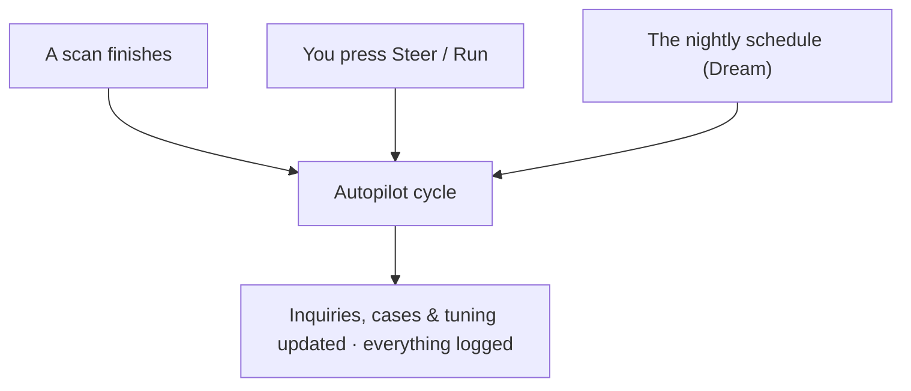
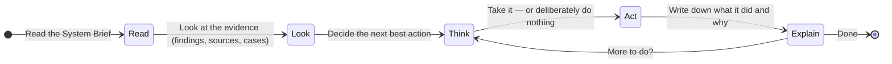
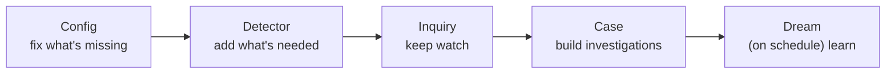
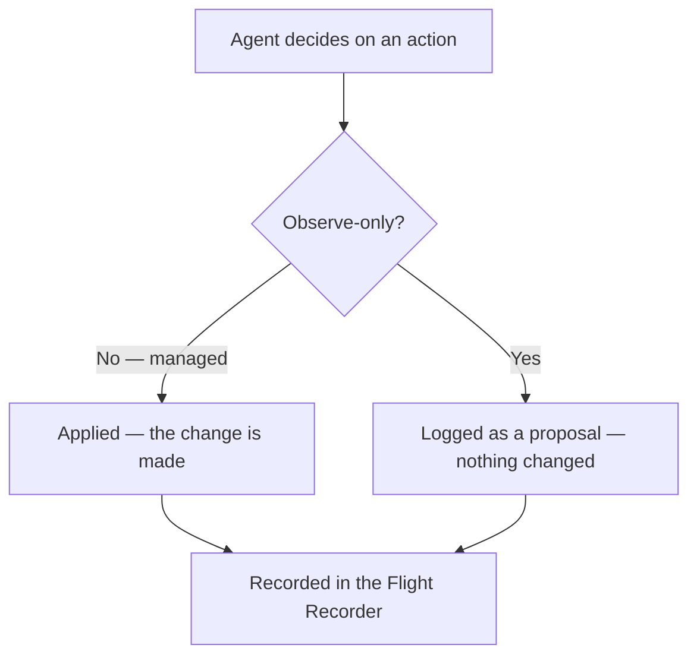

# How a Cycle Runs

Autopilot works in **cycles**. A cycle is one complete run: something wakes the
crew, each enabled agent does its work, and every move is recorded. You never
have to start a cycle yourself — though you can.

---

## What wakes Autopilot

| Trigger | When it happens | Good for |
|---|---|---|
| **Scan completed** | Automatically, every time a source finishes scanning | The default — keeps investigations current with no effort |
| **Manual run** | When you press *Run* (optionally with an instruction) | Pointing Autopilot at something specific, or trying it out |
| **Scheduled dream** | On a quiet cadence (the Dream agent's housekeeping) | Keeping memory and the System Brief tidy over time |

A **scan-triggered** run reacts to what just changed. A **manual** run reviews
*all* of your open data, not just the latest delta — which is why it's the right
choice when you want a thorough sweep or want to aim the crew with an
instruction.

---

## The steps in a single run

Whatever wakes it, every agent follows the same simple rhythm. Picture a careful
analyst working a shift:

1. **Read the brief.** The agent starts by reading the System Brief — the living
   summary of your instance — so it's grounded in your terminology, your past
   decisions, and the current state of play.
2. **Look at the evidence.** It pulls the relevant findings, sources, inquiries,
   or cases it needs to make a good decision.
3. **Decide.** It chooses the single next best action — which may well be *do
   nothing*, and that's a valid, recorded outcome.
4. **Act.** It carries the action out (or, in observe-only mode, only proposes
   it).
5. **Explain.** Every action and non-action is written to the Flight Recorder
   with a plain-English rationale.

The agent repeats *look → decide → act → explain* a handful of times per run,
then stops. Each run has a built-in budget so it always finishes — it can't loop
forever or run up a surprise bill.

> **It picks up where it left off.** If a run is interrupted, Autopilot resumes
> from the exact step it had reached rather than starting over or repeating work
> it already did. You'll never get duplicate cases from a hiccup.

---

## The order the crew works in

When a cycle runs the full crew, the agents go in an order that builds on itself:
first the detection side makes sure the right findings exist, then the
investigation side turns those findings into managed work.

You don't have to run the whole crew. You can enable just the agents you want —
see [Steering & Fine-Tuning](/investigations/autopilot/steering/).

---

## Observe-only: proposing without touching

Every action runs through one safety gate: **is this thing in observe-only
mode?** If so, the agent is allowed to *read* and *propose*, but never to
*change* anything.

This is how you build trust gradually: run Autopilot in observe-only first, read
its proposals in the Flight Recorder, and switch the things you're happy with
over to managed. You can set observe-only for the **whole instance**, or for a
**single source, detector, or case**. Details in
[Steering & Fine-Tuning](/investigations/autopilot/steering/).

---

## What you end up with

After a cycle you'll typically see some mix of: new or enriched **inquiries**,
new or updated **cases** with drafted **hypotheses**, **sources** with better
detector settings, the occasional **new detector**, and — every time — a complete
entry in the **Flight Recorder** explaining each decision.

Next: understand what keeps Autopilot grounded across all those cycles in
**[Memory & System Brief](/investigations/autopilot/memory/)**.
