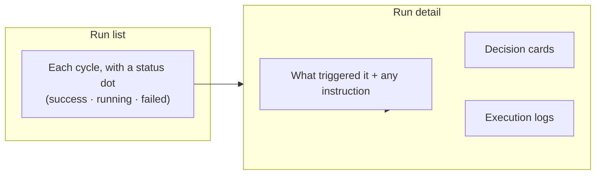
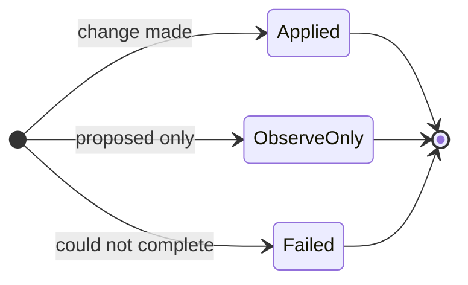

# Flight Recorder & Audit

Autopilot is built so you never have to take its word for anything. Every cycle
is captured in the **Flight Recorder**: a complete, readable record of what each
agent did, what it chose *not* to do, and the reason behind every decision. It's
a flight recorder, not a black box.

You'll find it in the Harness panel, alongside an **Activity** timeline that
spans every run.

---

## How a run is recorded

- **Run list** — every cycle in order, each with a status dot (succeeded,
  running, or failed), a short summary, and a timestamp. While a run is in
  progress the view updates live.
- **Run detail** — open any cycle to see what triggered it (a scan, a schedule,
  or your manual instruction), the individual decisions, and the logs.

---

## Decision cards — the heart of it

Each thing an agent decided becomes a **decision card**. This is where the
"explains itself" promise lives:

| On the card | What it tells you |
|---|---|
| **Outcome badge** | Whether the decision was **applied**, was **observe-only** (proposed, nothing changed), or **failed**. |
| **Action** | What it did, in plain terms — *"opened case: credential exposure," "enabled secrets detector on wiki source."* |
| **Rationale** | A written reason for the decision. This is mandatory — every action *and* every deliberate non-action has one. |
| **Details** | The specifics behind the action, expandable when you want to dig in. |

Because *non*-actions are recorded too, you can see not just what Autopilot
changed, but what it considered and deliberately left alone — and why.

---

## Two ways to read the logs

Each run's logs come in two channels, so the right person gets the right level
of detail:

| Channel | Who it's for | What it reads like |
|---|---|---|
| **Business narrative** | Analysts, reviewers, auditors | Plain English: *"Reviewed 42 new findings, grouped 6 into an existing case, opened 1 new inquiry."* |
| **Technical log** | Operators debugging behaviour | A detailed, step-by-step trace of the run for when you need to see exactly what happened. |

Most of the time the business narrative is all you need. The technical channel is
there for the moments you want to verify a specific step.

---

## The run dashboard

The top of the Harness panel summarises Autopilot's recent health at a glance:

| Metric | Meaning |
|---|---|
| **Active runs** | Cycles running right now |
| **Runs (24h)** | How busy Autopilot has been today |
| **Applied** | Changes actually made |
| **Observe-only** | Proposals that were logged but not applied |
| **Failed** | Decisions that couldn't complete |
| **Memory entries** | How much Autopilot has learned |
| **Brief version** | How current the System Brief is |

A healthy instance running in *managed* mode shows mostly **applied** decisions;
one you've kept in *observe-only* shows mostly **observe-only** — exactly the
proposals waiting for your review.

---

## Why this matters

- **Trust through transparency.** Nothing happens silently. If Autopilot opened a
  case or changed a source, the reason is one click away.
- **Audit-ready.** Every action is attributed and timestamped, so the record
  stands up to a compliance or security review.
- **A feedback loop.** Reading the rationale on a decision you disagree with tells
  you exactly which **guidance** or **operator directive** to adjust — see
  [Steering & Fine-Tuning](/investigations/autopilot/steering/).

---

## You've seen the whole picture

That completes the tour of Autopilot — from the big idea to the details:

| Page | |
|---|---|
| [Overview](/investigations/autopilot/) | What Autopilot is and why it exists |
| [Meet the Agents](/investigations/autopilot/agents/) | The five agents and what each changes |
| [How a Cycle Runs](/investigations/autopilot/cycle/) | Triggers, the run rhythm, and observe-only |
| [Memory & System Brief](/investigations/autopilot/memory/) | How it stays grounded and learns |
| [Steering & Fine-Tuning](/investigations/autopilot/steering/) | Every knob you can turn |
| Flight Recorder & Audit | How to read what it did *(you are here)* |
