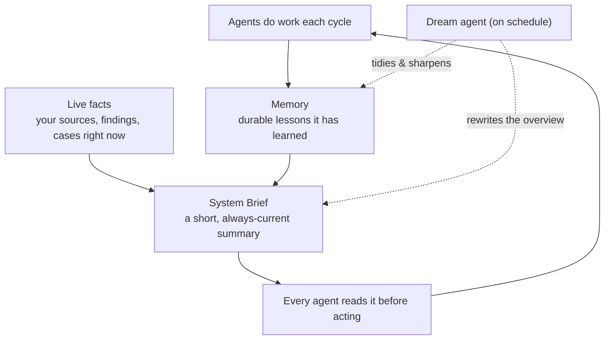
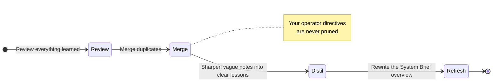

# Memory & System Brief

The single biggest difference between Autopilot and a generic chatbot is that
Autopilot **knows your instance**. It builds up a memory of your world and keeps
a living summary — the **System Brief** — that every agent reads before it acts.
Together these are what make it get *sharper* over time instead of starting cold
every run.

---

## The System Brief

The System Brief is a short, plain-language summary of your whole instance.
Think of it as the one-page handover note a new analyst would read before
starting a shift — except it's always up to date, and every agent reads it
before every action.

It's assembled fresh each time from two things: **live facts** pulled straight
from your instance, and the **lessons** Autopilot has saved in memory. Because
the facts are read live, the brief never goes stale or drifts away from reality.

A brief typically covers:

| Section | What it tells the agents |
|---|---|
| **Overview** | A few sentences on what this instance is for — the one part the crew writes in its own words. |
| **Coverage** | Live counts: how many sources, findings, custom detectors, inquiries, and cases exist right now. |
| **Glossary** | The key terms specific to your organisation. |
| **Topics** | Which subjects map to which inquiries and cases. |
| **Gaps** | Known blind spots and detector ideas still to try. |
| **Setup** | A practical checklist — is an AI provider configured? Are there silent sources? Which agents are switched on? |

> Because the **Setup** section is built from real state, the System Brief
> doubles as a to-do list for *you*. If Autopilot isn't doing something you
> expect, the brief usually tells you why (e.g. "no AI provider configured").

You can read the current brief — and edit its overview in your own words — under
the **Brief** tab of the Harness panel.

---

## What Autopilot remembers

Alongside the brief, Autopilot keeps a longer-term **memory** of durable lessons.
This is not a transcript of past chats; it's a curated set of facts worth
keeping. There are a few kinds:

| Memory kind | Example | Why it's kept |
|---|---|---|
| **Glossary** | *"'PRD' means our production environment, not a product doc."* | So agents read your data the way your team does. |
| **Decision precedents** | *"We treat test-data card numbers as false positives."* | So past calls are applied consistently. |
| **Topic map** | *"'Credential leak' findings belong to Inquiry #12."* | So related findings land in the right place. |
| **Source & detector notes** | *"Enabled the secrets pack on the wiki source; expecting key matches."* | So a later run can check whether a change worked. |
| **Operator directives** | *"Never open cases for the staging environment."* | Your standing instructions — see below. |

Every memory entry carries a **weight** (how important it is, which nudges how
strongly it's recalled) and **tags** (for grouping and search). You can browse,
search, edit, and delete entries under the **Memory** tab of the Harness panel.

---

## Operator directives — your standing orders

Some memory is sacred: the instructions *you* give Autopilot. These are called
**operator directives**, and they are treated differently from everything else.

- They express your standing policy — *"don't touch the staging sources,"*
  *"always treat IBANs as high severity," "focus on customer-data exposure."*
- The Dream agent's housekeeping **never prunes or rewrites them**. Ordinary
  learned notes can be merged or trimmed; your directives stay exactly as you
  set them.
- They steer every agent, every cycle, until you change them.

This is the cleanest way to encode a permanent rule. For one-off nudges, use a
manual run with an instruction instead — see
[Steering & Fine-Tuning](/investigations/autopilot/steering/).

---

## How memory stays healthy

Left alone, any growing memory turns into clutter. That's the Dream agent's job:
on a quiet schedule it consolidates entries, removes duplicates and noise,
distils long notes into crisp lessons, and refreshes the brief's overview — while
always leaving your operator directives untouched.

The result is memory that keeps getting *clearer*, so Autopilot's understanding
of your world compounds instead of decaying.

Next: put it all to work — every toggle and knob is in
**[Steering & Fine-Tuning](/investigations/autopilot/steering/)**.
