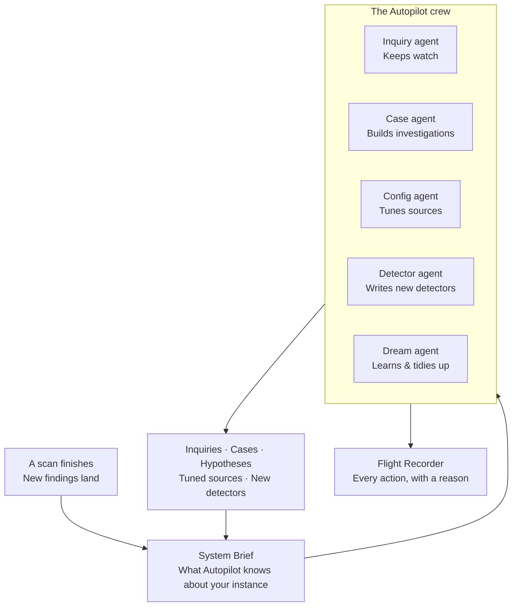

# Autopilot

Most scanners hand you a findings table and wish you luck. **Autopilot** is the
team of AI agents that picks that table up and does the work: it opens
**inquiries**, builds **cases**, drafts **hypotheses**, tunes your **sources**,
and even writes new **detectors** — automatically, after every scan, and with a
written reason for every move.

You watch and steer it from one place in the app: the **Harness** panel. Think
of Harness as mission control, and Autopilot as the crew flying the mission.

> **Autopilot, not copilot.** A copilot waits for you to type a prompt.
> Autopilot does not wait. It wakes on its own after a scan finishes, recalls
> what it has learned about *your* instance, and moves the investigation forward
> — so the work is already done (or proposed) by the time you next log in.

---

## The big picture

Everything flows around the **System Brief** — a living summary of your instance
that every agent reads before it acts, and that the crew keeps up to date as it
learns. That is what stops Autopilot from feeling like a generic chatbot: it
always works from *your* glossary, *your* past decisions, and *your* current
state.

---

## What Autopilot does for you

| Job | What it means in practice |
|---|---|
| **Keeps watch** | Turns recurring findings into standing **inquiries** so the same issue is tracked, not re-discovered every scan. |
| **Builds investigations** | Opens **cases**, groups related evidence, and drafts **hypotheses** for your team to confirm or reject. |
| **Wakes up silent sources** | Spots a source that ingests data but produces no findings, looks at the data, and switches on the detectors that fit it. |
| **Writes new detectors** | When nothing on the shelf catches an important signal, it authors, tests, and deploys a new custom detector — then checks whether it worked. |
| **Learns your domain** | Remembers your terminology and decisions so it gets sharper over time instead of starting from scratch. |
| **Explains itself** | Records every action — and every deliberate *non*-action — with a plain-English rationale you can read later. |

---

## Who's on the crew?

Autopilot is not one big model — it's five focused agents, each with one job.
Keeping them separate is what makes the work predictable and easy to steer.

| Agent | Its one job |
|---|---|
| **Inquiry** | Keeps the set of standing questions healthy — creates, enriches, and de-duplicates inquiries. |
| **Case** | Builds and maintains investigation cases: evidence, hypotheses, links, and status. |
| **Config** | Tunes each source's detectors and sampling to catch more and waste less. |
| **Detector** | Authors brand-new custom detectors when existing ones miss something. |
| **Dream** | Runs on a quiet schedule to consolidate memory and refresh the System Brief. |

Read on in **[Meet the Agents](/investigations/autopilot/agents/)** for what
each one actually changes.

---

## You are always in control

Autopilot is built to be trusted, which means it is built to be *reined in*.

- **Off by default.** Every agent is disabled until you switch it on. Nothing
  runs without your say-so.
- **Observe-only mode.** Flip the whole instance — or a single source, detector,
  or case — to *observe-only* and Autopilot will *propose* without touching
  anything.
- **Steer it.** Point it at what matters with a one-line instruction, or kick off
  a run manually whenever you like.
- **Everything is logged.** The **Flight Recorder** keeps a complete, readable
  record of what each agent did and why.

> New to this? Start with **[How a Cycle Runs](/investigations/autopilot/cycle/)**
> to see what happens from "a scan finishes" to "the work is done," then visit
> **[Steering & Fine-Tuning](/investigations/autopilot/steering/)** to make
> it your own.

---

## Where to go next

| Page | What you'll learn |
|---|---|
| **[Meet the Agents](/investigations/autopilot/agents/)** | What each of the five agents does, and what it changes. |
| **[How a Cycle Runs](/investigations/autopilot/cycle/)** | What wakes Autopilot, and the steps a single run goes through. |
| **[Memory & System Brief](/investigations/autopilot/memory/)** | How Autopilot remembers your domain and stays grounded. |
| **[Steering & Fine-Tuning](/investigations/autopilot/steering/)** | Every knob: toggles, guidance, observe-only, schedules, and more. |
| **[Flight Recorder & Audit](/investigations/autopilot/flight-recorder/)** | How to read exactly what Autopilot did and why. |
