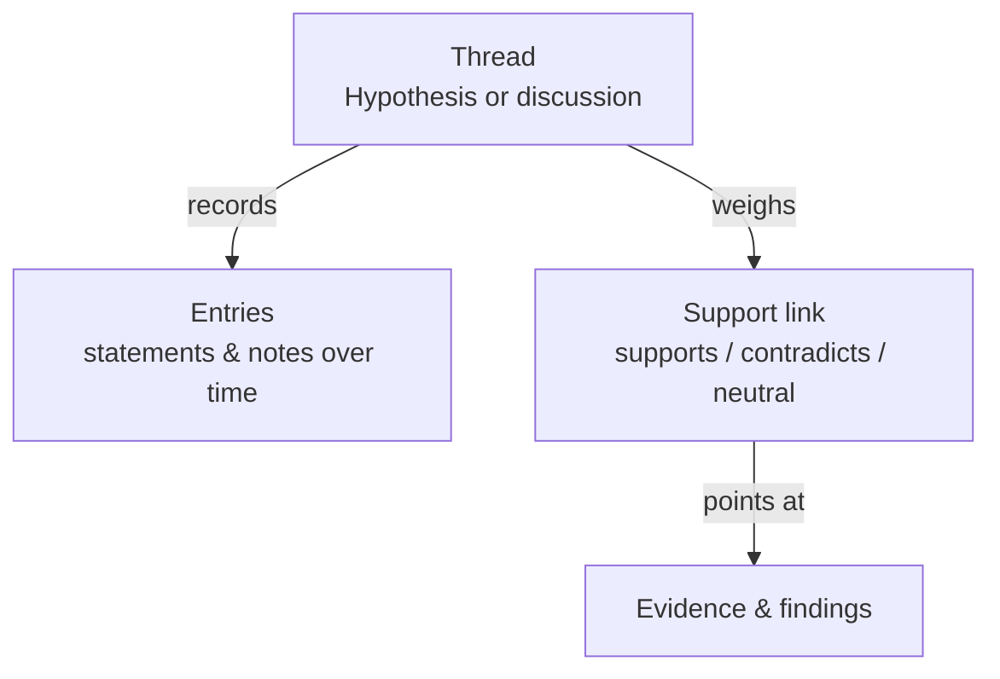
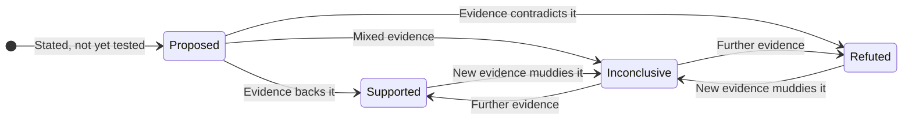

# Hypothesis & Threads

Inside a case, **threads** are where the thinking happens. They come in two
kinds: **hypotheses** — explanations you're testing — and **discussions** —
free-form notes and debrief. A hypothesis is the heart of it: you state a theory,
then let the evidence confirm or kill it.

---

## How a hypothesis evolves

A hypothesis starts as a proposal and moves as the evidence comes in:

| Verdict | What it means |
|---|---|
| **Proposed** | Stated but not yet tested |
| **Supported** | The evidence consistently backs it |
| **Refuted** | The evidence consistently contradicts it |
| **Inconclusive** | The evidence is mixed or insufficient |

Because you can run several hypotheses side by side, a case becomes a set of
competing explanations — and the evidence shows which one is winning.

---

## Linking evidence: for and against

The power of a hypothesis comes from connecting it to evidence with a clear
**stance**:

| Stance | Meaning |
|---|---|
| **Supports** | This evidence backs the hypothesis |
| **Contradicts** | This evidence argues against it |
| **Neutral** | Relevant context, but not pointing either way |

Each hypothesis shows a running **for / against** count, so at a glance you can
see how strongly the evidence leans — and which theory is holding up.

---

## Confidence

Alongside the verdict, you can set a **confidence** level — your own certainty in
the hypothesis. It's deliberately separate from the verdict: you might have a
*supported* hypothesis you're only moderately sure of, or a *refuted* one you're
very confident is wrong. Verdict captures *what the evidence says*; confidence
captures *how sure you are*.

---

## A record of the reasoning

Every thread keeps a running history — the statements added, the verdict and
confidence changes, and the notes along the way. That makes a hypothesis not just
a conclusion but a **transparent line of reasoning** anyone can follow later,
including which steps were taken by a teammate and which by
[Autopilot](/investigations/autopilot/).

> Hypotheses and their evidence links are also drawn on the
> [knowledge graph](/investigations/cases/graph/), so you can *see* which
> evidence supports which theory.
