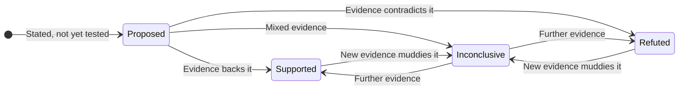

import { Callout, Steps } from "nextra/components"
import { CaseBoardDemo } from "@/components/case-board/board-demo"
import { LineKey } from "@/components/case-board/board-key"

# Hypotheses & threads

A **hypothesis** is a statement of what you think happened: *"The supplier's
bank details were changed by a fraudster."* You put it on the board, link the
evidence that bears on it, and let that evidence confirm it or kill it. Running
several hypotheses side by side keeps the investigation honest: you test the
explanations against each other instead of falling for the first one.

Behind every hypothesis is a **thread**: its verdict, your confidence, the
evidence for and against, and a running record of the reasoning.

<CaseBoardDemo
  scene="hypotheses"
  height={460}
  caption="Two competing hypotheses. Click a card to focus it: only its evidence stays lit. Click the empty canvas to show everything again. Point at a line to read the stance and the note that explains it."
/>

---

## The hypothesis card

Each hypothesis appears on the board as a card:

- **H1, H2, …** in the order they were created, with a **colour** of its own (the
  strip on the card's left edge). The same colour marks the evidence that cites
  it.
- The **verdict** in the top corner: *Proposed*, *Supported*, *Refuted* or
  *Inconclusive*.
- The **statement** itself.
- A **confidence** bar, once someone has set one.
- The **tally** of linked evidence: ✓ supporting, ✗ contradicting, ○ neutral.
- How many **entries** the thread has, and who wrote the last one and when.
- **Open thread**, which opens the thread in the side panel. Double-clicking the
  card does the same.

On every asset a hypothesis cites, a small **dot in the hypothesis colour**
appears above the circle. Contested evidence, cited by several hypotheses,
carries several dots. Click a dot to focus that hypothesis.

---

## Verdict and confidence

A hypothesis starts as *Proposed* and moves as the evidence comes in:

```mermaid
stateDiagram-v2
    direction LR
    [*] --> Proposed: Stated, not yet tested
    Proposed --> Supported: Evidence backs it
    Proposed --> Refuted: Evidence contradicts it
    Proposed --> Inconclusive: Mixed evidence
    Supported --> Inconclusive: New evidence muddies it
    Refuted --> Inconclusive: New evidence muddies it
    Inconclusive --> Supported: Further evidence
    Inconclusive --> Refuted: Further evidence
```

| Verdict | What it means |
|---|---|
| **Proposed** | Stated but not tested yet |
| **Supported** | The evidence consistently backs it |
| **Refuted** | The evidence consistently contradicts it |
| **Inconclusive** | The evidence is mixed or not enough |

**Confidence** is separate from the verdict, on purpose. The verdict records
*what the evidence says*; confidence records *how sure you are*. You can have a
supported hypothesis you are only moderately sure of, or a refuted one you are
very sure is wrong.

---

## Linking evidence: for and against

A stance joins a hypothesis to a piece of evidence, or to a single finding:

<LineKey only="stances" />

Ways to set one:

- **Drag** from the card to an asset or finding. When you drop, pick
  **Supports**, **Contradicts** or **Neutral**.
- **Right-click** evidence → **Add to hypothesis**: pick the hypothesis and the
  stance. Select several things first to link them all at once.
- In the thread, on the **Evidence** tab, use **Link evidence or a finding…**.

A stance can also carry a **note** saying why, such as *"Look-alike domain:
agency-ltd.co"*, and a confidence of its own; Autopilot adds them when it links
evidence. Point at a stance line to read them. Record your own reasoning in
the hypothesis's thread.

---

## Focus

**Click a card** to focus it: the hypothesis, its stance lines and the evidence
they point to stay lit, and everything else fades. It is the fastest way to ask
"what exactly is this theory built on?"

- Click the card again, click the empty canvas, or press `Esc` to show
  everything again.
- Press `.` to **lock the focus**. While locked, clicking around the board no
  longer clears it. A banner says **Focus locked**; press `.` again to unlock.

---

## The thread

Open a thread with **Open thread**, a double-click on the card, or from the
**Hypotheses** panel. It opens in the side panel:

| Part | What you do there |
|---|---|
| **Statement** | Reword the hypothesis as your understanding sharpens. The old wording stays in the log as *Restated* |
| **Verdict** | Set *Proposed*, *Supported*, *Refuted* or *Inconclusive* with one click |
| **Confidence** | Drag the slider to how sure you are |
| **Balance of evidence** | A bar showing supporting against contradicting evidence, and how much is linked |
| **Evidence** tab | Everything linked to the hypothesis, supporting evidence first. Change a stance from its chip, unlink it, or link more |
| **Log** tab | The complete history: when it was stated, restated, when the verdict or confidence changed, and every note, each with who and when |
| **Test** tab | Write down what you would expect to find in the data if the hypothesis is true, or false. For example: *"Every invoice from this supplier carries the same IBAN."* |
| **Note box** | At the bottom: record reasoning, a new observation, or why the verdict changed |

The thread's **⋯** menu can show the card on the board (or place it, if it is not
on the board yet), focus it, change its colour, or delete the hypothesis.
Deleting removes its notes, history and evidence links; the evidence itself
stays in the case.

<Callout type="info">
Verdict and confidence change through entries in the thread, never silently.
That keeps the log a complete, trustworthy line of reasoning that anyone can
follow later. It also shows which steps a teammate took and which
[Autopilot](/investigations/autopilot/) took.
</Callout>

---

## Creating a hypothesis

<Steps>

### Place it

Use any of these:

- Press `T` (the **Hypothesis** tool) and click on the board.
- Right-click the empty canvas → **Add hypothesis here**.
- Press `⌘K` and choose **New hypothesis**.
- In the **Hypotheses** panel, click **New hypothesis**.

### State it

Type the statement and press `Enter`.

### Start from the evidence (optional)

Select one or more pieces of evidence first, then right-click → **New
hypothesis from selection**. The new hypothesis starts with the selection
linked as supporting evidence.

</Steps>

---

## The Hypotheses panel

The **Hypotheses** panel (the flask icon on the right) lists every hypothesis of
the case, on the board or not. For each one it shows the verdict, the
confidence, the balance of evidence and how many entries its thread has, and it
counts how many already have a verdict. Click one to open its thread. A
hypothesis that is not on the board can be placed from here.

Removing a card from the board (right-click → **Remove card from board**) does
**not** delete the hypothesis: it stays in the panel with its whole history, and
you can place it again at any time.

Right-clicking a card also offers **Edit statement**, **Focus**, **Change
colour** and **Comment**.

---

## Discussions

Not every thread is a hypothesis. **Discussions** are free-form conversations:
debriefs, questions and hand-over notes. A discussion starts from a comment
pinned on the board (see [Notes, frames & comments](/investigations/cases/organise/#comments)),
and everyone can reply. The **Timeline** panel's *Threads* tab lists every
thread, with **Show on board** or **Place on board**.
