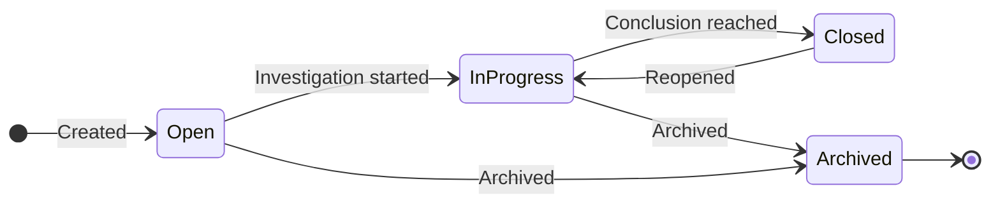

import { Callout } from "nextra/components"
import { CaseBoardDemo } from "@/components/case-board/board-demo"

# Cases

A case is an **investigation case file**. Findings tell you that *something*
turned up; a case is where you work out **what happened, why it matters and what
to do about it**.

Every case opens on its **case board**: a canvas where the evidence, the
findings on it, your hypotheses and your notes sit side by side, joined by lines
that say how they relate. You arrange it however the case makes sense to you,
and the board keeps the picture for everyone who works on it.

<CaseBoardDemo
  scene="overview"
  height={460}
  caption="A live board. Drag things around, click the hypothesis card to see only its evidence, and point at an asset to see where you can pull a link from. Nothing here is saved."
/>

The board above tells a short story. A payroll spreadsheet was **transformed**
into a CSV export. The export was **attached** to an email, and the email went to
a private address. Hypothesis **H1** says the data was forwarded to a private
mailbox, and two findings **support** it (the green lines). A note holds the next
step, and a pink frame groups the exfiltration path.

---

## What's on a board

| On the board | What it is | Learn more |
|---|---|---|
| **Evidence** | An asset you added to the case (a file, an email, a table, a page), drawn as a circle with its kind icon and a lime ring | [Evidence & findings](/investigations/cases/evidence/) |
| **Findings** | What the detectors found in that asset, as small circles in their severity colour | [Evidence & findings](/investigations/cases/evidence/) |
| **Lines** | How two things relate: lineage and references the platform found, links you drew, and the stance of a hypothesis | [Lines & links](/investigations/cases/links/) |
| **Hypotheses** | Cards stating what you think happened, with a verdict, a confidence and the evidence for and against | [Hypotheses & threads](/investigations/cases/hypothesis/) |
| **Neighbours and connections** | Assets connected to your evidence that are not in the case yet, and the full trail of where data came from and went | [Connections & neighbours](/investigations/cases/connections/) |
| **Notes, frames and comments** | Sticky notes, named groups and conversations pinned to the board | [Notes, frames & comments](/investigations/cases/organise/) |

For a guided tour of the screen itself (the top bar, the tools and the side
panels), see [The case board](/investigations/cases/board/). To move around
quickly, see [Navigating & shortcuts](/investigations/cases/navigate/). For
which tool to reach for when, see [Use cases](/investigations/cases/use-cases/).

---

## Starting a case

A case can start in three places, depending on where the work begins:

1. **From an inquiry.** Open a case straight from an
   [inquiry](/investigations/inquiry/). The inquiry becomes a *watch* that
   feeds the case, and its current matches arrive as starting evidence.
2. **From a confirmed duplicate.** In [Duplicate review](/duplicates/), turn a
   duplicate or similarity cluster into a case; its members arrive as evidence.
3. **From scratch.** Start a blank case, then add evidence from the board, or
   link one or more inquiries to seed it with their matches.

An empty board offers the three quickest ways in: **Link a watch**, **Add
evidence** and **Add a note**.

---

## Status lifecycle

| Status | Meaning |
|---|---|
| **Open** | Created, waiting for someone to pick it up |
| **In progress** | Actively being investigated |
| **Closed** | A conclusion is written and the investigation is complete |
| **Archived** | No longer active, kept for the record |

The status and the case's severity are shown next to its name at the top of
the board.

---

## Letting Autopilot help

Each case has an **AI mode** that decides whether the
[Autopilot](/investigations/autopilot/) case agent may act on it on its own,
or only watch and propose. Set it in the **Case file** panel on the board, where
you can also start an Autopilot run straight away (**Run Autopilot…**, also in
the board's **More** menu).

What Autopilot proposes for a case arrives in the **Leads** panel. Drag a lead
onto the board to add it where you want it, or accept or reject it from the
list. Everything Autopilot does on the case is recorded in the
[timeline](/investigations/cases/timeline/) with a clear AI badge. To freeze a
sensitive case so that Autopilot only observes, see
[Steering & Fine-Tuning](/investigations/autopilot/steering/).

---

## Closing a case

Close a case from the **Case file** panel or the board's **More** menu
(**Close case…**). Closing asks for a written **conclusion**: the answer the
investigation reached. When you close it:

- its linked inquiries are archived, so they stop feeding it new matches;
- the conclusion is recorded in the [timeline](/investigations/cases/timeline/);
- a **snapshot** of the board is taken, so the picture at the moment of closing
  is kept exactly as it was;
- the board becomes **read-only**. A banner says so, with a **Reopen** button.

<Callout type="info">
Reopening puts the case back in progress and makes the board editable again.
Nothing is lost by closing: the snapshot, the timeline and every note stay.
</Callout>

---

## Go deeper

| Page | |
|---|---|
| [The case board](/investigations/cases/board/) | A tour of the screen: top bar, canvas, tools, side panels |
| [Evidence & findings](/investigations/cases/evidence/) | Adding evidence and reading what the circles say |
| [Lines & links](/investigations/cases/links/) | Relations the platform found, links you draw, stances |
| [Hypotheses & threads](/investigations/cases/hypothesis/) | Propose explanations and test them against the evidence |
| [Connections & neighbours](/investigations/cases/connections/) | Find what else is connected, and trace the whole trail |
| [Notes, frames & comments](/investigations/cases/organise/) | Organise the board and talk about it |
| [Navigating & shortcuts](/investigations/cases/navigate/) | Mouse, keyboard, zoom levels and the search |
| [Use cases](/investigations/cases/use-cases/) | Which tool to use for which kind of investigation |
| [Timeline](/investigations/cases/timeline/) | The complete record of what happened in a case |
