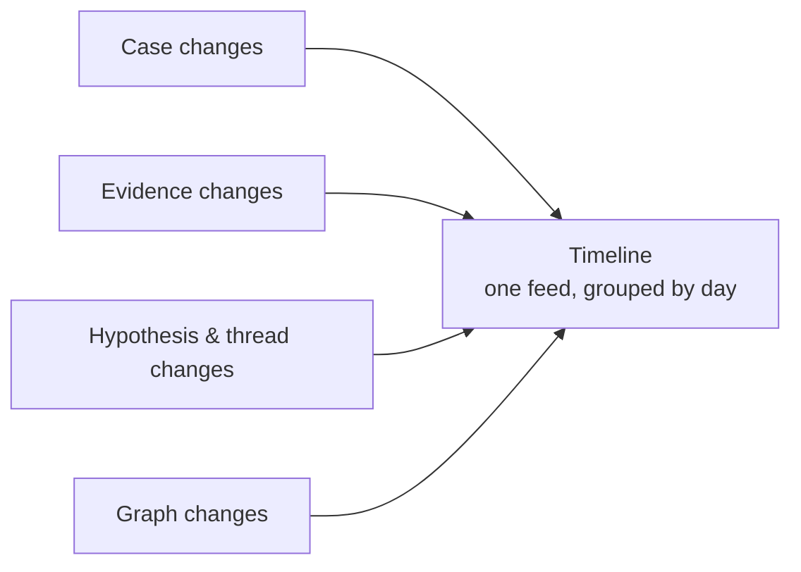

# Timeline

The timeline is a case's **complete activity log**. Every meaningful change —
from the moment the case was created, through every piece of evidence added, every
hypothesis updated, and the conclusion that closed it — is recorded in order. It's
the case's memory, and its audit trail.

---

## What it records

Everything that meaningfully changes a case shows up on the timeline:

| Area | Events you'll see |
|---|---|
| **Case** | Created, updated, closed, reopened |
| **Inquiries** | Linked, unlinked, and matches pulled in |
| **Evidence** | Assets and findings attached or removed, and notes edited |
| **Hypotheses** | Threads created, verdicts and confidence changed, links and notes added |
| **Graph** | Manual connections added, renamed, or removed |

---

## Reading the feed

The timeline is built to scan quickly:

- **Grouped by day**, with clear date headers, so you can follow the
  investigation as a story.
- **Each event shows who did it** — a teammate, or an
  [Autopilot](/investigations/autopilot/) agent, clearly badged — so human
  and AI work sit side by side in one trustworthy record.
- **Filter by area** — focus on just evidence, just hypotheses, and so on.
- **Jump to a date** to skip straight to a moment you care about, and **load
  older** activity as you go back in time.

> Because both people *and* Autopilot act on the same case, the timeline is where
> you confirm exactly what the AI did and when — the same "explain everything"
> principle behind the [Autopilot flight
> recorder](/investigations/autopilot/flight-recorder/).
