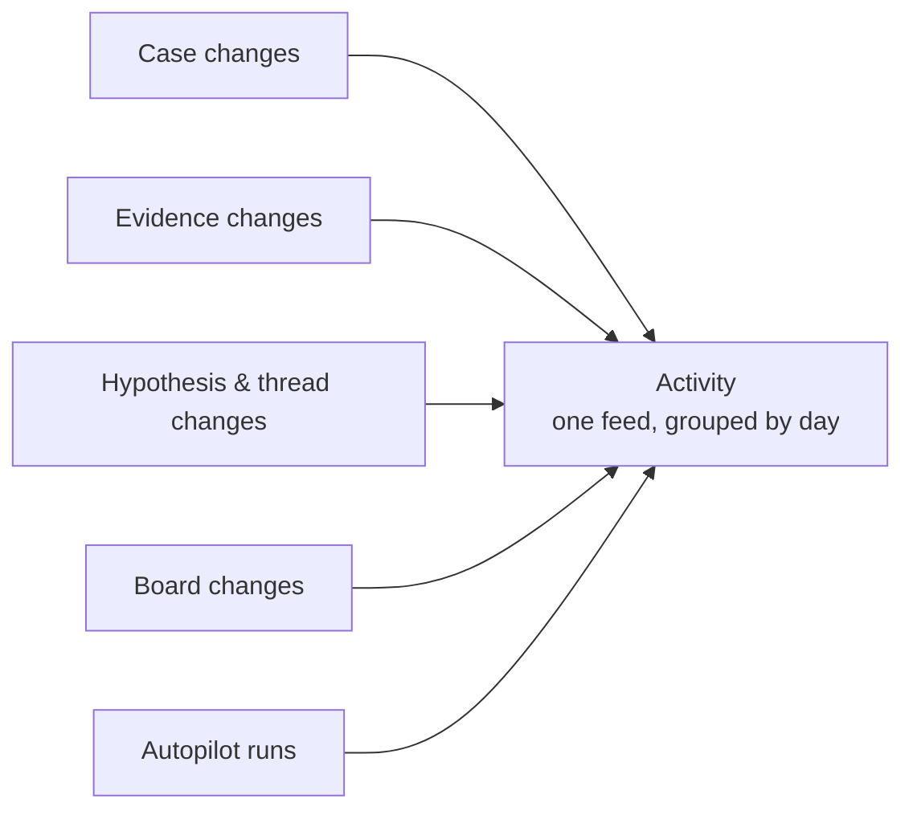

import { Callout } from "nextra/components"

# Timeline

The timeline is a case's **complete activity log**. Every meaningful change is
recorded in order: the moment the case was created, every piece of evidence
added, every hypothesis updated, every link drawn on the board, and the
conclusion that closed it. It is the case's memory and its audit trail.

Open it from the **Timeline** panel on the right of the
[case board](/investigations/cases/board/). The panel has three tabs:

| Tab | What it holds |
|---|---|
| **Activity** | Everything done on the case, by people and by Autopilot, grouped by day |
| **Chronology** | The story of what happened in the real world, in the order it happened. You build it |
| **Threads** | Every hypothesis and discussion, with **Show on board** or **Place on board** |

```mermaid
graph LR
    Case["Case changes"]
    Evidence["Evidence changes"]
    Threads["Hypothesis & thread changes"]
    Board["Board changes"]
    AI["Autopilot runs"]
    Feed["Activity<br/>one feed, grouped by day"]

    Case --> Feed
    Evidence --> Feed
    Threads --> Feed
    Board --> Feed
    AI --> Feed
```

---

## What Activity records

| Area | Events you'll see |
|---|---|
| **Case** | Opened, updated, conclusion written or changed |
| **Inquiries** | Linked, unlinked, and evidence pulled in from their matches |
| **Evidence** | Assets added or removed, findings attached or removed, and notes on them edited |
| **Hypotheses & threads** | Threads started, notes added, statements revised, verdicts and confidence changed, evidence linked or unlinked |
| **Board** | Notes and frames added, edited or removed; links drawn, edited, removed or made global; highlights; tidy-ups; snapshots; comments resolved |
| **Autopilot** | Each Autopilot run on the case |

---

## Reading the feed

The feed is built to scan quickly:

- **Grouped by day**, with clear date headers, so you can follow the
  investigation as a story.
- **Each event shows who did it**: a teammate, or an
  [Autopilot](/investigations/autopilot/) agent, clearly badged. Human and AI
  work sit side by side in one trustworthy record.
- **Filter by area** to see only evidence, only hypotheses, only the board, and
  so on.
- **Show on board**: events about something still on the board take you
  straight to it.

---

## Chronology

Activity records what was done *to the case*. **Chronology** is different: it is
the sequence of **real-world events** the investigation uncovers. For example:
*12 March, 23:40: payroll export emailed to a private address*, then *13 March:
mailbox reported*.

- **Add an event** with a title and the date and time it happened.
- Events are shown in the order they **happened**, not the order they were
  recorded.
- Events proposed by Autopilot are marked as such. **Verify** one once you have
  confirmed it; verified events are marked too.
- Edit or remove events as the picture changes.

A good chronology is often the clearest summary of a case: exactly what
happened, when, and how sure you are of each step.

<Callout type="info">
Because both people *and* Autopilot act on the same case, the timeline is where
you confirm exactly what the AI did and when. It follows the same "explain
everything" principle as the
[Autopilot flight recorder](/investigations/autopilot/flight-recorder/).
</Callout>
