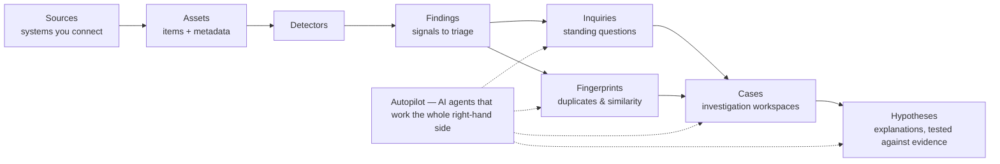
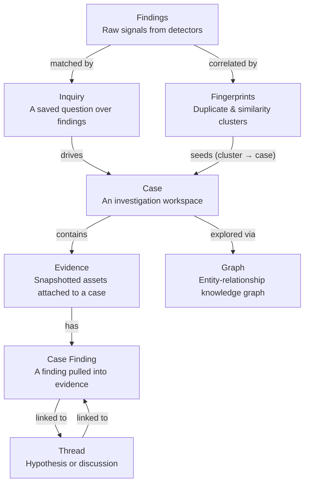
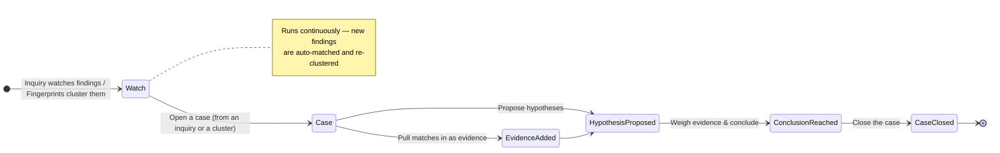

# Investigations

Detecting issues is only half the job. **Investigations** are where raw findings
become understood: tracked over time, connected to one another, grouped into
cases, and explained. This is the layer that turns *"here are 4,000 findings"*
into *"here are the three things you actually need to deal with, and why."*

---

## How it all connects

Everything in Classifyre is one connected pipeline. Investigations are the
right-hand side of it:

Reading it left to right:

1. **[Sources](/sources/)** connect the systems you run and scan them into
   **[assets](/sources/assets-and-metadata/)**.
2. **[Detectors](/detectors/)** read each asset and raise
   **[findings](/detectors/findings/)** — the signals worth looking at.
3. **[Inquiries](/investigations/inquiry/)** keep watch over findings by
   rule, and **[Fingerprints](/investigations/fingerprints/)** connect them
   by shared identity (duplicates and similar items).
4. **[Cases](/investigations/cases/)** are the workspaces where evidence is
   collected and **[hypotheses](/investigations/cases/hypothesis/)** are
   weighed until you reach a conclusion.
5. **[Autopilot](/investigations/autopilot/)** wraps the whole right-hand
   side: AI agents open inquiries, maintain fingerprints, build cases, and draft
   hypotheses — automatically, after every scan.

> If detectors answer *"what did we find?"*, investigations answer *"what does it
> mean, and what should we do?"*

---

## The building blocks

The investigation layer is made of four ideas. Each has its own page.

| Building block | What it does | When you reach for it |
|---|---|---|
| **[Inquiry](/investigations/inquiry/)** | A saved question that continuously surfaces matching findings | You want to *keep watching* for a class of issue |
| **[Fingerprints](/investigations/fingerprints/)** | Links assets that share evidence — duplicates and similar items, grouped into clusters | You want to find *the same thing showing up in many places* |
| **[Cases](/investigations/cases/)** | A workspace collecting evidence, hypotheses, and a conclusion | You're ready to *investigate and resolve* something |
| **[Autopilot](/investigations/autopilot/)** | AI agents that run the above for you | You want the legwork *done automatically* |

---

## A typical lifecycle

- **Inquiry** — Define what you want to watch and get a live count of matching
  findings, refreshed every scan.
- **Fingerprints** — See duplicates and similar assets, grouped into clusters you
  can turn straight into a case.
- **Case** — Collect evidence, weigh hypotheses, and reach a conclusion. Linked
  inquiries keep it fed with fresh matches.
- **Evidence & threads** — Snapshotted assets with their findings, and
  hypothesis threads that link to the evidence supporting or contradicting them.
- **Graph** — A knowledge graph visualising entities, relationships, and evidence
  across the whole investigation.

---

## Don't want to do it by hand?

Every step above can run on **[Autopilot](/investigations/autopilot/)**. Its
AI agents keep inquiries tidy, refresh fingerprints, build cases, and draft
hypotheses after each scan — with a written reason for every action. You stay in
control with observe-only mode and can steer it whenever you like.

Start anywhere: **[Inquiry](/investigations/inquiry/)** ·
**[Fingerprints](/investigations/fingerprints/)** ·
**[Cases](/investigations/cases/)** ·
**[Autopilot](/investigations/autopilot/)**
