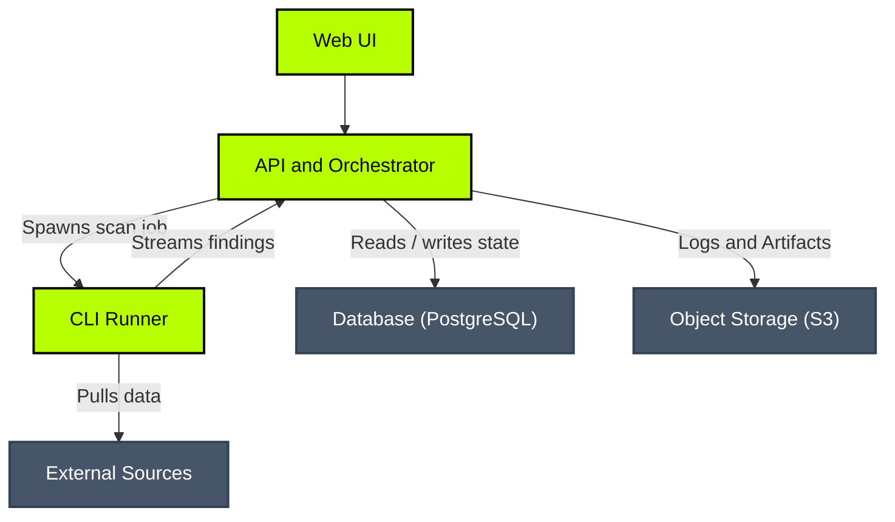

import { Separator } from "@workspace/ui/components"

# Classifyre Docs

Classifyre turns messy, distributed source data into governed signals. Connect the systems you already run, detect what matters, classify content and findings, and label data for security, privacy, moderation, and operational workflows.

##  Classifyre Component Architecture

The diagram below highlights the separation between the **Core Classifyre Stack** (colored in green) and the **External Infrastructure** (colored in gray):

---

Classifyre is designed as a distributed, decoupled platform. The system is split between the **Core Classifyre Stack** and **External Infrastructure** components:

### Core Classifyre Stack

These primary services form the core of the Classifyre application:

#### 1. Web UI (Frontend)
- **Role:** The user-facing frontend.
- **Responsibilities:**
  - Configuring and managing data sources.
  - Enabling, disabling, and adjusting settings for detectors and classifiers.
  - Inspecting scan runs, execution logs, and classified findings.
  - Triggering scans manually or defining automated schedules.

#### 2. API and Orchestrator
- **Role:** The control plane and orchestrator.
- **Responsibilities:**
  - Exposing REST APIs and WebSocket endpoints to power the Web UI.
  - Coordinating runner lifecycles, states, and jobs.
  - Spawning CLI execution runs (locally or as Kubernetes Jobs).
  - Receiving batched findings from active CLI scanners via REST endpoints.
  - Fetching run artifacts and logs from storage.

#### 3. CLI Runner
- **Role:** The ephemeral execution worker where the extraction and detection takes place.
- **Responsibilities:**
  - Ingesting documents from target external sources.
  - Executing extractors to parse text and structural metadata.
  - Running detectors (secrets, PII, custom LLM models) against parsed text.
  - Streaming NDJSON envelope findings back to the API in batches.

### External Infrastructure

Classifyre relies on standard external components for data persistence, storage, and ingestion. Users can configure and bring their own instances of these components:

- **[PostgreSQL Database](/deployment/database/):** Stores all system metadata, configurations, schedules, logs, and findings. Classifyre supports **embedded** database pods for quick evaluations or **external** database instances (such as AWS RDS, GCP Cloud SQL, or CloudNativePG clusters) for production.
- **[S3 Object Storage](/deployment/storage/):** An **external** and **optional** component used to persist long-term runner execution logs and developer sandbox uploads. If disabled, logs are streamed live but not saved.
- **[External Data Sources](/sources/):** The target systems containing unstructured documents (e.g., AWS S3, Confluence, Slack, Google Drive) that Classifyre scans using its extractors and detectors to identify security and compliance findings.

---

<Separator className="my-8" />

## Explore the Documentation

- **[Deployments](/deployment/):** Detailed installation and setup instructions using Docker All-in-One and Kubernetes Helm charts.
- **[Sources Reference](/sources/):** Connection parameters, schemas, and examples for all supported integrations.
- **[Detectors Reference](/detectors/):** Available detection engines (PII, secrets, regex, and ML models) to classify content.
- **[MCP Server](/mcp-server/):** Model Context Protocol integration configurations and capabilities.
