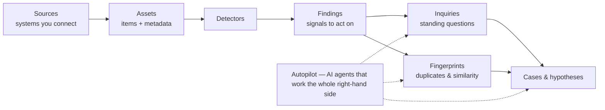

# Classifyre

Classifyre finds what matters in the data scattered across the systems you
already run — and turns it into **investigations you can act on**. Connect a
source, let detectors surface the evidence, and work the results like an
analyst: standing questions, duplicate detection, cases, and hypotheses — with an
**AI autopilot** doing the legwork in between.

It's an open-source investigation platform for your whole data estate:
databases, lakehouses, collaboration tools, content platforms, and more.

---

## What you can do with it

| | |
|---|---|
| **Connect what you already run** | Point Classifyre at databases, data lakes, storage buckets, collaboration tools, and content platforms — no data migration. |
| **Detect what matters** | Ready-made detectors for secrets, PII, and security, plus custom detectors you build — from a simple rule to a full AI model. |
| **See the same thing, everywhere** | Fingerprints connect duplicate and similar records across systems into a single picture. |
| **Investigate, don't just list** | Turn findings into cases with evidence, competing hypotheses, and a clear conclusion. |
| **Let AI do the legwork** | An autopilot opens inquiries, builds cases, and drafts hypotheses after every scan — explaining every move. |
| **Run it your way** | Start on a laptop with Docker, scale to Kubernetes, keep your data in your own infrastructure. |

---

## How it all connects

Classifyre is one connected pipeline — from the systems you connect, all the way
to a resolved investigation:

1. **[Sources](/sources/)** connect the systems you run and scan them into
   **[assets](/sources/assets-and-metadata/)** with rich metadata.
2. **[Detectors](/detectors/)** read each asset and raise
   **[findings](/detectors/findings/)** — the signals worth acting on.
3. **[Inquiries](/flow/investigations/inquiry/)** keep watch over findings, and
   **[Fingerprints](/flow/investigations/fingerprints/)** connect the ones that
   share identity.
4. **[Cases](/flow/investigations/cases/)** organise evidence and
   **[hypotheses](/flow/investigations/cases/hypothesis/)** into real
   investigations.
5. **[Autopilot](/flow/investigations/autopilot/)** does it for you, automatically,
   after every scan — with a written reason for every action.

---

## The building blocks

| Area | What it covers |
|---|---|
| **[Sources](/sources/)** | Connect systems, choose what to scan and how, and understand what a scan produces. |
| **[Detectors](/detectors/)** | Pre-built packs and custom detectors, how they run, and the findings they yield. |
| **[Investigations](/flow/investigations/)** | Inquiries, fingerprints, cases, and hypotheses — turning findings into answers. |
| **[Autopilot](/flow/investigations/autopilot/)** | The AI agents that run investigations for you, and how to steer them. |
| **[Settings](/settings/)** | AI providers, instance settings, and connecting your own tools. |
| **[Deployment](/deployment/)** | Run Classifyre with Docker or Kubernetes, on your own infrastructure. |

---

## Get started

- **Try it** — stand up the whole platform with the
  **[Docker All-in-One](/deployment/docker/)** guide.
- **Go to production** — deploy the open-source core with the
  **[Kubernetes Helm chart](/deployment/kubernetes/)**.
- **Connect your first source** — see the **[Sources](/sources/)** guide.
- **Understand the journey** — follow a scan from start to finish in
  **[Flow](/flow/)**.

---

## Explore the documentation

- **[Flow](/flow/):** The end-to-end lifecycle from a source scan to findings and
  investigations.
- **[Sources](/sources/):** How sources work, what to configure, and what a scan
  produces.
- **[Detectors](/detectors/):** Pre-built and custom detection, and the findings
  it yields.
- **[Investigations](/flow/investigations/):** Inquiries, fingerprints, cases,
  hypotheses, and the AI autopilot.
- **[Deployment](/deployment/):** Docker and Kubernetes installation, plus the
  platform architecture.
- **[Settings](/settings/):** AI providers, instance settings, and the
  [MCP server](/settings/mcp-server/) integration.
- **[Data Export](/data-export/)** and **[Notifications](/notifications/):**
  Getting data out, and staying informed.
