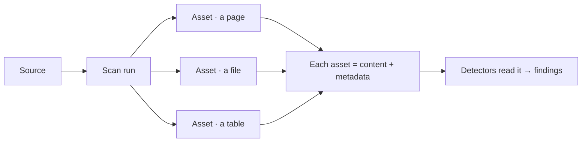
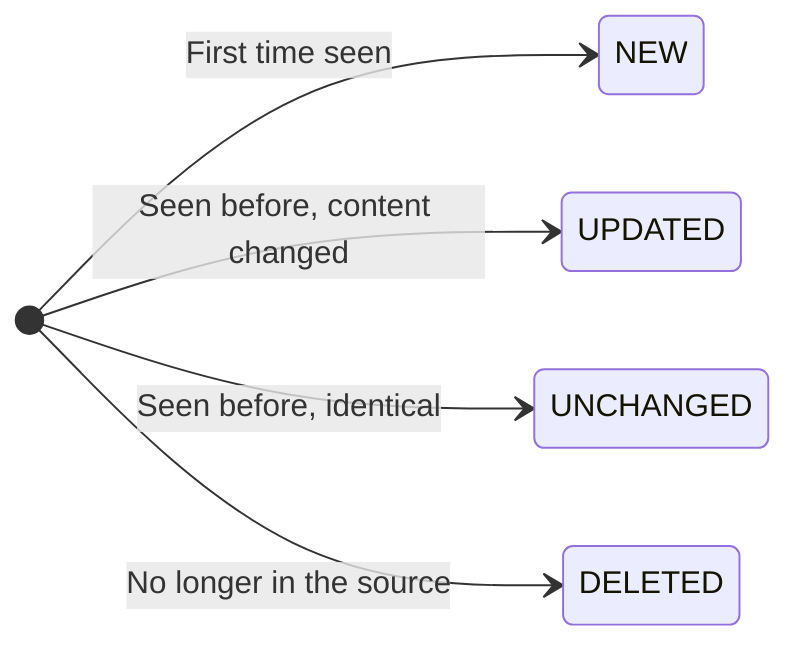

# Assets & Metadata

Running a scan turns the contents of a source into **assets**: one normalised
record per meaningful item, each carrying the **content** to be analysed and a
set of **metadata** describing it. Assets are the result of a source execution
and the input to every detector.

---

## What an asset is

An **asset** is a single item extracted from a source — a document, a file, a
wiki page, a chat message, a database table, a video. Whatever the system, every
asset shares the same core attributes:

| Attribute | What it is |
|---|---|
| **Name** | A human-readable label for the item. |
| **Kind** | What sort of item it is — `file`, `image`, `page`, `comment`, `table`, and so on. |
| **External URL** | A link back to the item in its original system. |
| **Links** | Related links discovered on or around the item. |
| **Content** | The text analysed by detectors — extracted directly, or via [OCR / transcription](/sources/content-extraction/). |
| **Metadata** | Structured facts about the item (see below). |
| **Change status** | How this item changed since the last scan (see below). |

Each asset is identified consistently across scans, so the same item is tracked
over time rather than duplicated — that's what makes findings stable from one
run to the next.

---

## Asset change status

Because Classifyre remembers what it saw last time, every asset in a run is
marked with how it changed. This is what powers incremental scanning and the
automatic resolution of issues that have gone away:

| Status | Meaning |
|---|---|
| **New** | The item appeared for the first time. |
| **Updated** | The item existed before and its content changed. |
| **Unchanged** | The item is identical to the last scan. |
| **Deleted** | The item is gone from the source; its findings can be auto-resolved. |

The mechanics of how a scan diffs against the previous run live in the
**[Flow](/flow/)** section.

---

## Asset metadata

Beyond its content, each asset carries **metadata** — structured facts that make
findings easier to understand, filter, and investigate. Metadata comes in two
layers.

### Shared, content-based metadata

Some metadata depends on the *kind of content*, no matter which source it came
from. These reusable families are attached automatically:

| Content family | Typical fields |
|---|---|
| **File** | Byte size, MIME type, and a parse-error note if extraction failed |
| **Image** | Pixel width and height |
| **Document** (PDF, DOCX) | Page count, paragraph count, table count |
| **Spreadsheet / table** (CSV, XLSX, Parquet) | Row count and column definitions |
| **Audio / video** | Duration and transcript details when [transcription](/sources/content-extraction/) is on |

### Source-specific metadata

On top of that, each source adds facts that only make sense for *its* system — a
chat message's channel and author, a wiki page's space and version, a video's
view count and upload date, a database row's table and schema.

> **Find the exact list.** Every source's reference page has an **Extracted
> Metadata** section listing precisely which fields it attaches to each asset
> kind. Browse the **[Source Catalog](/sources/)** and open any source to see
> its metadata.

---

## Why metadata matters

Metadata isn't just description — it does real work downstream:

- **Findings inherit context.** A finding points at the asset that produced it,
  so its name, location, and metadata travel with it into triage and
  investigation.
- **Better filtering and grouping.** Metadata lets you slice findings by source,
  kind, location, and more.
- **It helps the AI.** When a source is silent, the [Config and Detector
  agents](/flow/investigations/autopilot/agents/) read asset metadata to work out
  what kind of data they're looking at and which detectors to enable — the
  "cold start" described in [Autopilot](/flow/investigations/autopilot/).

---

## From assets to findings

Assets are where source execution ends and detection begins. Each asset's content
is handed to the detectors configured on the source, and anything they flag
becomes a **finding** attached to that asset.

That handoff — which detectors run, on what content, and what they produce — is
the subject of the **[Detectors](/detectors/)** section.

---

## You've covered the essentials

| Page | |
|---|---|
| [How Sources Work](/sources/how-it-works/) | What a source is and its journey to findings |
| [Configuration & Fields](/sources/configuration/) | Required, masked, and optional fields |
| [Sampling Strategies](/sources/sampling/) | How much to read, and which items |
| [OCR & Transcription](/sources/content-extraction/) | Reading images, audio, and video |
| [Testing & Scheduling](/sources/testing/) | Verify connections and automate scans |
| Assets & Metadata | What a scan produces *(you are here)* |
